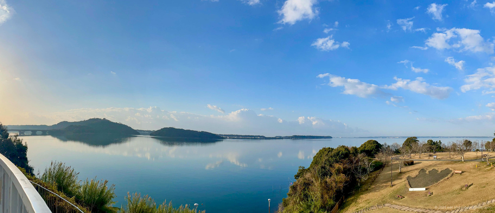
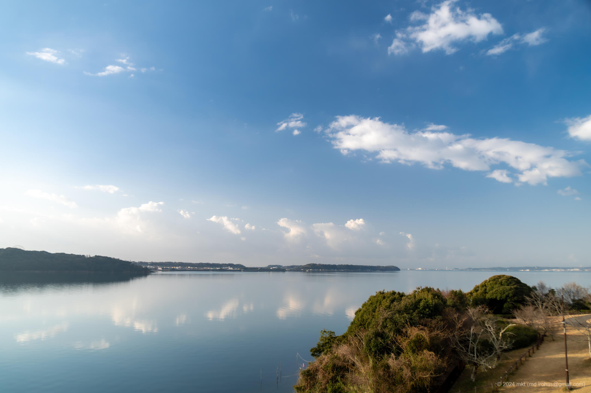

+++
title = '浜名湖サービスエリア（2024年3月）'
date = 2024-04-22T00:10:19+09:00
summary = '2024年3月に鳥取へ行く途中で浜名湖サービスエリアに立ち寄りました。'
categories = ['ブログ（旅行）']
tags = ['旅行', '写真', '静岡県', '浜名湖SA']

description = '2024年3月に鳥取へ行く途中で立ち寄った浜名湖サービスエリアの記事です。'

draft = false
isCJKLanguage = true
+++

3月下旬に [鳥取へ行く]() 途中で浜名湖サービスエリアに立ち寄りました。

奥にあるテラスからの眺めはよく、広場ものんびりできる場所でした。

## 写真


  
  


- iPhone 12 mini
    1. IMG\_2598-2.jpg (Google Drive: [JPG](https://drive.google.com/file/d/14SM1bAgDHwPqucvioK6lz87Acdof2CJ-/view)):  
       奥のテラスから浜名湖を撮ったパノラマ写真です。
       「[ゴジラ-1.0](https://ja.wikipedia.org/wiki/%E3%82%B4%E3%82%B8%E3%83%A9-1.0)」で登場するゴジラの実物大足跡がありました。
- Sony α6500
    1. DSC05185-Enhanced-NR.jpg (Google Drive: [JPG](https://drive.google.com/file/d/19QPb3BI8n4JVCdKtmc2SlAdluXJqECPF/view) / [RAW (ARW)](https://drive.google.com/file/d/11dM5vro8su9hvXZBehhIwwb6Bs8e55gA/view)):  
       同じく奥のテラスから浜名湖を撮影した写真です。

{}

## マップ

<iframe src="https://www.google.com/maps/embed?pb=!1m18!1m12!1m3!1d3276.9521462651196!2d137.6066219764942!3d34.78197997884623!2m3!1f0!2f0!3f0!3m2!1i1024!2i768!4f13.1!3m3!1m2!1s0x601b272259be1cbb%3A0x7ef95dc95f872643!2z6Iqd55Sf5YWs5ZySIOa1nOWQjea5llNB!5e0!3m2!1sen!2sjp!4v1713826076794!5m2!1sen!2sjp" width="600" height="450" style="border:0;" allowfullscreen="" loading="lazy" referrerpolicy="no-referrer-when-downgrade"></iframe>

## 編集履歴

- 2024/04/28: 写真のライセンスの追加。写真のリンクの修正。
- 2024/04/23: 初稿作成。

