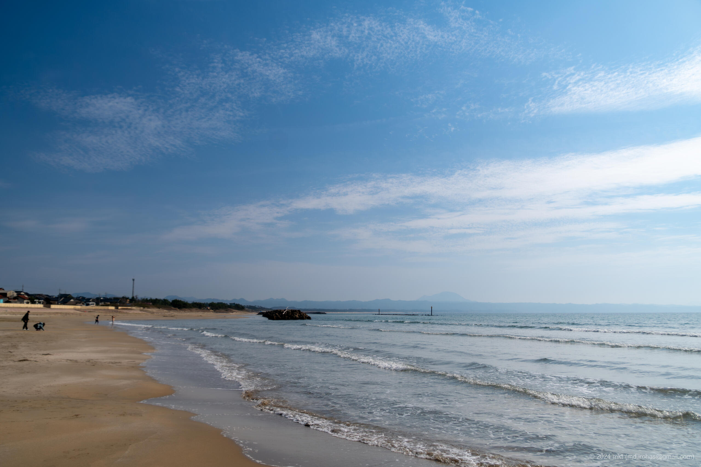

+++
title = '出雲日御碕灯台（2024年3月）'
date = 2024-04-27T18:45:45+09:00
summary = '2024年3月に出雲日御碕灯台を観光しました。'
categories = ['ブログ（旅行）']
tags = ['旅行', '写真', '島根県', '出雲日御碕灯台']

description = '2024年3月に出雲日御碕灯台を観光したときの記事です。'

draft = false
isCJKLanguage = true
+++

2024年3月に島根県の [出雲日御碕灯台 (Wikipedia)](https://ja.wikipedia.org/wiki/%E5%87%BA%E9%9B%B2%E6%97%A5%E5%BE%A1%E7%A2%95%E7%81%AF%E5%8F%B0) を観光しました。

出雲日御碕灯台は、明治36年（1903年）に設置された白い石造洋式灯台で、2022年に国の重要文化財に指定されました。
地上からの高さは43.65m、海面からの高さは63.3mで、石造灯台としては日本一の高さです。

2024年3月現在、灯台の内部は一般公開されており、大人300円で灯台の内部を見学できます。
灯台内には163段の急峻な螺旋階段があり、それをのぼると展望台から日本海を一望することができます。

展望台は高く、私が訪れた日は強風だったこともあり、私はかなり足がすくみましたが、展望台からの眺めは絶景でした。

出雲大社を観光する人は、日御碕灯台もあわせて観光してはいかがでしょう。

## 写真


  
  
  


 


  
  
  
  
  


- iPhone 12 mini
    1. IMG\_2759.jpg (Google Drive: [JPG](https://drive.google.com/file/d/1kIfnd17z-peqgBKcB3ZmS2uDILFjltof/view)):  
       灯台内部の螺旋階段の写真です。
    1. IMG\_2743.jpg (Google Drive: [JPG](https://drive.google.com/file/d/160gUe9dVpQxTrVxVEULxJfiz9D8CgkVs/view)):  
       灯台内部で螺旋階段をのぼった後の階段（というより梯子）の写真です。
    1. IMG\_2744.jpg (Google Drive: [JPG](https://drive.google.com/file/d/11mXjQvwsBV_AUSVzLvVJ1zyhKelzp2hI/view)):  
       日本海と灯台のパノラマ写真です。
- Sony α6500
    1. DSC05387-Enhanced-NR.jpg (Google Drive: [JPG](https://drive.google.com/file/d/1N6sQNE0qw9ffxeXgNlRal611mBEugCCk/view) / [RAW (ARW)](https://drive.google.com/file/d/11JrfLe-PzlVIzR87Fv03wwx2z6BJ4lk7/view)):  
       灯台の入口の写真です。
    1. DSC05394-Enhanced-NR.jpg (Google Drive: [JPG](https://drive.google.com/file/d/1cCCpvK6PxEQ3Zc8bm1CKt3InUUBSFdPP/view) / [RAW (ARW)](https://drive.google.com/file/d/1Scbt7GQyOyEAFgCu_DCAOi936Njdu9AS/view)):  
       灯台の展望台から撮った写真です。
    1. DSC05396-Enhanced-NR.jpg (Google Drive: [JPG](https://drive.google.com/file/d/1uL02DDq1VU8VtFCOWvPb5feS9LWObsEj/view) / [RAW (ARW)](https://drive.google.com/file/d/1O0JNILxR-MCT1t_sB3L8YT-jTCQrEtn4/view)):  
       灯台の展望台から撮った写真です。
    1. DSC05397-Enhanced-NR.jpg (Google Drive: [JPG](https://drive.google.com/file/d/14Vnl-35yn8zq79QgQMCfDVZqnFK4pmrM/view) / [RAW (ARW)](https://drive.google.com/file/d/1EvZ7jd040CxFjxDrMMmbcz7YO8SVONnj/view)):  
       灯台の写真です。
    1. DSC05418-Enhanced-NR.jpg (Google Drive: [JPG](https://drive.google.com/file/d/15z0DSHX25Jaf_ewU41fNNjLdDeWCyyMY/view) / [RAW (ARW)](https://drive.google.com/file/d/1FKTaqWw9pBkFV12RaSs5OhPQPPucRJIH/view)):  
       灯台から少し離れた稲佐の浜の海岸の写真です。

{}

## マップ

<iframe src="https://www.google.com/maps/embed?pb=!1m18!1m12!1m3!1d3250.8489298314094!2d132.62674227651354!3d35.433772143526745!2m3!1f0!2f0!3f0!3m2!1i1024!2i768!4f13.1!3m3!1m2!1s0x35575c209d62fdcb%3A0xff48b1cb937150be!2sIzumo%20Hinomisaki%20Lighthouse!5e0!3m2!1sen!2sjp!4v1714212125062!5m2!1sen!2sjp" width="600" height="450" style="border:0;" allowfullscreen="" loading="lazy" referrerpolicy="no-referrer-when-downgrade"></iframe>

## 編集履歴

- 2024/04/27: 初稿作成。

