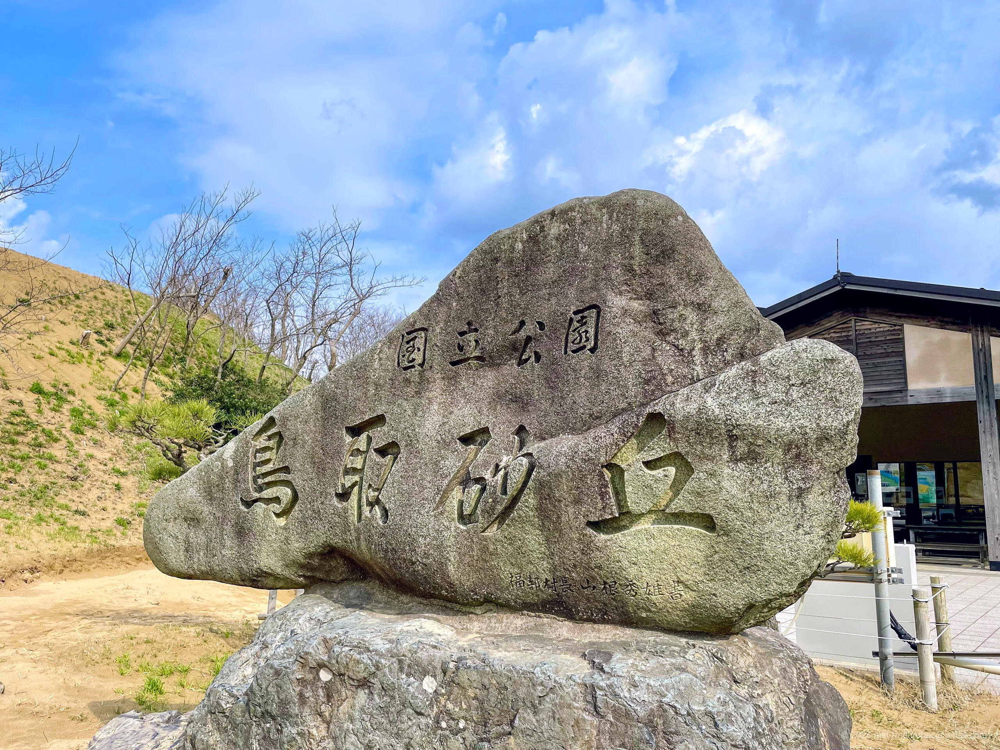
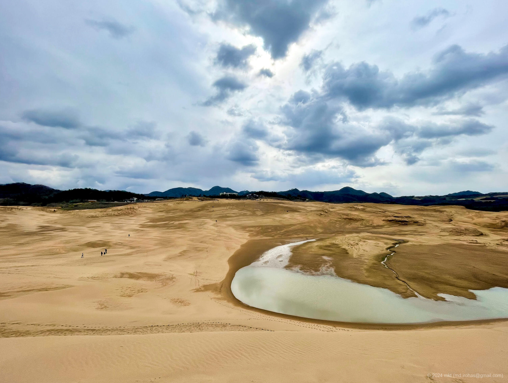
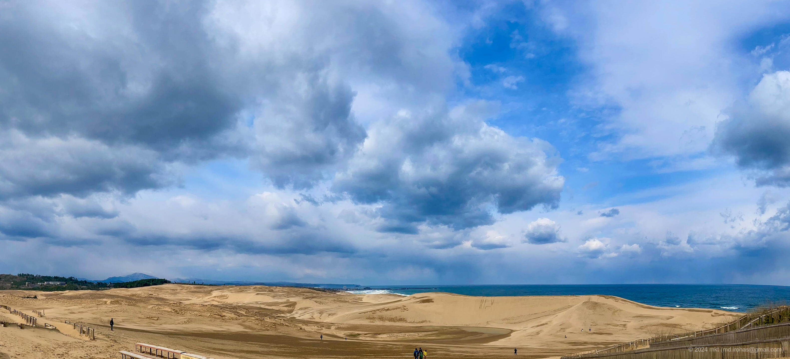
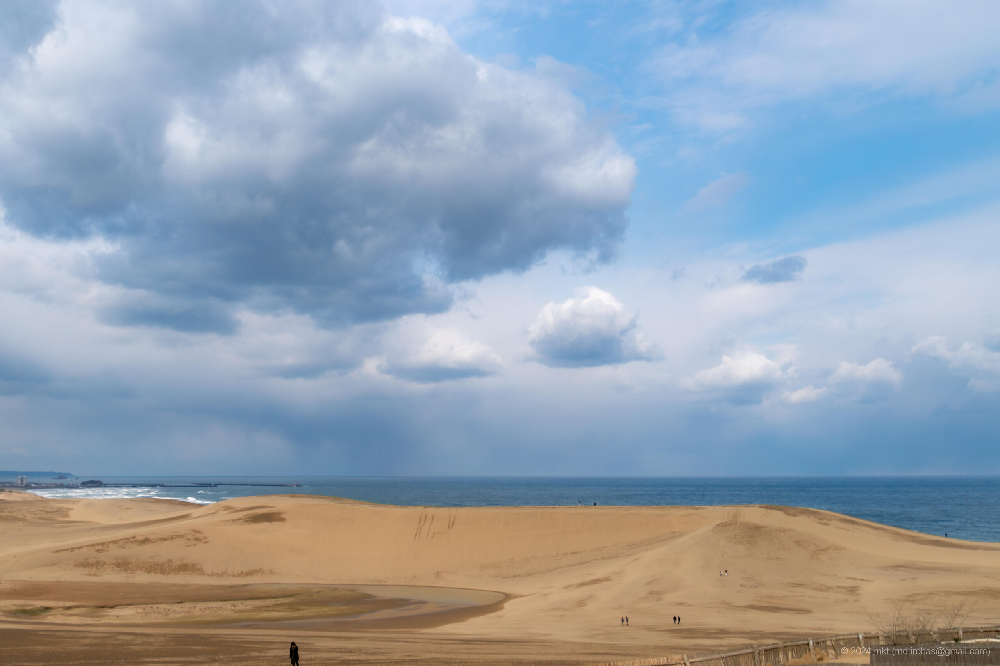

+++
title = 'Tottori Sand Dunes (March, 2024)'
date = 2024-04-18T18:40:23+09:00
summary = 'This is an article about Tottori Sand Dunes I visited in March 2024.'
categories = ['Blog (Trip)']
tags = ['Trip', 'Photo', 'Tottori', 'Tottori Sand Dunes']

description = 'This is an article about Tottori Sand Dunes I visited in March 2024.'

draft = false
isCJKLanguage = true
+++

I visited [Tottori Sand Dunes (Wikipedia)](https://en.wikipedia.org/wiki/Tottori_Sand_Dunes) in late March.

The dunes appeared smaller from a distance than I had imagined.
However, once I got closer and entered the site, I realized they were surprisingly large.
I ended up spending nearly two hours walking around and taking photos."

## Photos


  
  
  
  
  


- iPhone 12 mini
    1. IMG\_2603-2.jpg (Google Drive: [JPG](https://drive.google.com/file/d/1vsrMTMlwGqy0XRywhah8zz6aW10VuJiX/view)):  
       A stone monument at the entrance of Tottori Sand Dunes.
    1. IMG\_2622-2.jpg (Google Drive: [JPG](https://drive.google.com/file/d/1IGJx5BTRFFJfR32Ytskc5dGEM8TzHqZF/view) ):  
       A photo taken from a hill called "Uma-no-Se (horse's back)" toward the entrance.
    1. IMG\_2606-2.jpg (Google Drive: [JPG](https://drive.google.com/file/d/1Y_qKRoO0xpcZyzaVO_odsaA_XRnoKBNS/view)):  
       A panoramic photo taken at the entrance.
- Sony α6500
    1. DSC05202-Enhanced-NR.jpg (Google Drive: [JPG](https://drive.google.com/file/d/1dfPe1eDh0TROHDqZRrVT3atJRA4Hh8Lu/view) / [RAW (ARW)](https://drive.google.com/file/d/1ROfEdxKIYjKtOdeIAxZtDrl-102g1ZKu/view)):  
       A photo of the hill called "Uma-no-se," which can be seen just after entering the dunes.
    1. DSC05211-Enhanced-NR.jpg (Google Drive: [JPG](https://drive.google.com/file/d/1H5eftyjHElTuCNLWiVrocQLATjp7hOG-/view) / [RAW (ARW)](https://drive.google.com/file/d/1C4dpDpUs4I3PwiUncOVp8m8R1Pb9d9Cq/view)):  
       A photo of a wave-like pattern made on sand by wind.

{}

## Map

<iframe src="https://www.google.com/maps/embed?pb=!1m18!1m12!1m3!1d12985.830818383683!2d134.21747357211962!3d35.542396671990936!2m3!1f0!2f0!3f0!3m2!1i1024!2i768!4f13.1!3m3!1m2!1s0x35558f38273614bd%3A0xd76eab646cb0f519!2sTottori%20Sand%20Dunes!5e0!3m2!1sen!2sjp!4v1713433590438!5m2!1sen!2sjp" width="600" height="450" style="border:0;" allowfullscreen="" loading="lazy" referrerpolicy="no-referrer-when-downgrade"></iframe>

## Change History

- 2024/06/27: Small fixes.
- 2024/04/28: Fix links of photos.
- 2024/04/21: Added photos taken by iPhone.
- 2024/04/20: First version.

