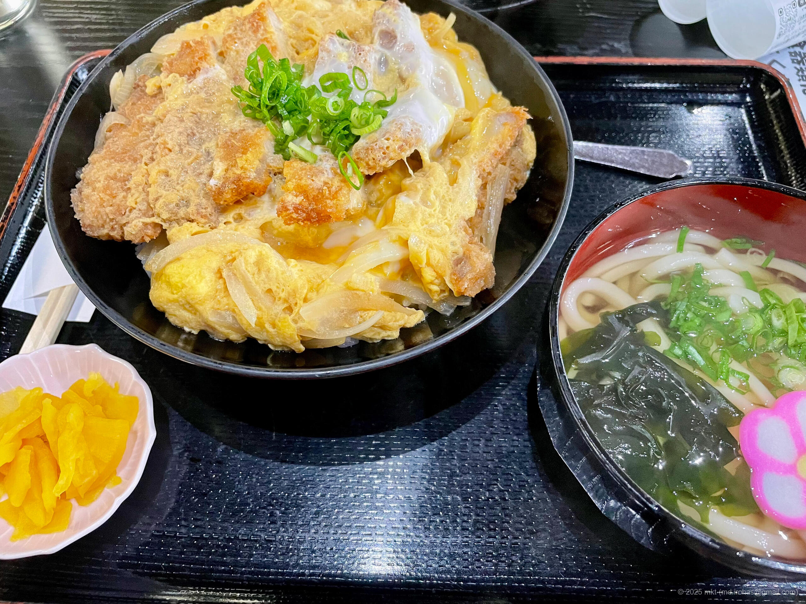

+++
title = 'Trip Recap: San-in & Kyushu (March, 2024)'
date = '2024-04-17'
categories = ['Blog (Trip Recap)']
tags = ['Trip Recap', 'Tottori', 'Shimane', 'Kumamoto']

isCJKLanguage = false
description = '🚙 A blog post about my trip to San-in & Kyushu in March 2024.'
summary = '📍 Tottori Sando Dunes, Mizuki Shigeru Road, Izimo Taisha, Izumo Hinomisaki Lighthouse, Mt. Aso, Daikanbo'

draft = false

# Params
+++

## Story

In late March 2024, I took about two weeks off and went on a road trip through
the San'in region and down into Kyushu.



All in all, I drove around 3,000 kilometers.
It was pretty exhausting physically, but I made it back home safely.

The first half of the trip was spent exploring the San'in region.
Even though it was early spring, the weather on the Sea of Japan side was rough
-- with strong winds and snowstorms -- so getting around wasn't easy.
Still, I managed to visit some iconic spots like the Tottori Sand Dunes and
Izumo Taisha Shrine.

In the second half, I crossed over to Kyushu and drove along the Milk Road
around Mount Aso.
That stretch of road, winding along the outer rim of the Aso caldera, was
absolutely amazing.

There were quite a few places I couldn't visit this time due to time
constraints, so I'm already thinking about planning another trip.

## Timeline

This trip lasted 9 days, with a total distance of about 3,000 km.

Here is the timeline and the spots I visited during the trip.





I left Tokyo at night and drove to Hamana Lake Service Area in Hamamatsu, Shizuoka.
I spent the night in the car at the service area.

 
 







I had breakfast at the Starbucks in Hamanako SA and enjoyed the view of the lake from the terrace behind the service area.

 
 



 
 

After that, I headed to my first main destination: Tottori city in Tottori prefecture.

 
 



 

Even though it was late March, the mountain roads toward Tottori were hit by a snowstorm.
I followed behind a snowplow for a while, but eventually made it safely to Tottori.

 
 

Because the Tottori Sand Dunes were also experiencing strong winds and snow, I decided to relax at a nearby hot spring and stayed overnight at a hotel in the city.





The weather wasn't great on the second day either,
but I did some sightseeing at the Tottori Sand Dunes and then headed west to Sakaiminato.

 
 







I spent the morning exploring the Tottori Sand Dunes.

 
 



 

After walking around the dunes for about three hours, I continued west.





On the way to Sakaiminato, I stopped by Hakuto Shrine, which is dedicated to the <a href="https://en.wikipedia.org/wiki/Hare_of_Inaba" target="_blank">"Hare of Inaba" (Wikipedia) </a> .
The god worshipped here is also known as a deity of matchmaking.

 







The shrine also has a roadside station where you can look out over the ocean across the street.







After that, I continued west, and stopped for lunch at a seafood restaurant next to an AEON Mall, where I had a tuna rice bowl.







I strolled along Mizuki Shigeru Road in Sakaiminato.

 
 



 

The hotel near Sakaiminato Station, part of the Dormy Inn group, was reasonably priced, had a Japanese-style atmosphere, and an onsen on the top floor. Highly recommended.





On the third day, I traveled from Sakaiminato to Izumo, visited Izumo Taisha Shrine and Hinomisaki Lighthouse, then moved on to Hamada in Shimane prefecture.

 
 







First, I visited the Shimane Museum of Ancient Izumo.

<ul>
    <li>Shimane Museum of Ancient Izumo: <a href="https://www.izm.ed.jp/english/" target="_blank">https://www.izm.ed.jp/english/</a></li>
</ul>

I browsed the exhibits about Izumo’s history and artifacts, then had lunch at the museum cafe.





Izumo Taisha Shrine is located right next to the museum, so I visited it afterwards.

<ul>
    <li>Izumo Taisha Shrine: <a href="https://izumooyashiro.or.jp/en/" target="_blank">https://izumooyashiro.or.jp/en/</a></li>
</ul>

As expected, Izumo Taisha was packed with people.













There was a Starbucks near the entrance to Izumo Taisha, so I took a break there before heading to Hinomisaki Lighthouse.





After touring Izumo Taisha, I headed to Hinomisaki Lighthouse.

 
 



 

After enjoying Inasa Beach, I continued west and stayed overnight at a hotel in Hamada, Shimane.





On the fourth day, I had planned to visit Tsunoshima Lighthouse and Tsunoshima Bridge,
but the weather was so stormy that sightseeing wasn’t really possible, so I moved on quickly.

 
 





Still, since I was in the area, I found a hot spring at a roadside station and spent some time relaxing there.

 
 

After my bath, I had lunch at the station’s attached dining hall. The light and flavorful broth was delicious.







Spent some relaxing days at my family home.





On the eighth day, I began the return journey.

 
 

First, I headed to Aso in Kumamoto and drove along the scenic Milk Road on the outer rim of Mt. Aso.

 
 



 

I had planned to visit a few more spots, but started feeling unwell while exploring Mt. Aso, so I rushed back to Tokyo.

 
 

I took naps at service areas along the way, and eventually made it back home in Tokyo safely.

 
 



 

After returning, I spent two or three days resting in bed. And with that, my solo journey in March came to an end.





## Gallery





## Map




\* The route is approximate.


## Related Articles







## Change History

- 2025/09/14: Fix sentence structure and minor wording issues. Add new photos.
- 2025/06/03: Revise sentences.
- 2025/05/30: First version.
