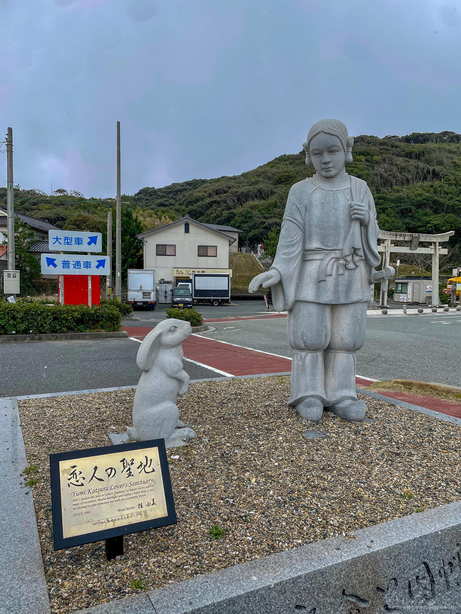
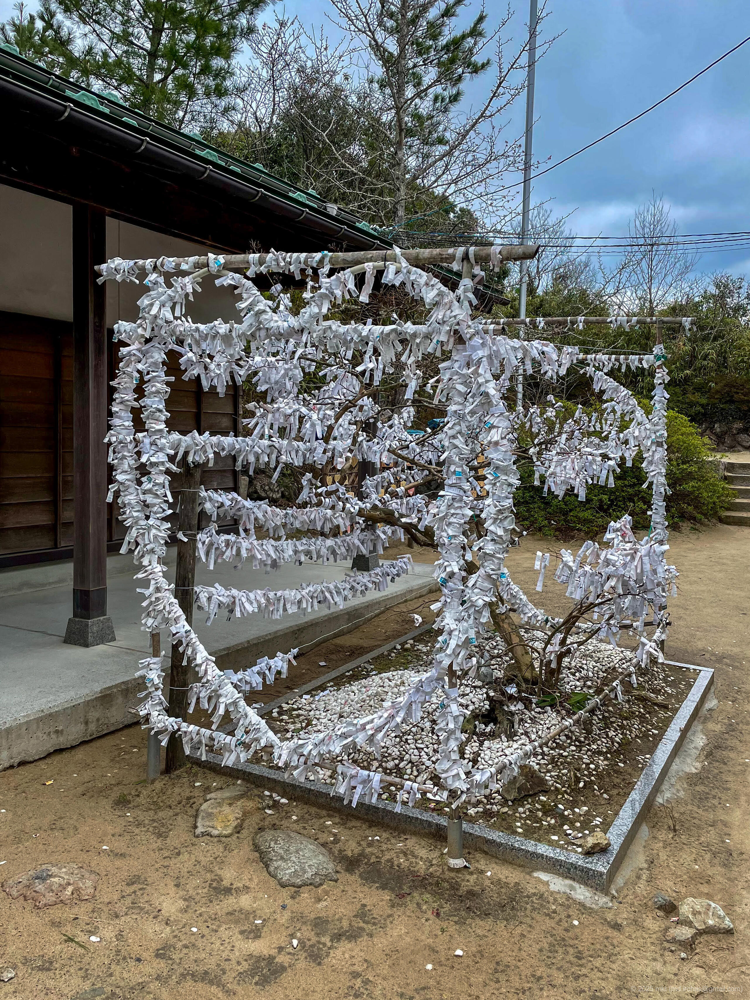
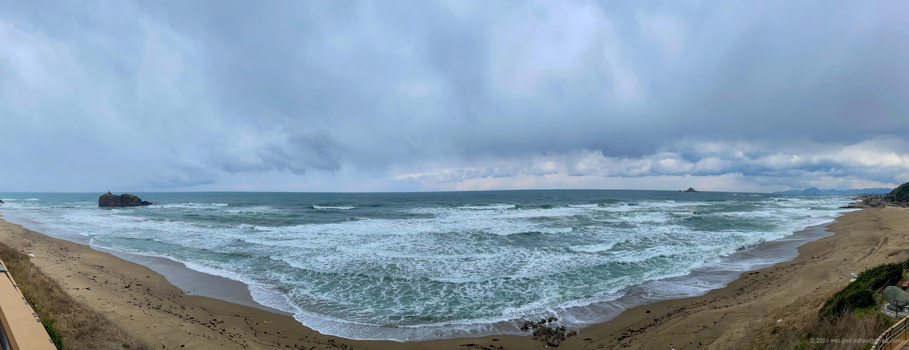
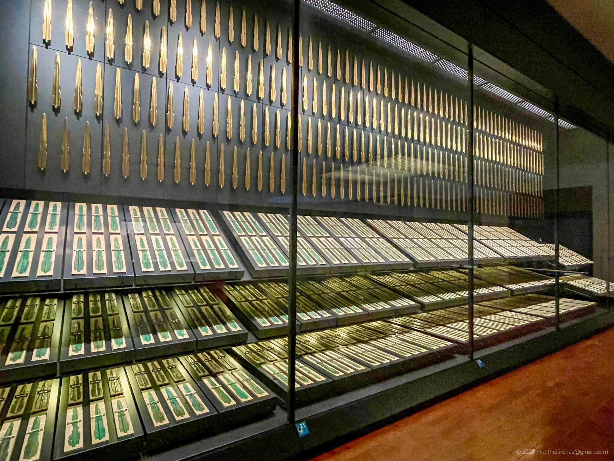
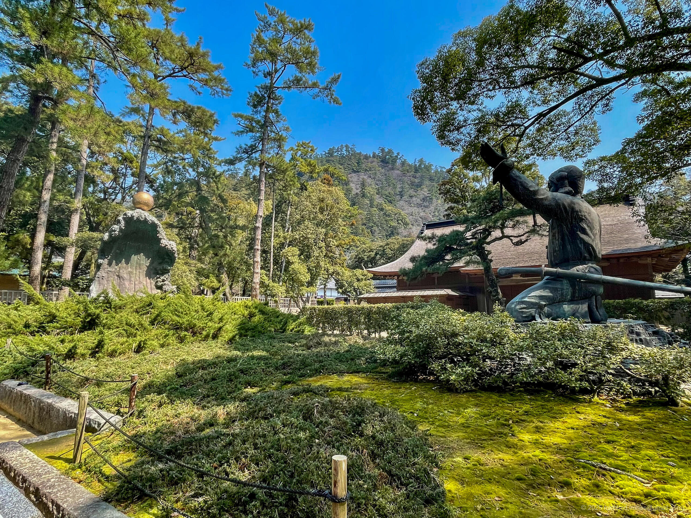
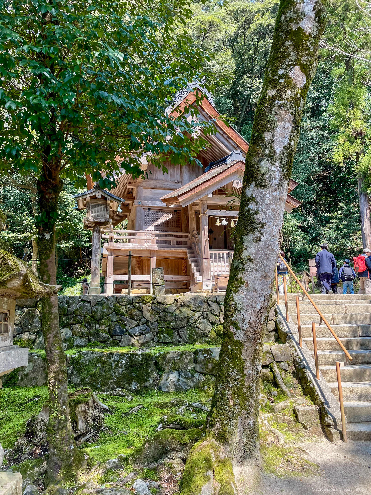
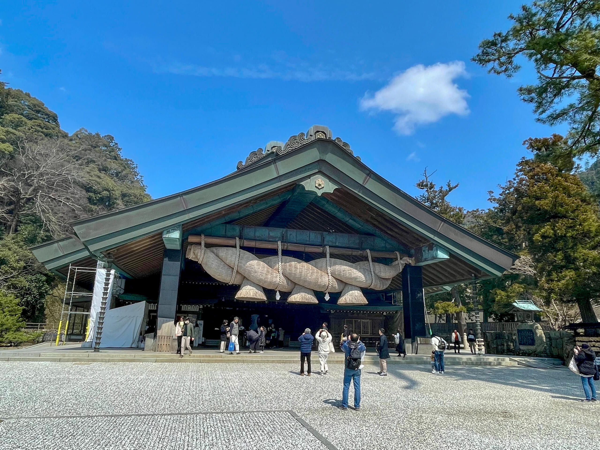

+++
title = '旅の記録: 山陰・九州（2024年3月）'
date = '2024-04-17'
categories = ['ブログ（旅の記録）']
tags = ['旅の記録', '鳥取県', '島根県', '熊本県']

isCJKLanguage = true
description = '🚙 2024年3月に巡った山陰・九州地方ぶらり旅の記録です。'
summary = '📍 鳥取砂丘、水木しげるロード、出雲大社、出雲日御碕灯台、阿蘇山、大観峰'

draft = false

# Params
+++

## ストーリー

2024年3月下旬、約2週間の休暇を取り、山陰地方と九州地方を車で巡る旅へ出ました。



全行程の走行距離はおよそ3000km。
全ての移動が車で、体力的になかなかハードな旅でしたが、無事帰宅することができました。

旅の前半は山陰地方。
春先とはいえ、日本海側の天候は暴風雪を伴う荒れ模様で移動には苦労しましたが、
鳥取砂丘や出雲大社などの名所を訪れました。

後半は九州へ渡り、阿蘇山のミルクロードを走りました。
阿蘇山の外輪山を走るミルクロード、とても良かったです。

今回の旅では時間の都合上、立ち寄れなかった場所が多く残っているので、次の旅行を計画したいです。

## タイムライン

今回の旅の全日程は9日間、総移動距離は約3000kmでした。

この度で立ち寄った各スポットとそのタイムラインです。





夜に東京を出発して静岡県浜松市の浜名湖SAまで移動し、浜名湖SAで車中泊しました。

 
 







浜名湖SAのスタバで朝食を食べ、サービスエリアの裏のテラスで浜名湖を眺めました。

 
 



 
 

そのあと、最初の目的地である鳥取県鳥取市へ向かいました。

 
 



 

鳥取へ向かう山道は、3月下旬にもかかわらず吹雪いていました。
除雪車の後ろを走行しつつ、なんとか鳥取に着くことができました。

 
 

鳥取砂丘も暴風雪だったため、この日は近くの温泉でのんびりし、市内のホテルに一泊しました。





2日目も天気はいまいちでしたが、
この日は鳥取砂丘を観光して、そのあと鳥取県の西にある境港市まで移動しました。

 
 







2日目は朝から鳥取砂丘を歩き回りました。

 
 



 

鳥取砂丘を3時間ほど歩き回って、その後、西へ移動しました。





境港へ向かう途中に <a href="https://ja.wikipedia.org/wiki/%E5%9B%A0%E5%B9%A1%E3%81%AE%E7%99%BD%E5%85%8E" target="_blank">「因幡の白兎」（Wikipedia）</a> の白兎を祀っている神社があったので立ち寄りました。
祀られている神様は、縁結びの神様でもあるそうです。

 







神社には道の駅が併設されており、向かいの海を眺めることができました。







その後、引き続き西へ移動し、途中にあったイオンモールの隣の海鮮丼屋さんで、
昼食にマグロ丼を食べました。







境港の水木しげるロードを散策しました。

 
 



 

境港駅前のドーミーイン系列のホテルは、
値段も手頃ながら和風で、最上階に温泉もありとても良かったです。





3日目は、境港市から出雲市へ移動し、出雲大社、日御碕灯台を散策し、
その後島根県浜田市まで移動しました。

 
 







はじめに、島根県立古代出雲歴史博物館を訪れました。

<ul>
    <li>古代出雲歴史博物館: <a href="https://www.izm.ed.jp/" target="_blank">https://www.izm.ed.jp/</a></li>
</ul>

出雲歴史や出土品等を一通り眺めて、博物館のカフェで昼食をとりました。





出雲大社は博物館の隣にあるため、そのまま出雲大社を参拝しました。

<ul>
    <li>出雲大社: <a href="https://izumooyashiro.or.jp/" target="_blank">https://izumooyashiro.or.jp/</a></li>
</ul>

流石の出雲大社で人がとても多かったです。













出雲大社の入口付近にスタバがあったので、
そこで休憩して駐車場へ戻り、出雲日御碕灯台へ向かいました





出雲大社を観光した後、出雲日御碕灯台へ向かいました。

 
 



 

稲佐の浜まで満喫したので、その後は再び西へ移動し、
島根県浜田市のホテルで一泊しました。





4日目は、角島灯台と角島大橋を散策する予定だったのですが、
暴風雨でとても観光できる状況ではなかったため、早々に移動しました。

 
 





とはいえせっかくなので、近くの道の駅の温泉を見つけてそこでのんびりしました。

 
 

風呂上がりは、道の駅に併設してある食堂で昼食を取りました。
さっぱりした出汁でとても美味しかったです。







実家でのんびりしました。





8日目、後半戦の復路の開始です。

 
 

はじめに、熊本県阿蘇市の阿蘇山へ向かい、
阿蘇山外輪のミルクロードを走りました。

 
 



 

その後もいくつか回る予定だったのですが、
阿蘇山を散策しているあたりで、体調が悪くなってきたため急いで東京へ戻りました。

 
 

サービスエリアで仮眠をとりつつ、どうにか無事に自宅の東京まで戻ることができました。

 
 



 

その後、2〜3日寝込みましたが、これにて3月の一人旅は終了となります。





## ギャラリー





## マップ




※ルートは大体の経路です。


## 関連記事







## 編集履歴

- 2025/09/14: 文章構成、細かな表現を修正。写真を追加。
- 2025/06/03: 文面を修正。
- 2025/05/30: 初稿作成。
