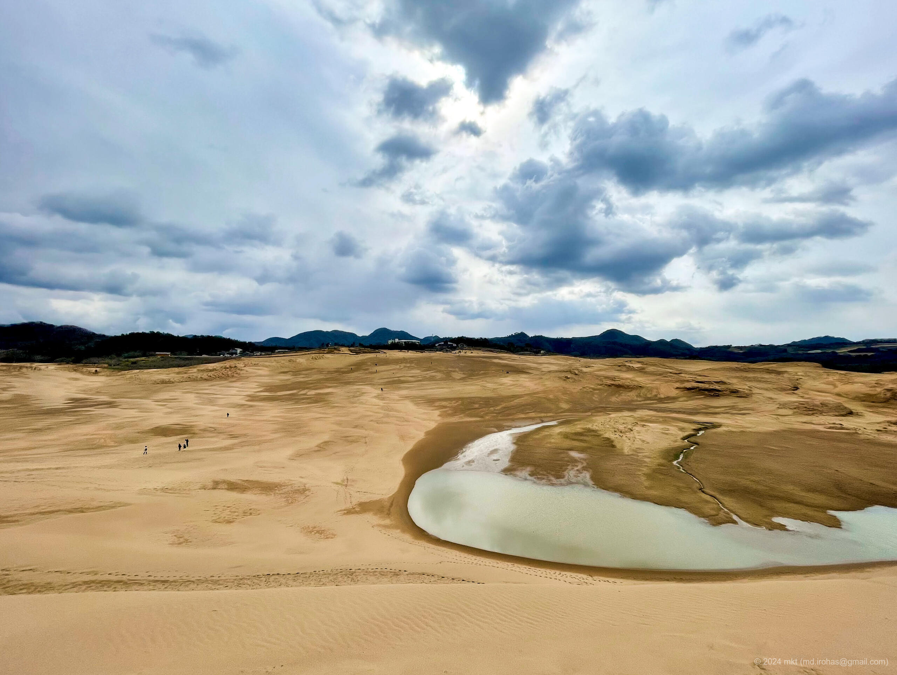
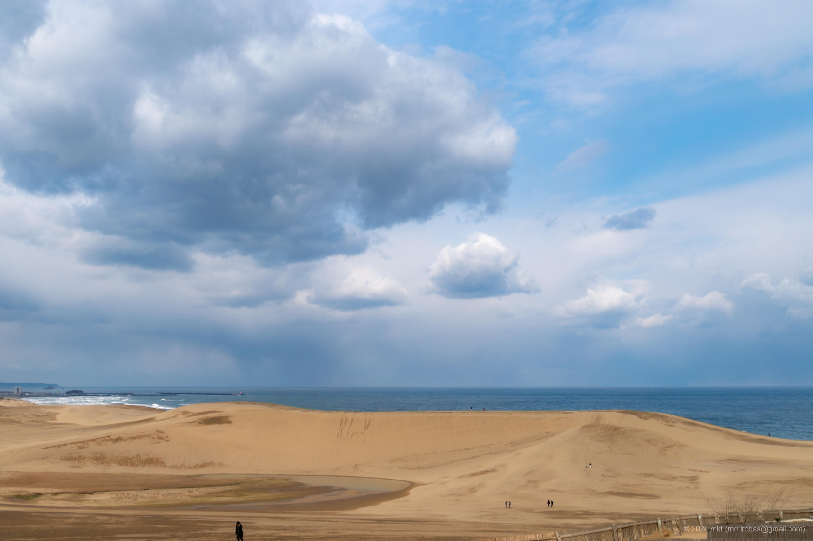
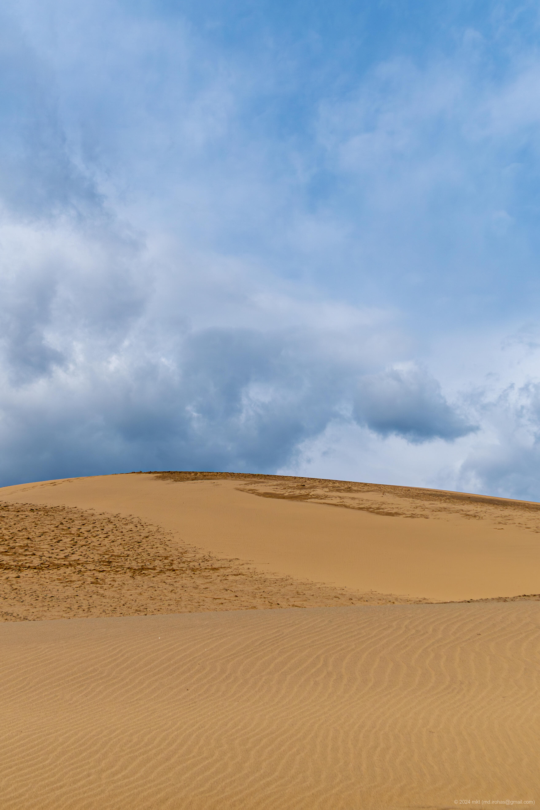

+++
title = 'Tottori Sand Dunes (March, 2024)'
date = '2024-04-18'
categories = ['Blog (Trip Photo)']
tags = ['Trip', 'Photo', 'Tottori', 'Tottori Sand Dunes']

isCJKLanguage = false
description = 'An article about Tottori Sand Dunes I visited in March 2024.'

draft = false

# Params
googlePhotoUrl = "https://photos.app.goo.gl/gwzehBM7AaAusUQG7"
googleDriveUrl = "https://drive.google.com/drive/folders/1K9zUdPwhUa8U-_jj5lG94sRQj7N_gU19?usp=sharing"
+++

## Summary

In March 2024, I stopped by the Tottori Sand Dunes while traveling through
the San'in region.

Just the day before, the Sea of Japan coast had been hit by a fierce snowstorm.
But when I arrived, I was lucky enough to catch a break in the clouds, with
patches of blue sky peeking through. Despite the biting wind, I was able to
walk around the dunes without any trouble.

At first, seeing the dunes from a distance, I thought they looked smaller than
expected. But that impression quickly changed once I set foot on them. The
rolling landscape unfolding before me truly lived up to the name "sand dunes."
The soft ground gave way under each step, and climbing up and down the sloping
hills turned out to be far more dynamic than I had imagined—like a natural
playground shaped entirely by the wind.

With my camera in hand, I wandered the dunes for what ended up being nearly two
hours.

Standing at the top, gazing out over the wild Sea of Japan, I felt as if I’d
stepped into another world—briefly removed from everyday life.

## Gallery




  
  
  

  
  




## Map

### Tottori Sand Dunes



### Sites



## Photo Details

### iPhone 12 mini


  
  
  


1. IMG\_2603-2.jpg (  ):  
    A stone monument at the entrance of Tottori Sand Dunes.
1. IMG\_2622-2.jpg (  ):  
    A photo taken from a hill called "Uma-no-Se (horse's back)" toward the entrance.
1. IMG\_2606-2.jpg (  ):  
    A panoramic photo taken at the entrance.

### Sony α6500


  
  


1. DSC05202-Enhanced-NR.jpg (  /  ):  
    A photo of the hill called "Uma-no-se," which can be seen just after entering the dunes.
1. DSC05211-Enhanced-NR.jpg (  /  ):  
    A photo of a wave-like pattern made on sand by wind.

## Change History

- 2025/05/24: Rewrote the article. Restructured the article.
- 2024/06/27: Small fixes.
- 2024/04/28: Fixed links of photos.
- 2024/04/21: Added photos taken by iPhone.
- 2024/04/20: First version.

