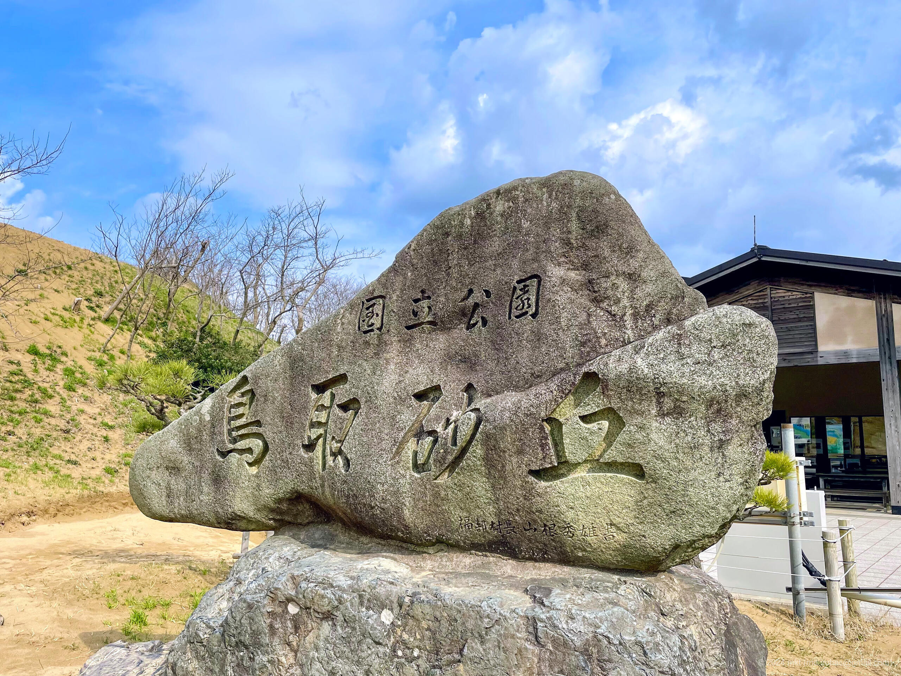
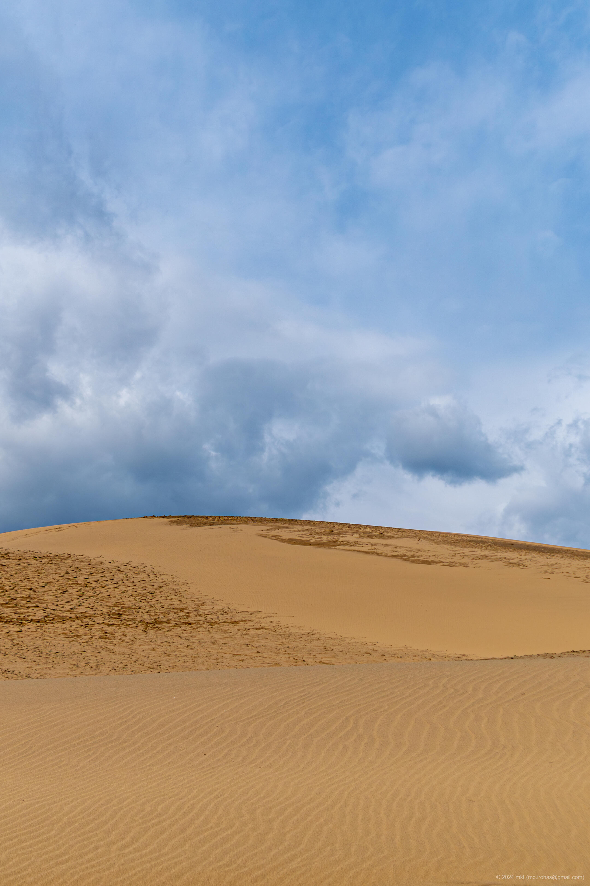

+++
title = '📸 旅の写真: 鳥取砂丘（2024年3月）'
date = '2024-04-18'
categories = ['ブログ（旅の写真）']
tags = ['旅行', '写真', '鳥取県', '砂丘', '空']

isCJKLanguage = true
description = '🏜️ 2024年3月に立ち寄った鳥取砂丘の写真です。'
summary = '📍 鳥取砂丘'

draft = false

# Params
googlePhotoUrl = "https://photos.app.goo.gl/gwzehBM7AaAusUQG7"
googleDriveUrl = "https://drive.google.com/drive/folders/1K9zUdPwhUa8U-_jj5lG94sRQj7N_gU19"
+++

## ストーリー

2024年3月下旬、山陰を旅する途中で、鳥取砂丘に立ち寄りました。



- 鳥取砂丘ビジターセンター: https://www.sakyu-vc.com/jp/

鳥取砂丘は、東西16km、南北2.4kmに広がる日本最大級の海岸砂丘の一つで、国の天然記念物に指定されています。

前日まで日本海側は暴風雪と悪天候だったのですが、
到着後、運よく雲が途切れ、わずかに晴れ間が広がりました。



風がとても冷たい中でしたが、どうにか砂丘を歩き回ることができました。





遠くから砂丘を見たときは案外小さいなと思ったのですが、
実際に足を踏み入れてみると、砂の丘というだけあってかなり大きかったです。





巨大な砂の丘を足を取られながら一歩ずつ歩いた感覚、
砂丘の上から荒れた日本海を眺めた時間は、どこか現実離れした非日常で良かったです。

## ギャラリー





### iPhone 12 mini





### α6500







## マップ

### 鳥取砂丘



### 場所一覧



## 編集履歴

- 2025/09/13: 文章構成、細かな表現を修正。
- 2025/09/04: タグを修正。
- 2025/06/03: 文面を修正。
- 2025/05/24: 文章を修正。ページの構成を変更。
- 2024/04/28: 写真のリンクを修正。
- 2024/04/23: タグの「鳥取」を「鳥取県」に変更。
- 2024/04/21: iPhoneの画像を追加。
- 2024/04/20: カテゴリ、タグを日本語に修正。
- 2024/04/19: 初稿作成。
