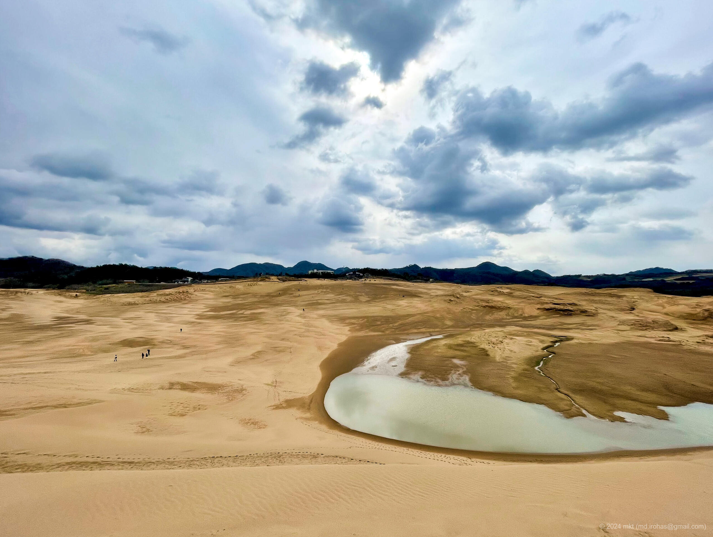
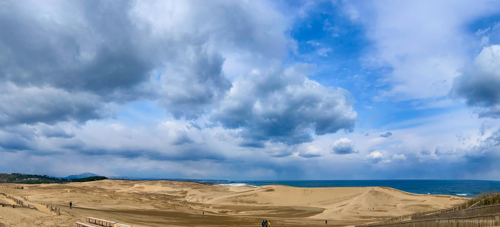
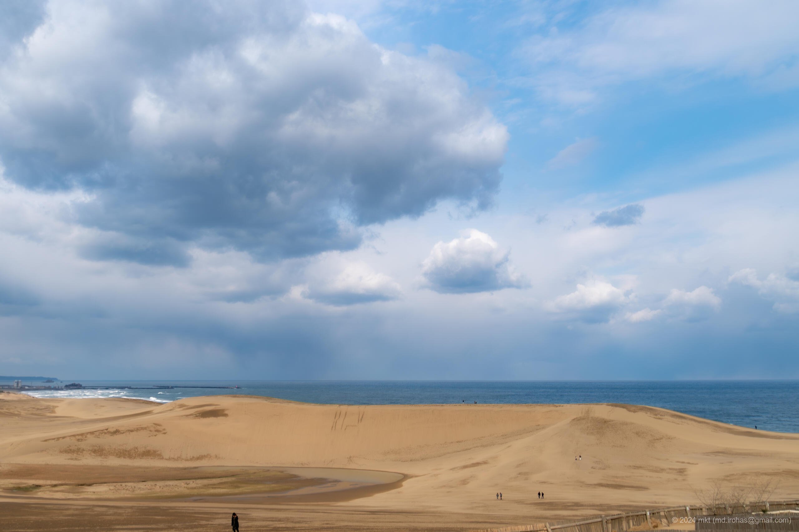

+++
title = '鳥取砂丘（2024年3月）'
date = '2024-04-18'
categories = ['ブログ（旅行写真）']
tags = ['旅行', '写真', '鳥取県', '鳥取砂丘']

isCJKLanguage = true
description = '2024年3月に立ち寄った鳥取砂丘の記事です。'

draft = false

# Params
googlePhotoUrl = "https://photos.app.goo.gl/gwzehBM7AaAusUQG7"
googleDriveUrl = "https://drive.google.com/drive/folders/1K9zUdPwhUa8U-_jj5lG94sRQj7N_gU19?usp=sharing"
+++

## 概要

2024年3月、山陰を旅する途中で、鳥取砂丘に立ち寄りました。

前日まで日本海側は暴風雪に見舞われていましたが、
訪れたときには運よく雲が途切れ、わずかな晴れ間が広がっていました。
冷たい風が吹き抜ける中ではありましたが、無事に砂丘を歩き回ることができました。

遠くから砂丘を眺めたときは「意外と小さいな」と思ったのですが、
実際に足を踏み入れてみると、その印象は大きく覆されました。
目の前に広がる起伏の連なりは、まさに“砂の丘”。
一歩ごとに足を取られる柔らかな地面を踏みしめながら、
傾斜のある坂を登ったり降りたりする体験は想像以上にダイナミックで、
自然が作ったアスレチックのようでした。

カメラを片手に砂丘の中を歩き回っているうちに、気づけば2時間が経過していました。

砂丘の上から荒れた日本海を眺めていたひとときは、どこか現実離れした非日常でした。

## ギャラリー




  
  
  

  
  




## マップ

### 鳥取砂丘



### 場所一覧



## 写真の詳細

### iPhone 12 mini


  
  
  


1. IMG\_2603-2.jpg (  ):  
    鳥取砂丘の入口にある銘板です。  
1. IMG\_2622-2.jpg (  ):  
    「馬の背」と呼ばれる丘から砂丘の入口方向を撮った写真です。
1. IMG\_2606-2.jpg (  ):  
    砂丘の入口で撮ったパノラマ写真です。

### Sony α6500


  
  


1. DSC05202-Enhanced-NR.jpg (  /  ):  
    砂丘の入口から見える「馬の背」と呼ばれる丘を撮影した写真です。
1. DSC05211-Enhanced-NR.jpg (  /  ):  
    風によって砂の上に作られる「風紋」と呼ばれる紋様を撮影した写真です。

## 編集履歴

- 2025/05/24: 文章を修正。ページの構成を変更。
- 2024/04/28: 写真のリンクを修正。
- 2024/04/23: タグの「鳥取」を「鳥取県」に変更。
- 2024/04/21: iPhoneの画像を追加。
- 2024/04/20: カテゴリ、タグを日本語に修正。
- 2024/04/19: 初稿作成。

