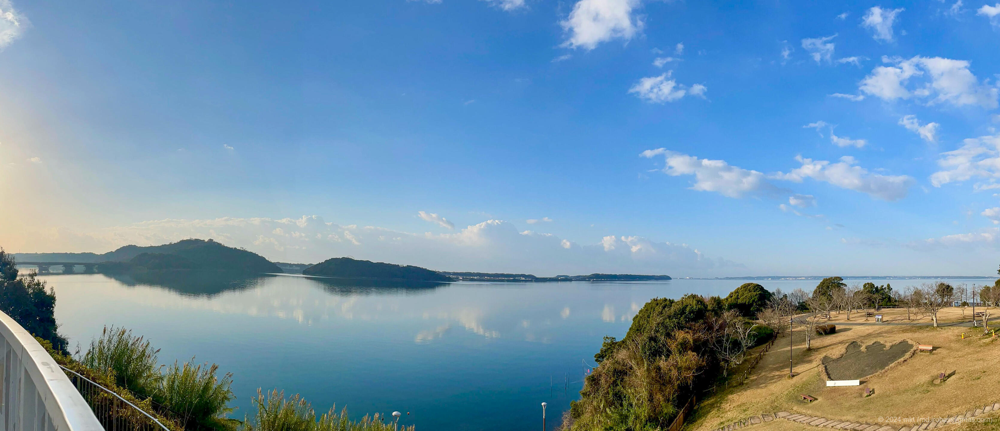
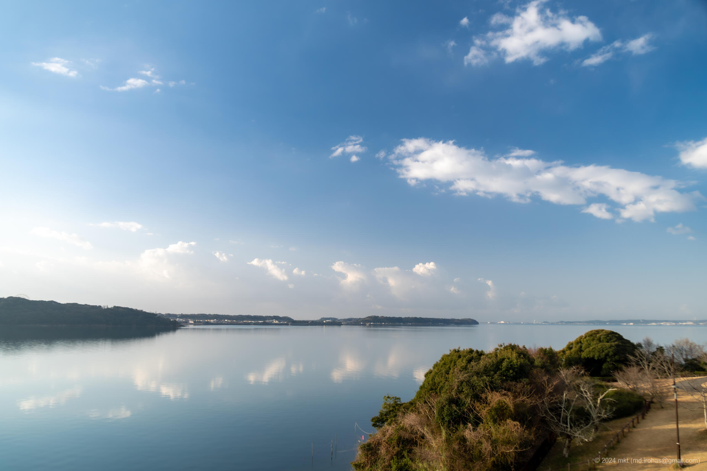

+++
title = 'Trip Photo: Hamana-ko Service Area (March, 2024)'
date = '2024-04-22'
categories = ['Blog (Trip Photo)']
tags = ['Trip', 'Photo', 'Shizuoka', 'Hamana-ko SA']

isCJKLanguage = false
description = 'An article about Hamana-ko service area I dropped in at in March 2024.'

draft = false

# Params
googlePhotoUrl = "https://photos.app.goo.gl/U1Hvs4rkD9wDqKhV7"
googleDriveUrl = "https://drive.google.com/drive/folders/1k5F5J71Ct6AFP_Bn57EcqLTopAeK99JH?usp=sharing"
+++

## Summary

In late March 2024, I dropped in at Hamana-ko (Lake Hamana) service area on my
way to Tottori

At the back of the service area, there was a terrace and a grassy lawn, and
from the terrace, I had a panoramic view of Lake Hamana.

## Photos




  

  




## Map

### Hamana-ko SA



### Sites



## Photo Details

### iPhone 12 mini


  


1. IMG\_2598-2.jpg (  ):  
    A panoramic photo of Hamana-ko taken from the terrace. There is a
    real-scale footprint of Godzilla that appears in
    "[Godzilla Minus One](https://en.wikipedia.org/wiki/Godzilla_Minus_One)".

### Sony α6500


  


1. DSC05185-Enhanced-NR.jpg (  /  ):  
    A photo of Hamana-ko taken from the terrace.

## Change History

- 2025/06/03: Revise sentences.
- 2025/05/25: Modified contents and restructured the article.
- 2024/06/13: Modified some sentences and meta info.
- 2024/04/28: Added a license of photos. Fix links of photos.
- 2024/04/23: First version.

