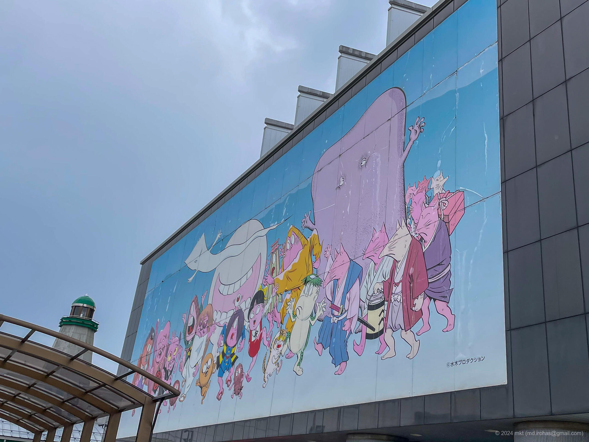
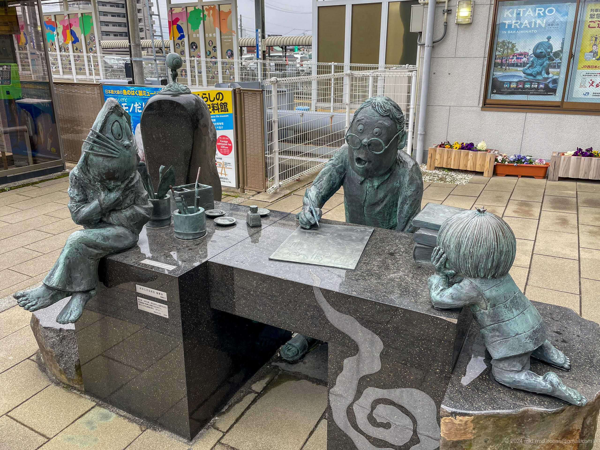
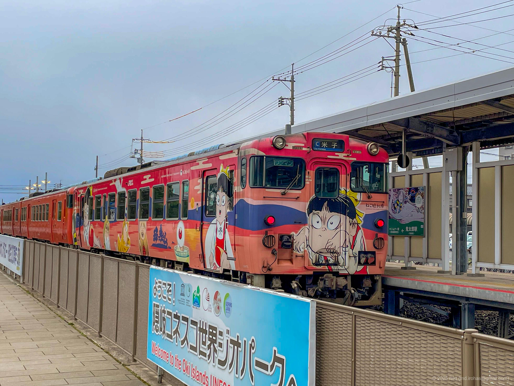
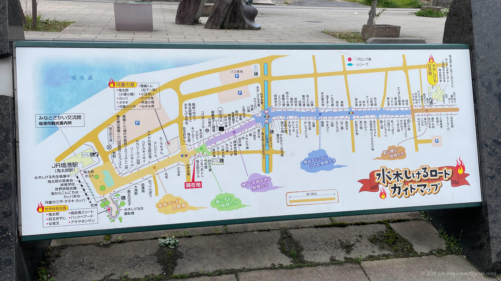
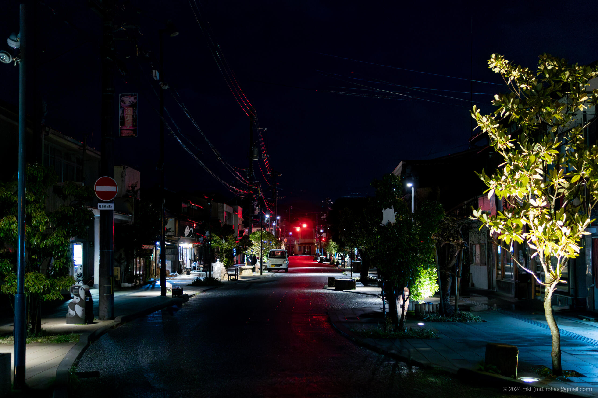
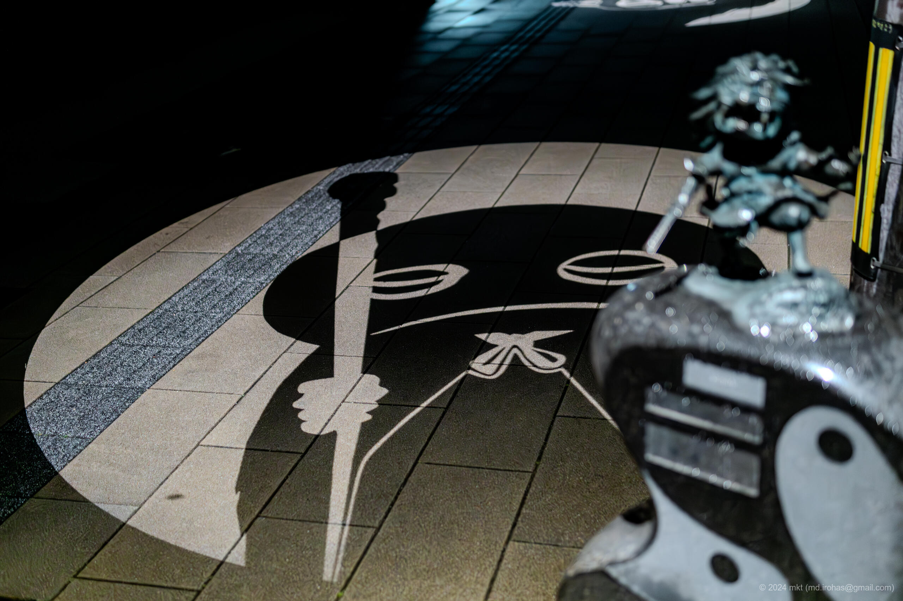
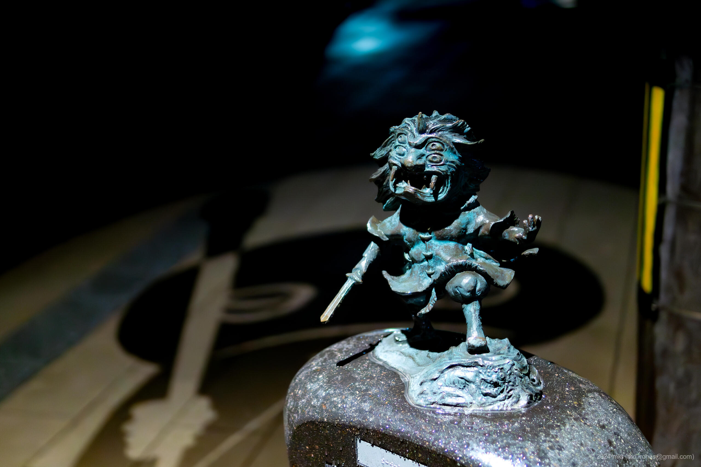
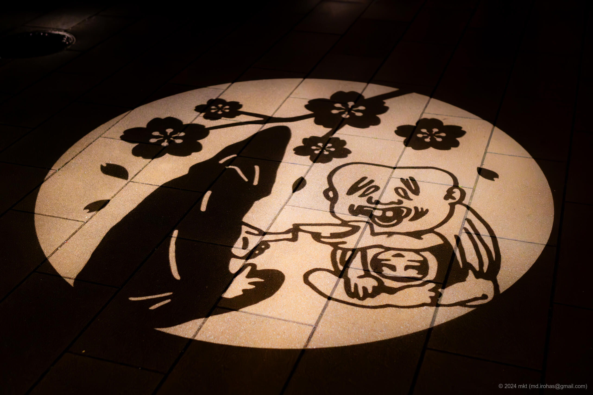
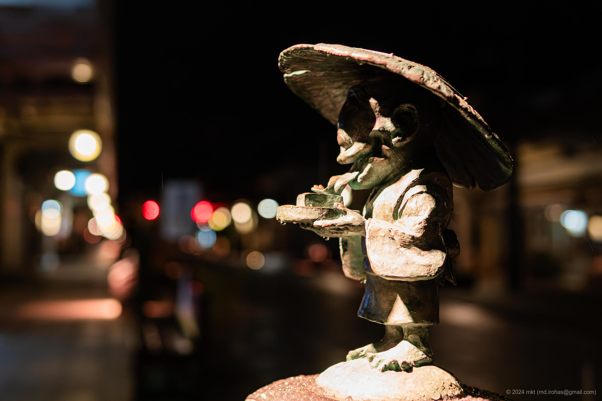
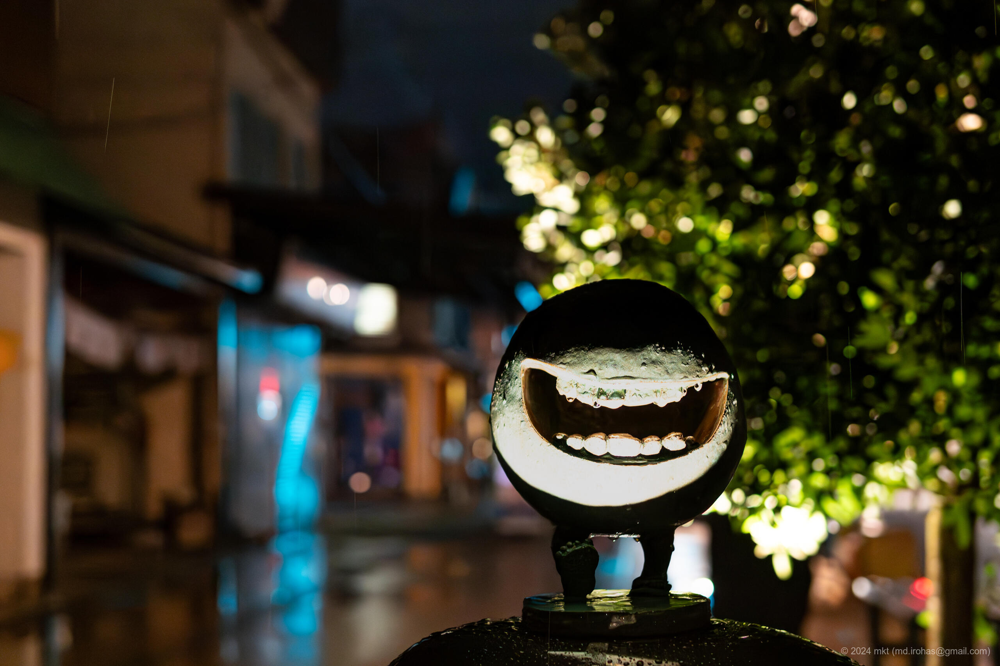

+++
title = 'Mizuki Shigeru Road (March, 2024)'
date = '2024-04-25'
categories = ['Blog (Trip Photo)']
tags = ['Trip', 'Photo', 'Tottori', 'Mizuki Shigeru Road']

isCJKLanguage = false
description = 'An article about sightseeing on Mizuki Shigeru Road in March 2024.'

draft = false

# Params
googlePhotoUrl = 'https://photos.app.goo.gl/LXJRtqDw5qHhQZDZ6'
googleDriveUrl = 'https://drive.google.com/drive/folders/19Fbfx3dihUcgKf4hSbg2zOFSZrVE5hWM?usp=sharing'
+++

## Summary

In March 2024, I visited Mizuki Shigeru Road in Sakaiminato City, Tottori
Prefecture.

Mizuki Shigeru Road is a popular tourist destination that brings to life the
world of manga artist Shigeru Mizuki, best known for GeGeGe no Kitaro. Lining
the street are around 180 bronze statues of
[yokai](https://en.wikipedia.org/wiki/Y%C5%8Dkai) -- Japanese spirits and
monsters -- greeting visitors with their eerie charm.

Unfortunately, the Mizuki Shigeru Memorial Museum was closed on the day I
visited, so I focused on exploring the road itself.

Mizuki Shigeru Road truly comes alive after sunset. The street is bathed in an
otherworldly glow, and the yokai statues take on a completely different
presence -- mysterious, expressive, and just a little haunting in the night.

## Gallery


The copyright of the yokai appearing in the photographs belongs to MIZUKI Productions.





  
  
  
  

  
  
  
  
  
  
  




## Map

### Mizuki Shigeru Road



### Sites



## Photo Details

### iPhone 12 mini


  
  
  
  


1. IMG\_2641.jpg (  ):  
    A photo of the wall of the building next to the Minato-Sakai Station.
1. IMG\_2642.jpg (  ):  
    A photo of the "Shigeru Mizuki Sensei Writing" statue near the Minato-Sakai Station.
1. IMG\_2643.jpg (  ):  
    A photo of a special train that was stopped at the Minato-Sakai Station.
1. IMG\_2685.jpg:  
    A photo of a guide map of the Shigeru Mizuki Road.
    There are said to be 177 bronze statues of yokai.

### Sony α6500


  
  
  
  
  
  
  


Although the area was lit up, it was still quite dark overall, so I used a
bright prime lens.
I didn't take notes of the statue names, so I'll skip the explanations.

1. DSC05279-Enhanced-NR.jpg (  /  )
1. DSC05281-Enhanced-NR.jpg (  /  )
1. DSC05282-Enhanced-NR.jpg (  /  )
1. DSC05297-Enhanced-NR.jpg (  /  )
1. DSC05311-Enhanced-NR.jpg (  /  )
1. DSC05316-Enhanced-NR.jpg (  /  )
1. DSC05337-Enhanced-NR.jpg (  /  )

## Change History

- 2025/05/26: Modified contents and restructured the article.
- 2024/06/28: Modified some sentences and meta info.
- 2024/04/28: Fixed links of photos.
- 2024/04/25: First version.

