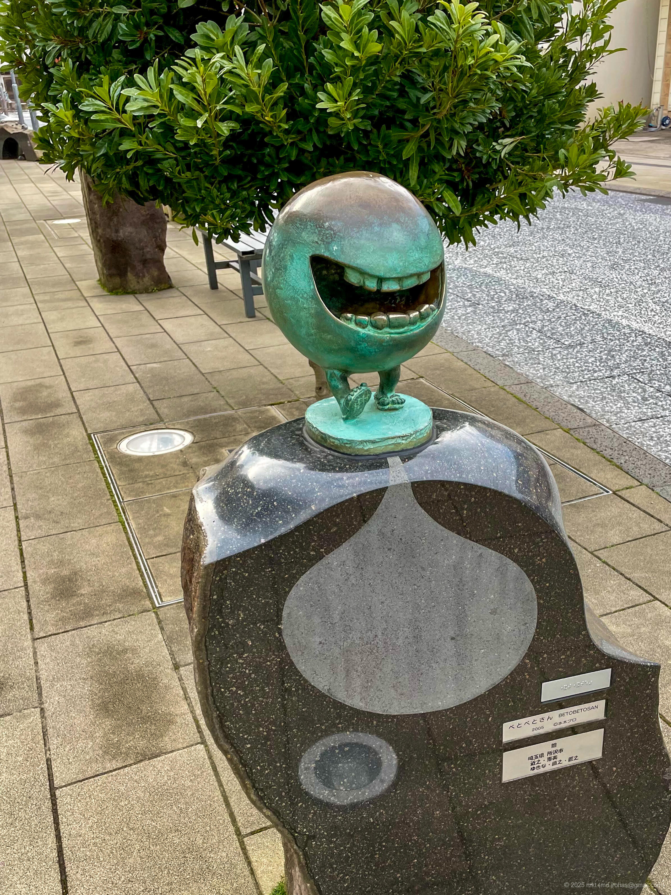

+++
title = 'Trip Photo: Mizuki Shigeru Road (March 2024)'
date = '2024-04-25'
categories = ['Blog (Trip Photo)']
tags = ['Trip', 'Photo', 'Tottori', 'Tourist Area']

isCJKLanguage = false
description = '👻 A blog post about my photos I took at Mizuki Shigeru Road in March 2024.'
summary = '📍 Mizuki Shigeru Road'

draft = false

# Params
googlePhotoUrl = 'https://photos.app.goo.gl/LXJRtqDw5qHhQZDZ6'
googleDriveUrl = 'https://drive.google.com/drive/folders/19Fbfx3dihUcgKf4hSbg2zOFSZrVE5hWM?usp=sharing'
+++

## Story

In late March 2024, I took a walk through Mizuki Shigeru Road in Sakaiminato City, Tottori Prefecture.



- Mizuki Shigeru Road: https://mizuki.sakaiminato.net/road/

Mizuki Shigeru Road is a themed street based on the world of [yokai (Wikipedia)](https://en.wikipedia.org/wiki/Y%C5%8Dkai) (Japanese spirits and monsters) created by manga artist Shigeru Mizuki, best known for "GeGeGe no Kitaro."
Along the route from Sakaiminato Station to the Mizuki Shigeru Museum,
you'll find around 180 bronze statues of yokai characters such as Kitaro, Nezumi Otoko, and Neko Musume.


The copyrights for the yokai characters appearing in the photos belong to Mizuki Productions.


### Mizuki Shigeru Road (Daytime)

Unfortunately, the Mizuki Shigeru Memorial Museum was closed the day I visited,
so I just strolled along the street.

At the starting point, Sakaiminato Station,
there was a huge mural and a decorated train parked outside.





Along the road to the museum, the street is packed with yokai statues.









### Mizuki Shigeru Road (Nighttime)

If you visit during the day, I highly recommend coming back after sunset for another walk.



At night, the street transforms -- the area is otherworldly lit up and the yokai statues take on a whole new mysterious presence in the darkness.













The lights stay on from sunset until 10 PM.
Even though the area is illuminated, it's still quite dark,
so I recommend using a bright lens if you're planning to take photos.

Also, the hotel next to Sakaiminato Station is a reasonably priced Japanese-style hotel,
and the top floor has a hot spring bath -- perfect for a relaxing night after exploring.

## Gallery





### iPhone 12 mini





### α6500







## Map

### Mizuki Shigeru Road



### Sites



## Change History

- 2025/09/13: Fix sentence structure and minor wording issues. Add new photos.
- 2025/09/04: Reorganize tags.
- 2025/06/04: Revise sentences.
- 2025/05/26: Modified contents and restructured the article.
- 2024/06/28: Modified some sentences and meta info.
- 2024/04/28: Fixed links of photos.
- 2024/04/25: First version.
