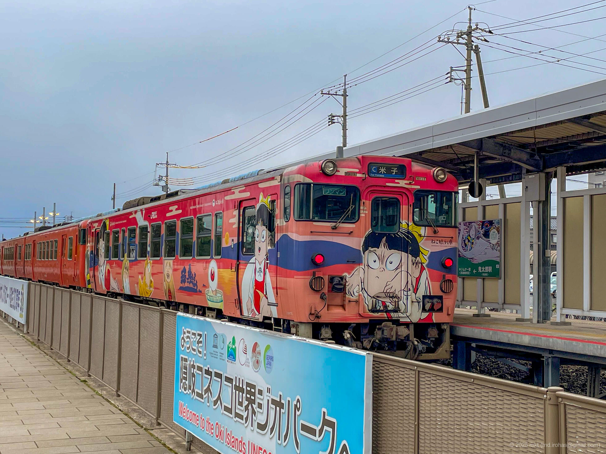
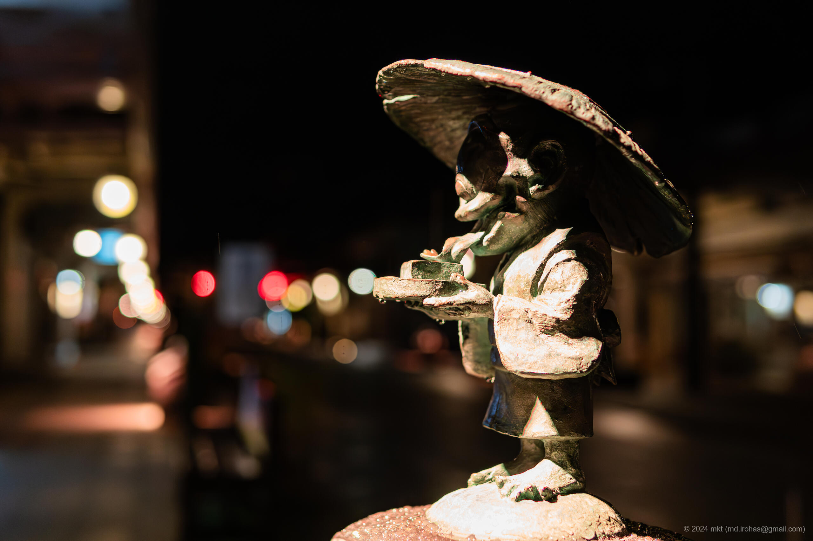

+++
title = '水木しげるロード（2024年3月）'
date = '2024-04-25'
categories = ['ブログ（旅行写真）']
tags = ['旅行', '写真', '鳥取県', '水木しげるロード']

isCJKLanguage = true
description = '2024年3月に観光した水木しげるロードの記事です。'

draft = false

# Params
googlePhotoUrl = 'https://photos.app.goo.gl/LXJRtqDw5qHhQZDZ6'
googleDriveUrl = 'https://drive.google.com/drive/folders/19Fbfx3dihUcgKf4hSbg2zOFSZrVE5hWM?usp=sharing'
+++

## 概要

2024年3月、鳥取県境港市にある「水木しげるロード」を訪れました。

水木しげるロードは、『ゲゲゲの鬼太郎』などで知られる漫画家・水木しげる氏の世界観を再現した観光スポットで、
鬼太郎やねずみ男、ねこ娘など、約180体の妖怪たちのブロンズ像が立ち並び、訪れる人々を出迎えてくれます。
私が訪れた日はあいにく水木しげる記念館が休館だったため、水木しげるロードを中心に散策しました。

水木しげるロードは日没後が必見です。
道の周囲がライトアップされ、夜闇に浮かび上がる妖怪たちは、昼とは全く異なる雰囲気を持った独特の表情を見せてくれました。

## ギャラリー


写真に写り込んでいる妖怪たちの著作権は水木プロが保有します。





  
  
  
  

  
  
  
  
  
  
  




## マップ

### 水木しげるロード



### 場所の一覧



## 写真の詳細

### iPhone 12 mini


  
  
  
  


1. IMG\_2641.jpg (  ):  
    港堺駅横の建物の壁の写真です。
1. IMG\_2642.jpg (  ):  
    港堺駅付近にある「水木しげる先生 執筆中」の像の写真です。
1. IMG\_2643.jpg (  ):  
    港堺駅に停車していたラッピング車両の写真です。
1. IMG\_2685.jpg:  
    水木しげるロードのガイドマップです。
    妖怪のブロンズ像は177体あるそうです。

### Sony α6500  


  
  
  
  
  
  
  


ライトアップされているとはいえ周囲がとても暗かったので、単焦点の明るいレンズを使用しました。
作品名をメモしてなかったので、説明は省略します。

1. DSC05279-Enhanced-NR.jpg (  /  )
1. DSC05281-Enhanced-NR.jpg (  /  )
1. DSC05282-Enhanced-NR.jpg (  /  )
1. DSC05297-Enhanced-NR.jpg (  /  )
1. DSC05311-Enhanced-NR.jpg (  /  )
1. DSC05316-Enhanced-NR.jpg (  /  )
1. DSC05337-Enhanced-NR.jpg (  /  )

## 編集履歴

- 2025/05/26: 文章を修正。ページの構成を変更。
- 2024/06/28: 一部表現、メタ情報を修正。
- 2024/04/28: 写真のライセンスを追記。写真のリンクを修正。
- 2024/04/25: 初稿作成。

