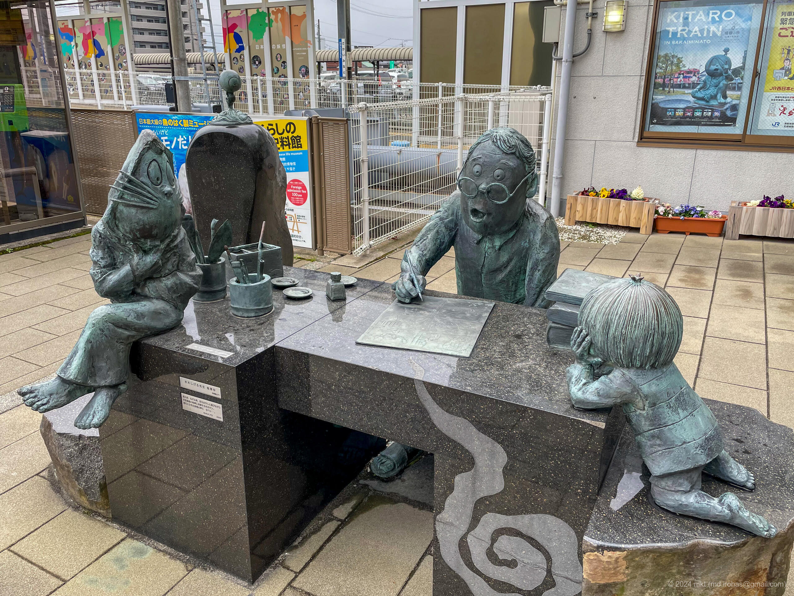
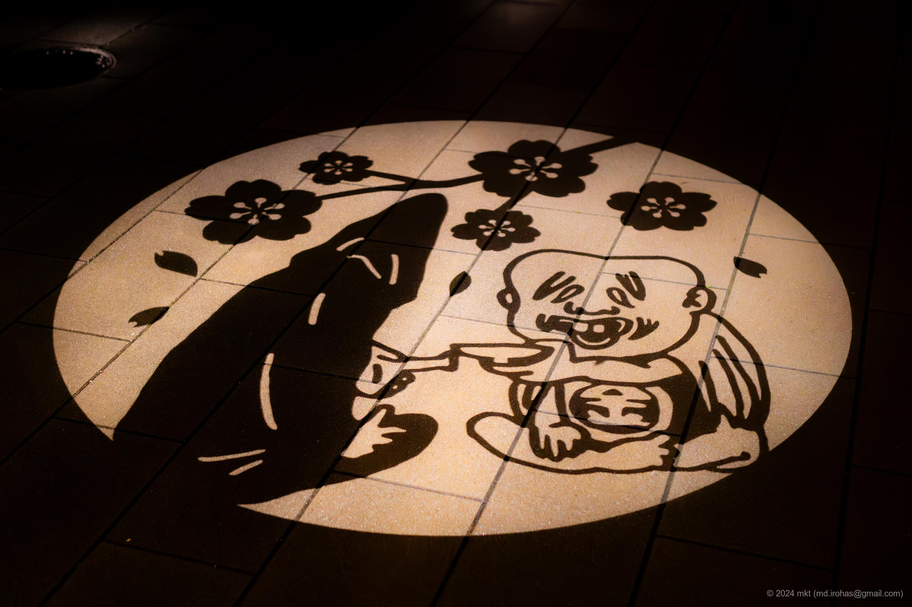
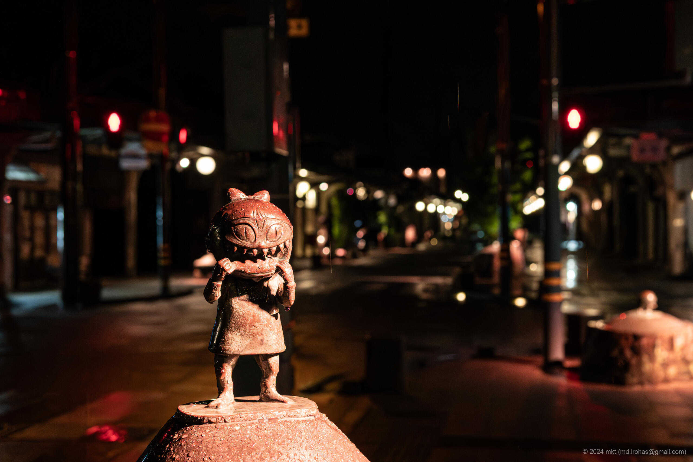

+++
title = '旅の写真: 水木しげるロード（2024年3月）'
date = '2024-04-25'
categories = ['ブログ（旅の写真）']
tags = ['旅行', '写真', '鳥取県', '観光エリア']

isCJKLanguage = true
description = '👻 2024年3月に観光した水木しげるロードの写真です。'
summary = '📍 水木しげるロード'

draft = false

# Params
googlePhotoUrl = 'https://photos.app.goo.gl/LXJRtqDw5qHhQZDZ6'
googleDriveUrl = 'https://drive.google.com/drive/folders/19Fbfx3dihUcgKf4hSbg2zOFSZrVE5hWM'
+++

## ストーリー

2024年3月下旬、鳥取県境港市の「水木しげるロード」を散策しました。



- 水木しげるロード: https://mizuki.sakaiminato.net/road/

水木しげるロードは、『ゲゲゲの鬼太郎』などで知られる漫画家・[水木しげる氏（Wikipedia）](https://ja.wikipedia.org/wiki/%E6%B0%B4%E6%9C%A8%E3%81%97%E3%81%92%E3%82%8B) の妖怪の世界観をテーマにした観光道路で、境港駅から水木しげる記念館までの間に、鬼太郎やねずみ男、ねこ娘など、約180体の妖怪たちのブロンズ像が立ち並んでいます。


写真に写り込んでいる妖怪たちの著作権は水木プロが保有します。


### 水木しげるロード（昼の部）

私が訪れた日はあいにく水木しげる記念館が休館だったため、水木しげるロードを散策しました。

始点の境港駅には大きな壁画があり、ラッピング電車も停車していました。





水木しげる記念館までの水木しげるロードには、ところ狭しと妖怪の像が並んでいました。









### 水木しげるロード（夜の部）

水木しげるロードは昼間に散策したら、ぜひ日没後にもう一度散策しましょう。



夜は一転、道の周囲がライトアップされ、
夜闇に浮かび上がる妖怪たちは、昼間とは全く異なる闇の表情をみせてくれます。













ライトアップは日没後から22時までとのことです。
ライトアップされているとはいえ周囲は暗いので、撮影の際は明るいレンズがおすすめです。

また、境港駅隣のホテルは価格も手頃な和風のホテルで、最上階には温泉もあり、夜の散策にはぴったりでした。

## ギャラリー





### iPhone 12 mini





### α6500







## マップ

### 水木しげるロード



### 場所一覧



## 編集履歴

- 2025/09/13: 文章構成、細かな表現を修正。写真を追加。
- 2025/09/04: タグを修正。
- 2025/06/04: 文面を修正。
- 2025/05/26: 文章を修正。ページの構成を変更。
- 2024/06/28: 一部表現、メタ情報を修正。
- 2024/04/28: 写真のライセンスを追記。写真のリンクを修正。
- 2024/04/25: 初稿作成。
