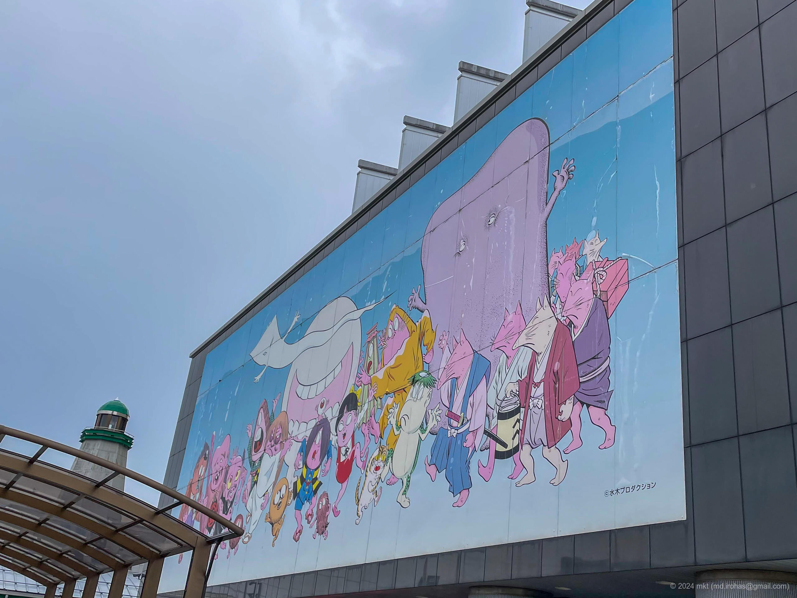
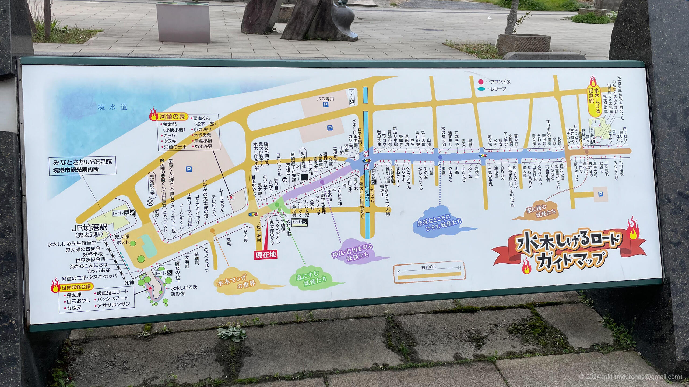
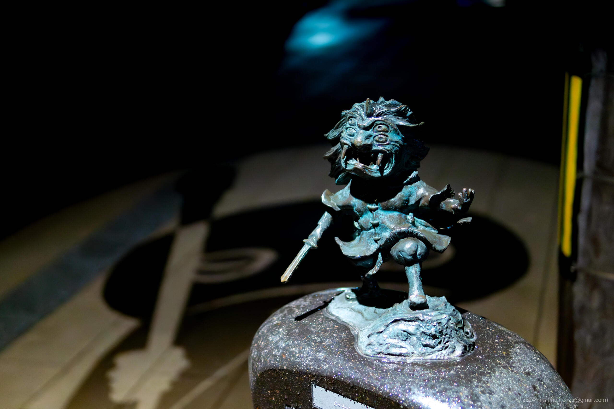

+++
title = '水木しげるロード（2024年3月）'
date = 2024-04-25T17:02:38+09:00
summary = '2024年3月に観光した水木しげるロードの記事です。'
categories = ['ブログ（旅行）']
tags = ['旅行', '写真', '鳥取県', '水木しげるロード']

description = '2024年3月に観光した水木しげるロードの記事です。'

draft = false
isCJKLanguage = true
+++

3月下旬に鳥取県境港市にある [水木しげるロード（Wikipedia）](https://ja.wikipedia.org/wiki/%E6%B0%B4%E6%9C%A8%E3%81%97%E3%81%92%E3%82%8B%E3%83%AD%E3%83%BC%E3%83%89) を訪れました。

水木しげるロードは、『ゲゲゲの鬼太郎』などで知られる漫画家・水木しげる氏が描く妖怪の世界観をテーマにした記念道路で、鬼太郎をはじめとした妖怪たちのブロンズ像などが展示されています。

私が訪れたとき、水木しげる記念館はあいにく休館中だったため、水木しげるロードの妖怪の像を中心に見て回りました。
昼の散策も十分に楽しめたのですが、ライトアップされた夜の水木しげるロードは、妖怪の世界観とも相まって独特の雰囲気がありました。

## 写真


  
  
  
  



  
  
  
  
  
  
  


- iPhone 12 mini
    1. IMG\_2641.jpg (Google Drive: [JPG](https://drive.google.com/file/d/1PvcxTm7Fxf8hdYekzNgH4AwJjqJ5Nn9P/view)):  
       港堺駅横の建物の壁の写真です。
    1. IMG\_2642.jpg (Google Drive: [JPG](https://drive.google.com/file/d/1ZDrZ0WtA9S2iYa5yMqJKwyeS-Ow2DLPl/view)):  
       港堺駅付近にある「水木しげる先生 執筆中」の像の写真です。
    1. IMG\_2643.jpg (Google Drive: [JPG](https://drive.google.com/file/d/19ofOuepoGBIkQLpqa70ddkPN1o1xQSq0/view)):  
       港堺駅に停車していたラッピング車両の写真です。
    1. IMG\_2685.jpg:  
       水木しげるロードのガイドマップです。
       妖怪のブロンズ像は177体あるそうです。
- Sony α6500  
  夜の水木しげるロードの写真です。
  暗かったので、単焦点の明るいレンズを使いました。
  作品名をメモしてなかったので、説明は省略します。
    1. DSC05279-Enhanced-NR.jpg (Google Drive: [JPG](https://drive.google.com/file/d/1yBAdXle0ciN1U-AbrtMLYC0Z7ReKnyEe/view) / [RAW (ARW)](https://drive.google.com/file/d/1kiaHtx1p8hmOHLx5WqWhDI-qErGvnggv/view))
    1. DSC05281-Enhanced-NR.jpg (Google Drive: [JPG](https://drive.google.com/file/d/1QzPo9u4tfhDjXtzrIj1UMw4yF_iWEuL0/view) / [RAW (ARW)](https://drive.google.com/file/d/11h9QBPIWA_enaqKktB46ppkf9Y5pBHH9/view))
    1. DSC05282-Enhanced-NR.jpg (Google Drive: [JPG](https://drive.google.com/file/d/1i-vB2cq3-6N5-4N2Nwv3M_fkk6kgn2MP/view) / [RAW (ARW)](https://drive.google.com/file/d/1gRmOY6cMgcmC9h-eoGsSQRZw6I-of5Xy/view))
    1. DSC05297-Enhanced-NR.jpg (Google Drive: [JPG](https://drive.google.com/file/d/1Nt1CDZNvG0j1dGaMTrrfcpuv3JhY92Yc/view) / [RAW (ARW)](https://drive.google.com/file/d/1Aiz6F0WNPRkfxS_18AGtdhle6jpU-Nua/view))
    1. DSC05311-Enhanced-NR.jpg (Google Drive: [JPG](https://drive.google.com/file/d/1m5fdoJ70qDlC2BFd6m4BVLWsXHqcFZTL/view) / [RAW (ARW)](https://drive.google.com/file/d/1E9fL5cw2tnPn5IBifhvNDdpA_QtWpJ_Q/view))
    1. DSC05316-Enhanced-NR.jpg (Google Drive: [JPG](https://drive.google.com/file/d/1M2qXa4iHWwGJDxjBQboblW7iSO87SNr3/view) / [RAW (ARW)](https://drive.google.com/file/d/1d-nihWGEvnxIPaqLljY3Vsg0ZA2rXb12/view))
    1. DSC05337-Enhanced-NR.jpg (Google Drive: [JPG](https://drive.google.com/file/d/1pS84fMhAUGvUepLfAMLWz53iFkZVCZyO/view) / [RAW (ARW)](https://drive.google.com/file/d/1KIaVNSF5H_Y6PmtgN4f_SACR-SOQQSju/view))

{}

## マップ

<iframe src="https://www.google.com/maps/embed?pb=!1m18!1m12!1m3!1d3246.3502335926387!2d133.22124177651676!3d35.545051537441516!2m3!1f0!2f0!3f0!3m2!1i1024!2i768!4f13.1!3m3!1m2!1s0x355655b2bc947ee5%3A0xc9cde9852f230188!2sMizuki%20Shigeru%20Road!5e0!3m2!1sen!2sjp!4v1714035631703!5m2!1sen!2sjp" width="600" height="450" style="border:0;" allowfullscreen="" loading="lazy" referrerpolicy="no-referrer-when-downgrade"></iframe>

## 編集履歴

- 2024/06/28: 一部表現、メタ情報を修正。
- 2024/04/28: 写真のライセンスを追記。写真のリンクを修正。
- 2024/04/25: 初稿作成。

