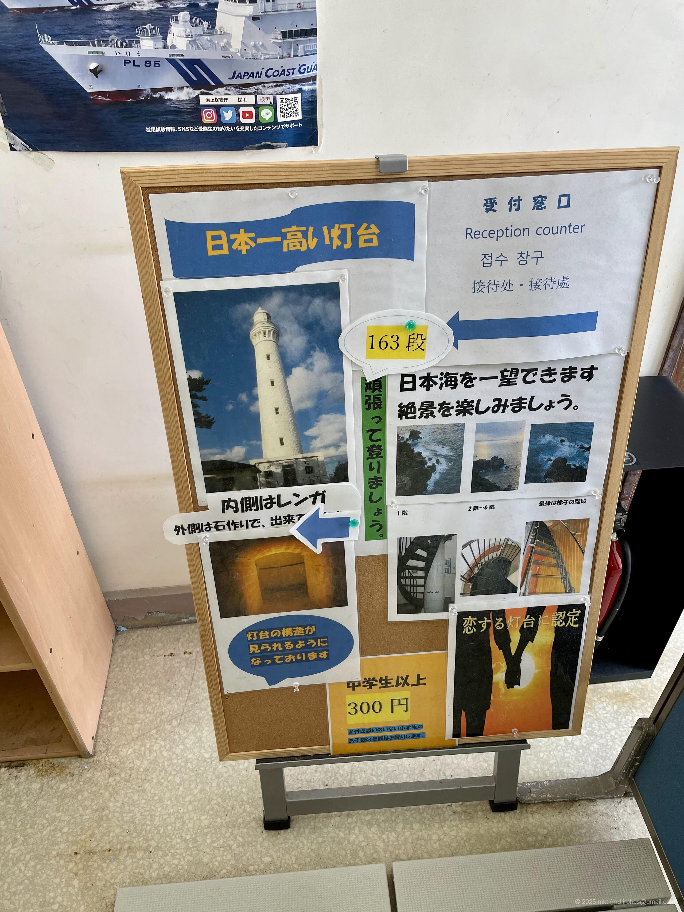
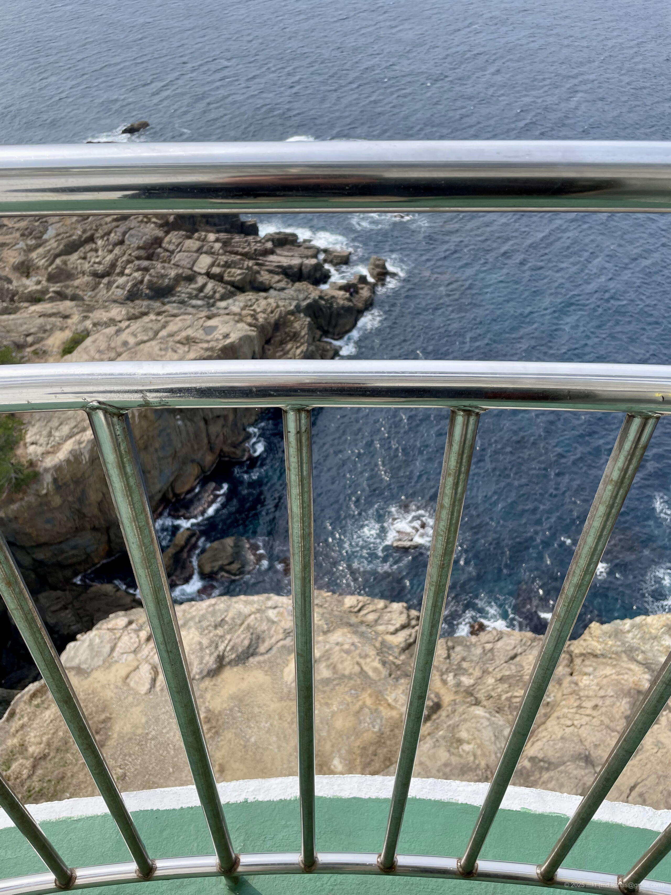
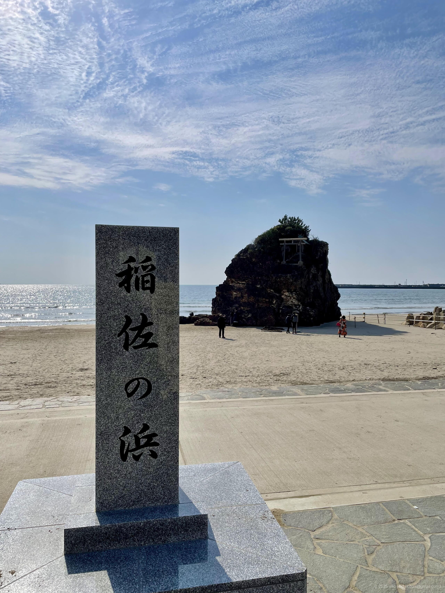
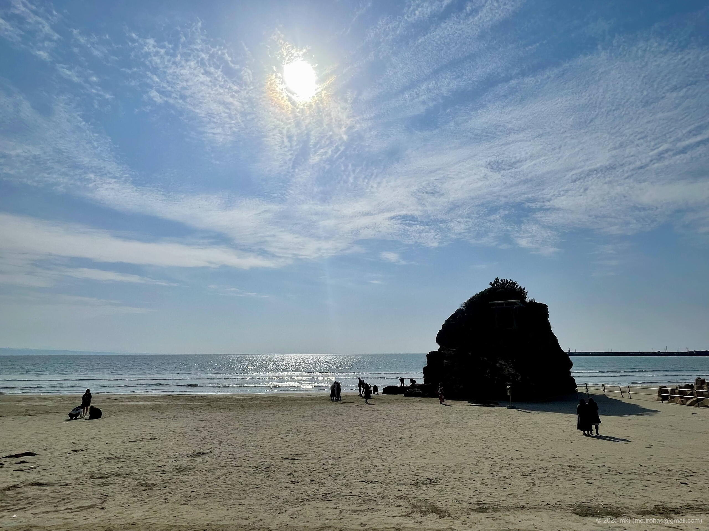

+++
title = '📸 Trip Photo: Izumo Hinomisaki Lighthouse (March 2024)'
date = '2024-04-27'
categories = ['Blog (Trip Photo)']
tags = ['Trip', 'Photo', 'Shimane', 'Sea', 'Sky', 'Lighthouse']

isCJKLanguage = false
description = '🌊 A blog post about my photos I took at Izumo Hinomisaki Lighthouse I visited in March 2024.'
summary = '📍 Izumo Hinomisaki Lighthouse, Inasa Beach'

draft = false

# Params
googlePhotoUrl = 'https://photos.app.goo.gl/oji8LpDpuSDpVTpX8'
googleDriveUrl = 'https://drive.google.com/drive/folders/1LrCXln1u4rltAc9Yuk3ARJ8GjVJlFnXo'
+++

## Story

In late March 2024, I visited the Hinomisaki Lighthouse in Izumo, Shimane Prefecture.



Hinomisaki Lighthouse is a white, Western-style stone lighthouse built in 1903 (Meiji 36).
Standing 43.65 meters tall from the ground and 63.3 meters above sea level,
it's said to be the tallest stone lighthouse in Japan.







As of March 2024, the inside of the lighthouse was open to the public, and I
was able to go in for 300 yen.



There were 163 steep spiral steps inside -- and near the top, it pretty much turned into a ladder.





I climbed all the way up, and from the observation deck, I got a stunning view
of the Sea of Japan.





It was incredibly windy the day I visited, and I honestly got so
nervous that I couldn't bring myself to walk around the deck...



After that, we went to Inasa Beach, which is a little further away.







## Gallery

{}



### iPhone 12 mini





### α6500







## Map

### Izumo Hinomisaki Lighthouse



### Inasa Beach



### Sites



## Change History

- 2025/09/13: Fix sentence structure and minor wording issues. Add new photos.
- 2025/09/04: Reorganize tags.
- 2025/06/04: Revise sentences.
- 2025/05/26: Restructured the article.
- 2024/06/28: Modified some sentences and meta info. Added a map.
- 2024/04/28: First version.
