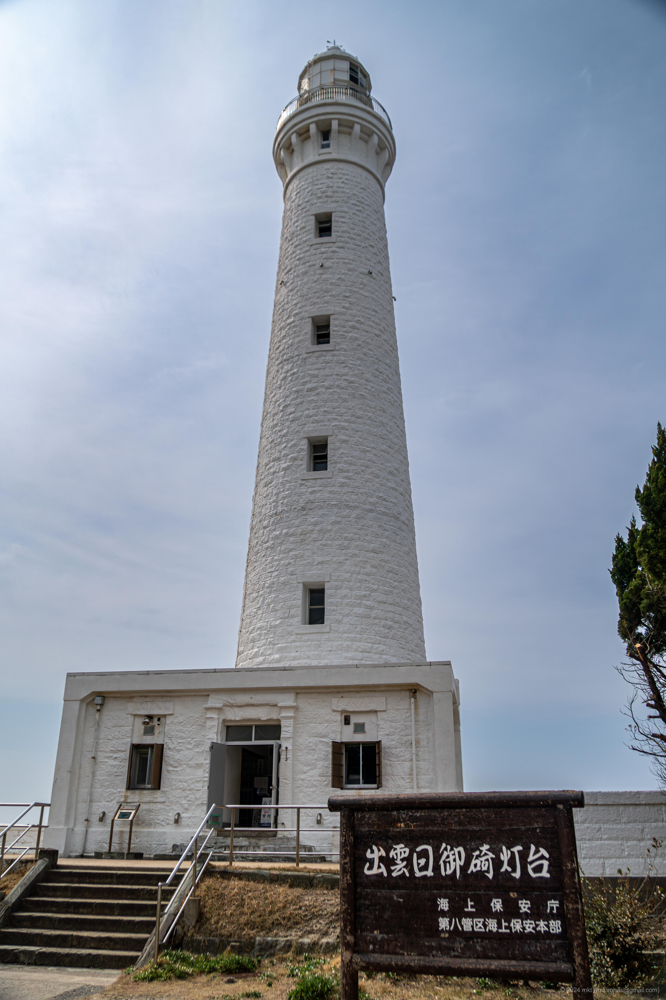
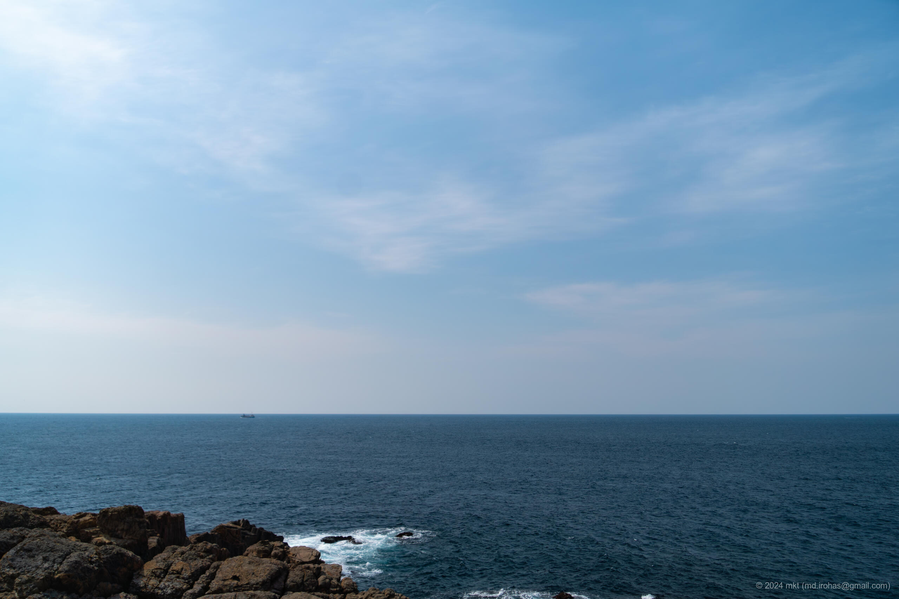
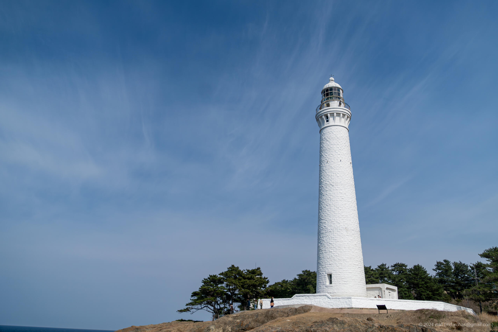

+++
title = 'Izumo Hinomisaki Lighthouse (March, 2024)'
date = 2024-04-27T18:56:59+09:00
summary = 'This is an article about Izumo Hinomisaki Lighthouse I visited in March 2024.'
categories = ['Blog (Trip)']
tags = ['Photo', 'Trip', 'Shimane', 'Izumo Hinomisaki Lighthouse']

description = 'This is an article about Izumo Hinomisaki Lighthouse I visited in March 2024.'

draft = false
isCJKLanguage = false
+++

I visited the Izumo Hinomisaki Lighthouse in Shimane Prefecture in late March.

The lighthouse, established in 1903, is a white stone Western-style lighthouse. In 2022, it was designated as an important cultural property of Japan.
The height from the ground is 43.65 meters (47.7 yards) and the height from the sea level is 63.3 meters (69.2 yards), making it the tallest stone lighthouse in Japan.

As of March 2024, the interior of the lighthouse is open to the public, and visitors can tour it for 300 yen per adult.
Inside the lighthouse, there are steep spiral staircases with 163 steps, and after climbing them, you can enjoy a panoramic view of the Sea of Japan from the observation deck.

## Photos


  
  
  


 


  
  
  
  
  


- iPhone 12 mini
    1. IMG\_2759.jpg (Google Drive: [JPG](https://drive.google.com/file/d/1kIfnd17z-peqgBKcB3ZmS2uDILFjltof/view)):  
       A photo of spiral staircases inside the lighthouse.
    1. IMG\_2743.jpg (Google Drive: [JPG](https://drive.google.com/file/d/160gUe9dVpQxTrVxVEULxJfiz9D8CgkVs/view)):  
       A photo of a staircase after climbing the spiral staircases.
    1. IMG\_2744.jpg (Google Drive: [JPG](https://drive.google.com/file/d/11mXjQvwsBV_AUSVzLvVJ1zyhKelzp2hI/view)):  
       A panoramic photo of the Sea of Japan and the lighthouse.
- Sony α6500
    1. DSC05387-Enhanced-NR.jpg (Google Drive: [JPG](https://drive.google.com/file/d/1N6sQNE0qw9ffxeXgNlRal611mBEugCCk/view) / [RAW (ARW)](https://drive.google.com/file/d/11JrfLe-PzlVIzR87Fv03wwx2z6BJ4lk7/view)):  
       A photo of the entrance of the lighthouse.
    1. DSC05394-Enhanced-NR.jpg (Google Drive: [JPG](https://drive.google.com/file/d/1cCCpvK6PxEQ3Zc8bm1CKt3InUUBSFdPP/view) / [RAW (ARW)](https://drive.google.com/file/d/1Scbt7GQyOyEAFgCu_DCAOi936Njdu9AS/view)):  
       A photo taken from the observation deck of the lighthouse.
    1. DSC05396-Enhanced-NR.jpg (Google Drive: [JPG](https://drive.google.com/file/d/1uL02DDq1VU8VtFCOWvPb5feS9LWObsEj/view) / [RAW (ARW)](https://drive.google.com/file/d/1O0JNILxR-MCT1t_sB3L8YT-jTCQrEtn4/view)):  
       A photo taken from the observation deck of the lighthouse.
    1. DSC05397-Enhanced-NR.jpg (Google Drive: [JPG](https://drive.google.com/file/d/14Vnl-35yn8zq79QgQMCfDVZqnFK4pmrM/view) / [RAW (ARW)](https://drive.google.com/file/d/1EvZ7jd040CxFjxDrMMmbcz7YO8SVONnj/view)):  
       A photo of the lighthouse.
    1. DSC05418-Enhanced-NR.jpg (Google Drive: [JPG](https://drive.google.com/file/d/15z0DSHX25Jaf_ewU41fNNjLdDeWCyyMY/view) / [RAW (ARW)](https://drive.google.com/file/d/1FKTaqWw9pBkFV12RaSs5OhPQPPucRJIH/view)):  
       A photo of the coast of Inasa Beach, which is a little far from the lighthouse.

{}

## Map

### Izumo Hinomisaki Lighthouse

<iframe src="https://www.google.com/maps/embed?pb=!1m18!1m12!1m3!1d3250.8489298314094!2d132.62674227651354!3d35.433772143526745!2m3!1f0!2f0!3f0!3m2!1i1024!2i768!4f13.1!3m3!1m2!1s0x35575c209d62fdcb%3A0xff48b1cb937150be!2sIzumo%20Hinomisaki%20Lighthouse!5e0!3m2!1sen!2sjp!4v1714212125062!5m2!1sen!2sjp" width="600" height="450" style="border:0;" allowfullscreen="" loading="lazy" referrerpolicy="no-referrer-when-downgrade"></iframe>

### Inasa Beach

<iframe src="https://www.google.com/maps/embed?pb=!1m18!1m12!1m3!1d3252.198245090809!2d132.66979197651233!3d35.400336345352024!2m3!1f0!2f0!3f0!3m2!1i1024!2i768!4f13.1!3m3!1m2!1s0x35575c865ebd4133%3A0x6746cc333009b799!2sInasa%20Beach!5e0!3m2!1sen!2sjp!4v1719506607774!5m2!1sen!2sjp" width="600" height="450" style="border:0;" allowfullscreen="" loading="lazy" referrerpolicy="no-referrer-when-downgrade"></iframe>

## Change History

- 2024/06/28: Modified some sentences and meta info. Added a map.
- 2024/04/28: First version.

