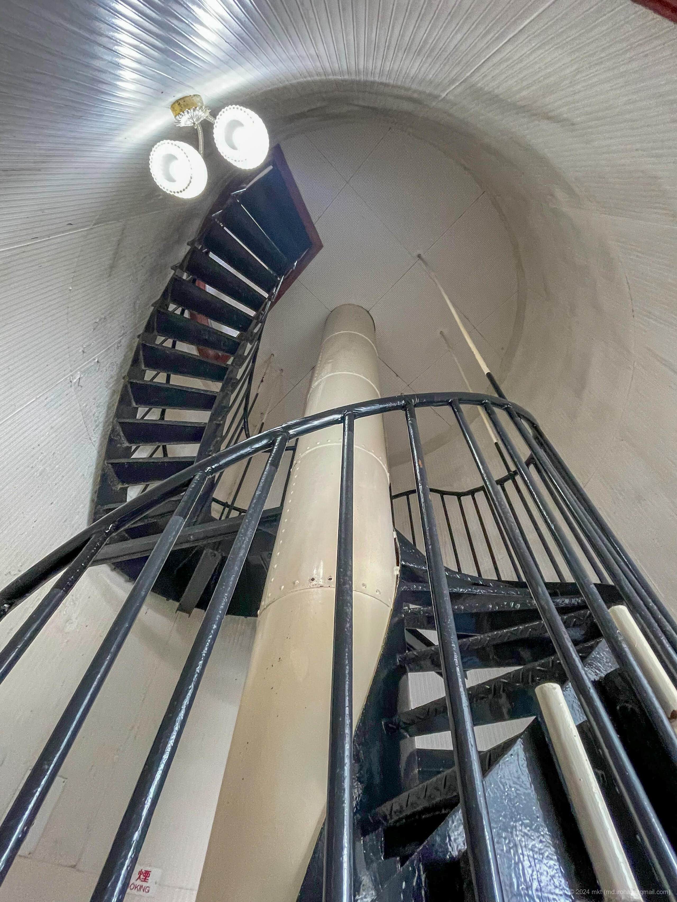
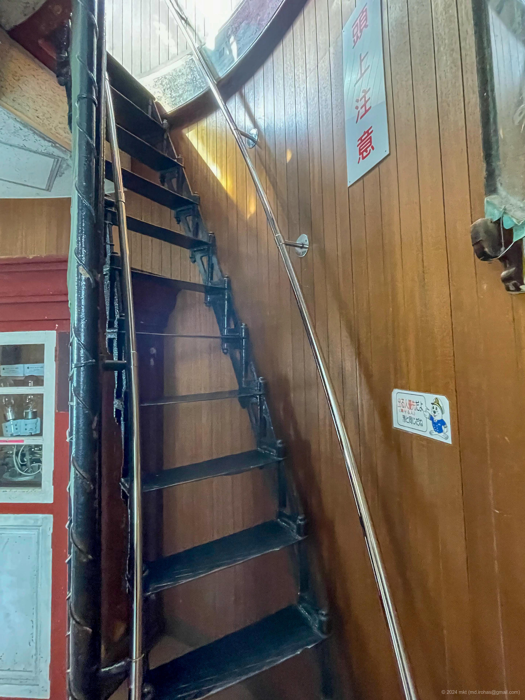
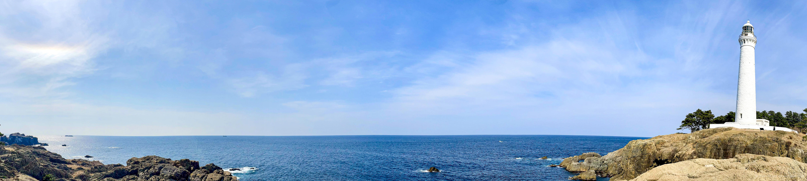
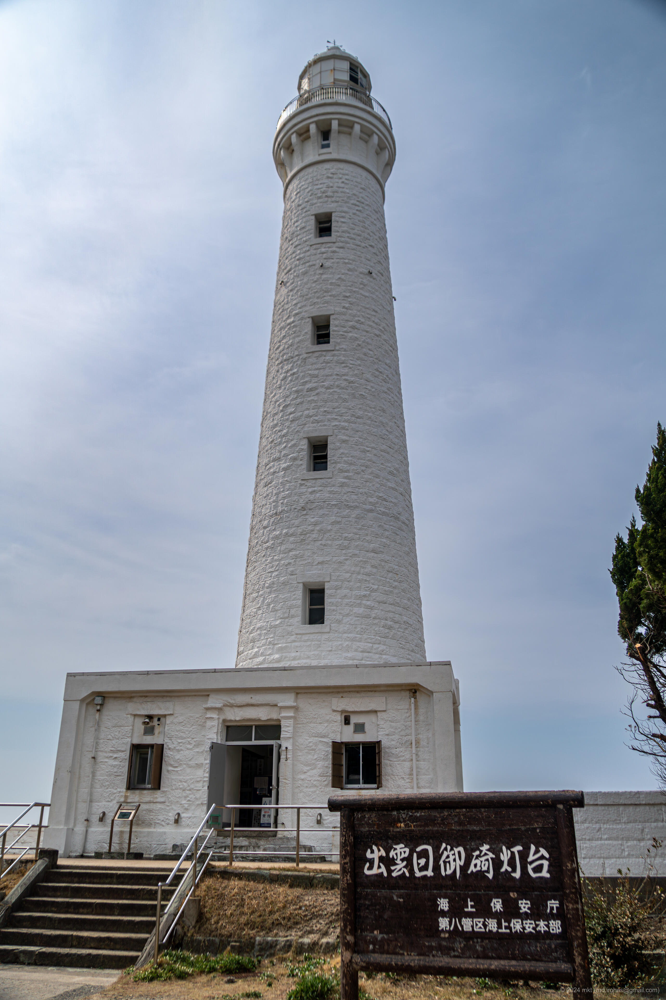
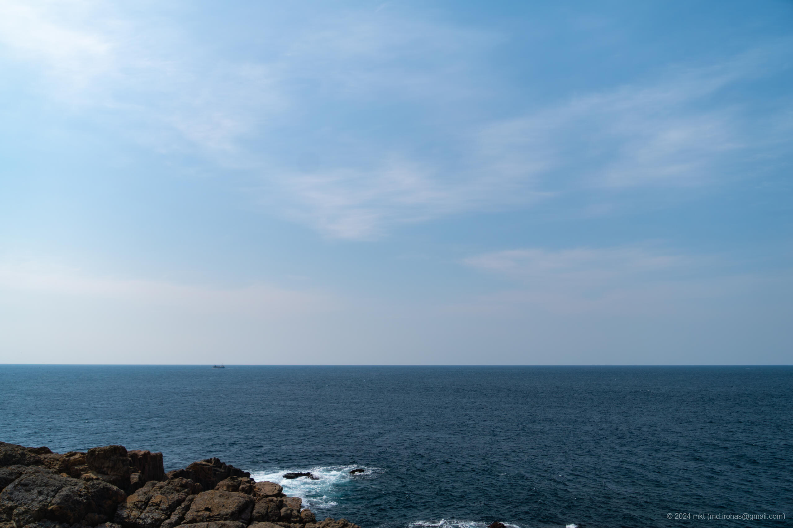
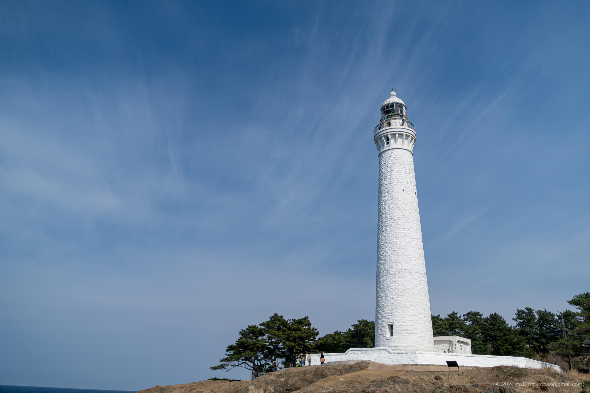
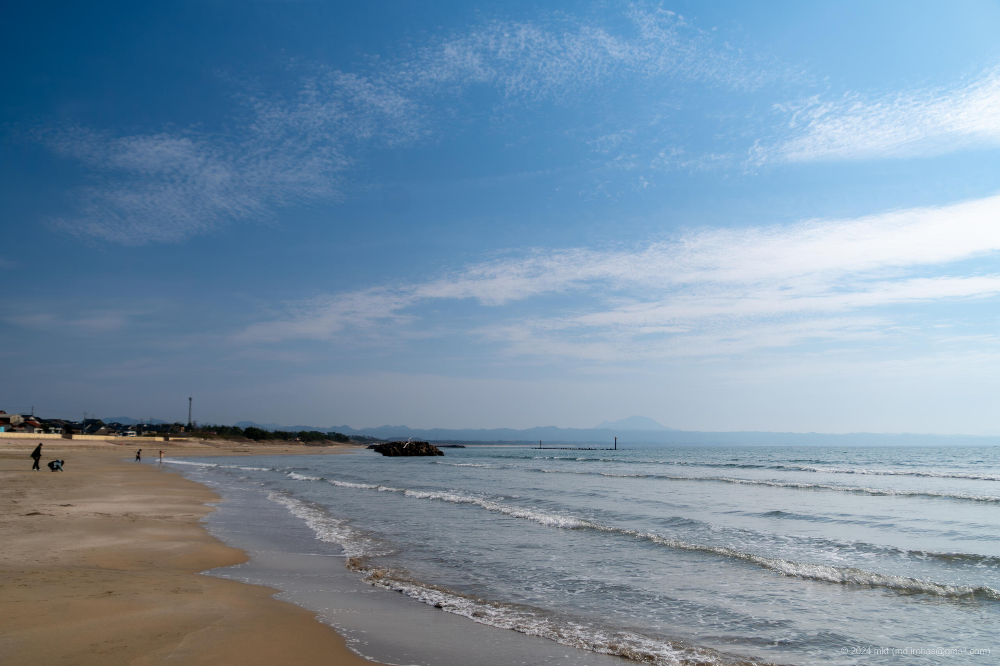

+++
title = '出雲日御碕灯台（2024年3月）'
date = '2024-04-27'
categories = ['ブログ（旅行写真）']
tags = ['旅行', '写真', '島根県', '出雲日御碕灯台']

isCJKLanguage = true
description = '2024年3月に訪れた出雲日御碕灯台の記事です。'

draft = false

# Params
googlePhotoUrl = 'https://photos.app.goo.gl/oji8LpDpuSDpVTpX8'
googleDriveUrl = 'https://drive.google.com/drive/folders/1LrCXln1u4rltAc9Yuk3ARJ8GjVJlFnXo?usp=drive_link'
+++

## 概要

2024年3月下旬に島根県の出雲日御碕灯台へ行きました。

出雲日御碕灯台は明治36年（1903年）に設置された白い石造洋式灯台で、
地上からの高さは43.65m、海面からの高さは63.3mと、石造灯台としては日本一の高さとのことです。

2024年3月現在、灯台の内部は一般公開されており、大人1人300円で灯台の内部を見学できました。
灯台内には163段の急峻な螺旋階段があり、最後の方はもはや梯子でしたが、
それを昇ると展望スペースから日本海を一望することができました。
なお、私が訪れた日はとても風が強く、足がすくんで展望スペースを歩けませんでした…

## ギャラリー




  
  
  

  
  
  
  
  




## マップ

### 出雲日御碕灯台



### 場所の一覧



## 写真の詳細

### iPhone 12 mini


  
  
  


1. IMG\_2759.jpg (  ):  
    灯台内部の螺旋階段の写真です。
1. IMG\_2743.jpg (  ):  
    灯台内部で螺旋階段をのぼった後の階段（というより梯子）の写真です。
1. IMG\_2744.jpg (  ):  
    日本海と灯台のパノラマ写真です。

### Sony α6500


  
  
  
  
  


1. DSC05387-Enhanced-NR.jpg (  /  ):  
    灯台の入口の写真です。
1. DSC05394-Enhanced-NR.jpg (  /  ):  
    灯台の展望台から撮った写真です。
1. DSC05396-Enhanced-NR.jpg (  /  ):  
    灯台の展望台から撮った写真です。
1. DSC05397-Enhanced-NR.jpg (  /  ):  
    灯台の写真です。
1. DSC05418-Enhanced-NR.jpg (  /  ):  
    稲佐の浜の写真です。

## 編集履歴

- 2025/06/04: 文面を修正。
- 2025/05/27: ページの構成を変更。
- 2024/06/28: 一部表現、メタ情報を修正。マップを追加。
- 2024/04/27: 初稿作成。

