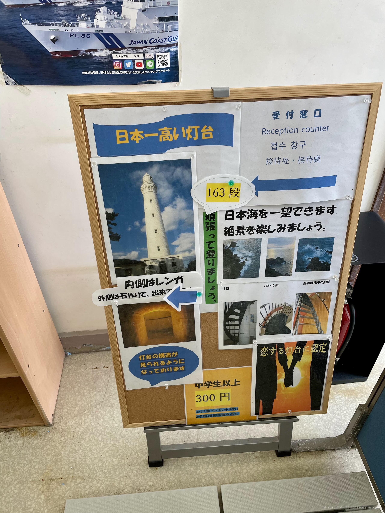
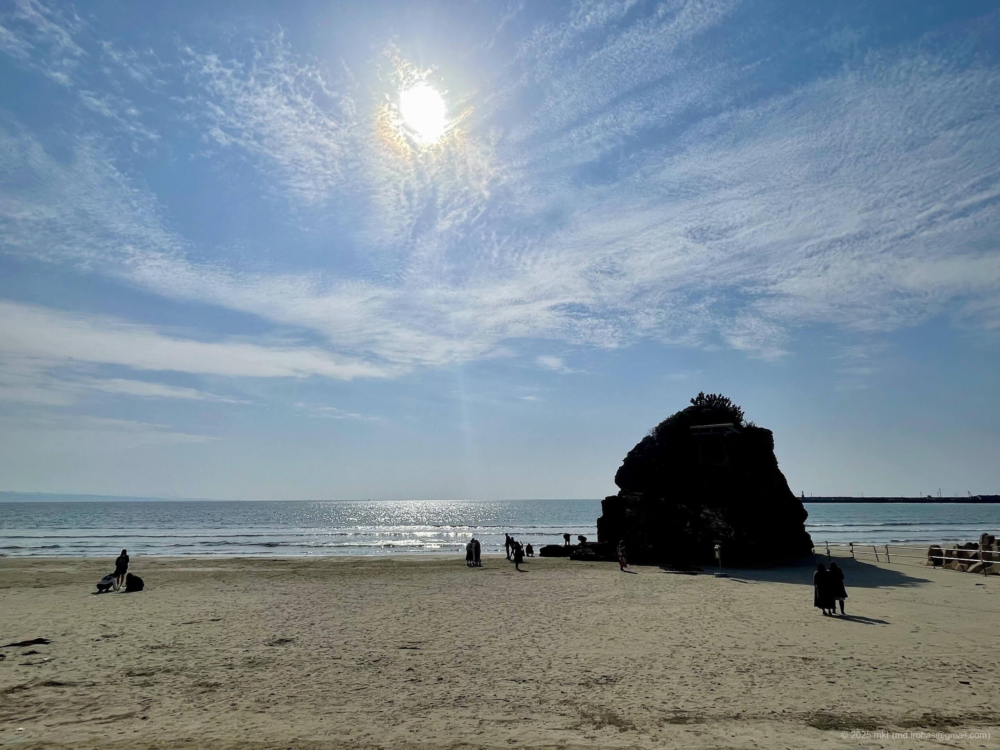

+++
title = '旅の写真: 出雲日御碕灯台（2024年3月）'
date = '2024-04-27'
categories = ['ブログ（旅行写真）']
tags = ['旅行', '写真', '島根県', '海', '空', '灯台']

isCJKLanguage = true
description = '🌊 2024年3月に訪れた出雲日御碕灯台の写真です。'
summary = '📍 出雲日御碕灯台、稲佐の浜'

draft = false

# Params
googlePhotoUrl = 'https://photos.app.goo.gl/oji8LpDpuSDpVTpX8'
googleDriveUrl = 'https://drive.google.com/drive/folders/1LrCXln1u4rltAc9Yuk3ARJ8GjVJlFnXo'
+++

## ストーリー

2024年3月下旬に島根県の出雲日御碕灯台を訪れました。



出雲日御碕灯台は明治36年（1903年）に設置された白い石造洋式灯台で、
地上からの高さは43.65m、海面からの高さは63.3mと、石造灯台としては日本一の高さとのことです。







2024年3月現在、灯台の内部は一般公開されており、大人1人300円で灯台の内部を見学できました。



灯台内には163段の急峻な螺旋階段があり、最後の方はもはや梯子でした。





それを昇ると展望スペースから日本海を一望することができました。





私が訪れた日はとても風が強く、足がすくんで展望スペースを歩けませんでした…



そのあと、少し離れた稲佐の浜へ行きました。







## ギャラリー





### iPhone 12 mini





### α6500







## マップ

### 出雲日御碕灯台



### 稲佐の浜



### 場所一覧



## 編集履歴

- 2025/09/12: 文章構成、細かな表現を修正。写真の追加。
- 2025/09/04: タグを修正。
- 2025/06/04: 文面を修正。
- 2025/05/27: ページの構成を変更。
- 2024/06/28: 一部表現、メタ情報を修正。マップを追加。
- 2024/04/27: 初稿作成。
