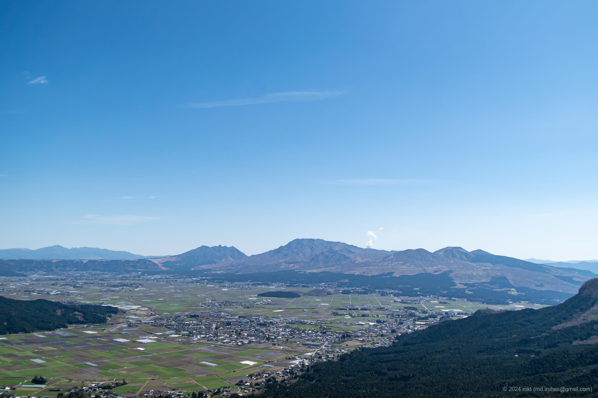
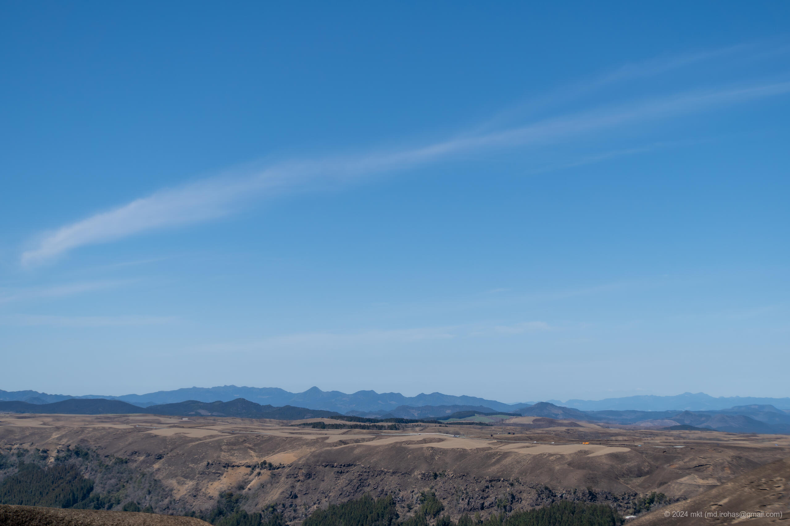
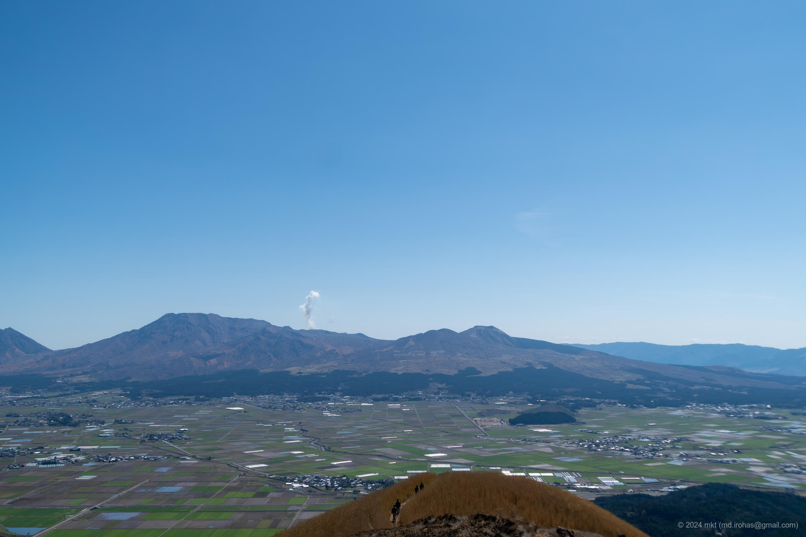
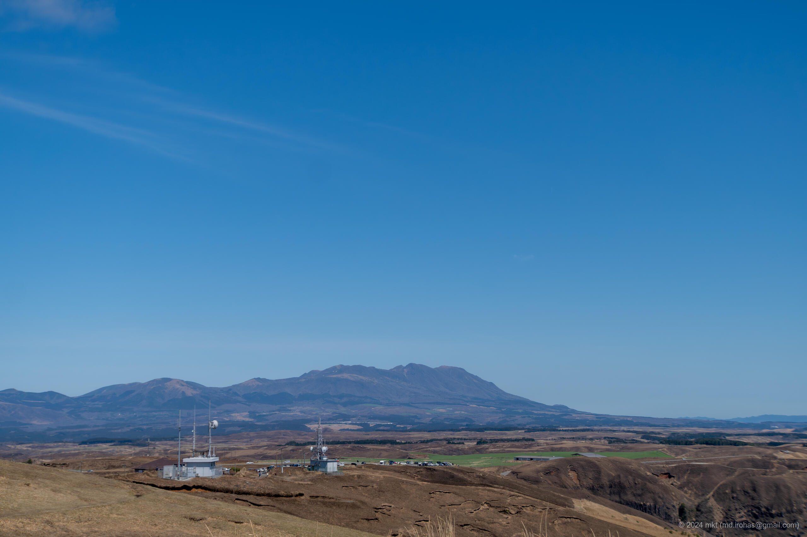

+++
title = 'Mt. Aso (March, 2024)'
date = 2024-05-04T13:55:01+09:00
summary = 'This is an article about Mt. Aso I visited in March 2024.'
categories = ['Blog (Trip Photo)']
tags = ['Photo', 'Trip', 'Kumamoto', 'Mt. Aso', 'Milk Road', 'Daikanbo']

description = 'This is an article about Mt. Aso I visited in March 2024.'

draft = false
isCJKLanguage = false
+++

I visited Mt. Aso (Wikipedia) in Kumamoto Prefecture in late March.

Mt. Aso is one of the most active volcanoes in Japan, and you can see the current crater, the surrounding caldera, and the grand view of the outer rim that surrounds them.

When I visited, the area around the crater was restricted.
So, I drove along a road that runs along the ridge line of the outer rim of Mt. Aso, commonly known as the Milk Road, to go around the observatories.

## Photos


    
    
    
    


- Sony α6500
    1. DSC05433-Enhanced-NR.jpg (Google Drive: [JPG](https://drive.google.com/file/d/1Gl4lSEx2Ag1iCNr5lBGZHfCfsxh7ASJo/view?usp=drive_link) / [RAW (ARW)](https://drive.google.com/file/d/131-cCVsIqJVTk5I5IpCeONRP8zEF6Uf_/view?usp=drive_link)):  
       A photo of Mt. Aso taken from the Kabutoiwa Scenic Overlook.
    1. DSC05454-Enhanced-NR.jpg (Google Drive: [JPG](https://drive.google.com/file/d/1yTZH0Qh84zjMcEKVsJNQgsWIYxnicNSp/view?usp=drive_link) / [RAW (ARW)](https://drive.google.com/file/d/1vzJ7xY0FBIoCsWUE_PLudP55GRys2R3b/view?usp=drive_link)):  
       A photo of the Milk Road running along the ridge line from Daikanbo.
    1. DSC05459-Enhanced-NR.jpg (Google Drive: [JPG](https://drive.google.com/file/d/1R5yyDEbGx_0e8u2C_sF2KUUKQimY3Fv2/view?usp=drive_link) / [RAW (ARW)](https://drive.google.com/file/d/1Rd7Z4zfskP3oPHQZH3-PbAdi-oG6wBJq/view?usp=drive_link)):  
       A photo of Mt. Aso taken from the Daikanbo.
    1. DSC05464-Enhanced-NR.jpg (Google Drive: [JPG](https://drive.google.com/file/d/1WlpeytN06xt-7EPwA6Xb-4WM0U0eZd0g/view?usp=drive_link) / [RAW (ARW)](https://drive.google.com/file/d/1yFJeteUhin3tUBcYgZ8D2KyfEX1QK-CI/view?usp=drive_link)):  
       A photo taken from the Daikanbo towards the parking lot at the Daikanbo entrance.

{}

## Maps

### Daikanbo

<iframe src="https://www.google.com/maps/embed?pb=!1m18!1m12!1m3!1d13385.12084323811!2d131.0570098709315!3d32.99638717389749!2m3!1f0!2f0!3f0!3m2!1i1024!2i768!4f13.1!3m3!1m2!1s0x3541244778a75a13%3A0xd2d7c47437373478!2sDaikanbo!5e0!3m2!1sen!2sjp!4v1714806714570!5m2!1sen!2sjp" width="600" height="450" style="border:0;" allowfullscreen="" loading="lazy" referrerpolicy="no-referrer-when-downgrade"></iframe>

### Milk Road

<iframe src="https://www.google.com/maps/embed?pb=!1m18!1m12!1m3!1d22746.157525460585!2d131.02425909386363!3d32.99683888994309!2m3!1f0!2f0!3f0!3m2!1i1024!2i768!4f13.1!3m3!1m2!1s0x354125fab825b67b%3A0x9db5ff3cfdeb1bbf!2z44Of44Or44Kv44Ot44O844OJ!5e0!3m2!1sen!2sjp!4v1714806753542!5m2!1sen!2sjp" width="600" height="450" style="border:0;" allowfullscreen="" loading="lazy" referrerpolicy="no-referrer-when-downgrade"></iframe>

### Kabutoiwa Scenic Overlook

<iframe src="https://www.google.com/maps/embed?pb=!1m18!1m12!1m3!1d1673.3965547599419!2d131.0152839!3d32.9828598!2m3!1f0!2f0!3f0!3m2!1i1024!2i768!4f13.1!3m3!1m2!1s0x3541216b944f692f%3A0x6be271f76d71d0e6!2sKabutoiwa%20Scenic%20Overlook!5e0!3m2!1sen!2sjp!4v1714807241877!5m2!1sen!2sjp" width="600" height="450" style="border:0;" allowfullscreen="" loading="lazy" referrerpolicy="no-referrer-when-downgrade"></iframe>

## Change History

- 2024/06/28: Modified some sentences and meta info.
- 2024/05/04: First version.

