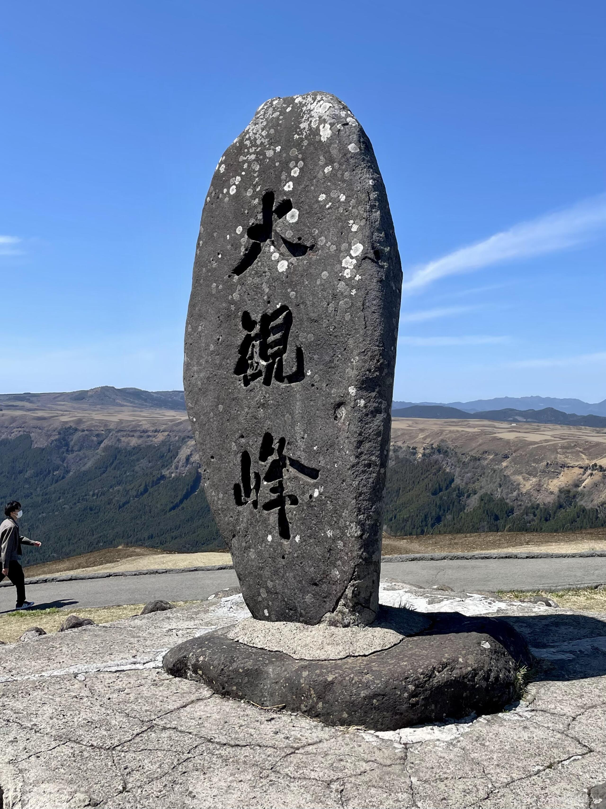
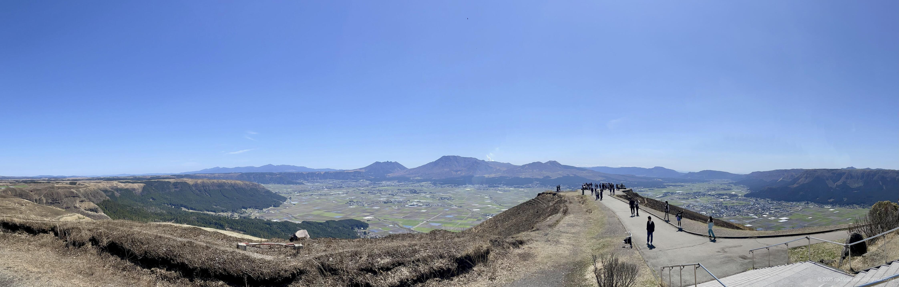

+++
title = '📸 Trip Photo: Mt. Aso (March 2024)'
date = '2024-05-04'
categories = ['Blog (Trip Photo)']
tags = ['Trip', 'Photo', 'Kumamoto', 'Mountain', 'Sky', 'Scenic Road', 'Lookout']

isCJKLanguage = false
description = '🌋 A blog post about my photos I took at Mt. Aso in March 2024. I had a magnificent view of the caldera.'
summary = '📍 Mt. Aso, Milk Road, Daikanbo'

draft = false

# Params
googlePhotoUrl = 'https://photos.app.goo.gl/7CN7KnVBrNiBtur69'
googleDriveUrl = 'https://drive.google.com/drive/folders/15jre1iIevkJH19ELPdTYY3BvIqDHtUnJ'
+++

## Story

In late March 2024, I visited Mount Aso in Kumamoto Prefecture.



Mount Aso is one of Japan’s most active volcanoes.
You can usually see smoke rising from the crater, along with the massive
caldera landscape that stretches around it, and the impressive outer rim
mountains that surround the whole area.

When I went, access to the crater itself was restricted,
so instead I explored the scenic viewpoints along the "Milk Road" that runs
along the outer rim.

Endless grasslands on both sides, unobstructed views, smoke rising from Mount
Aso in the distance...
With the weather on my side, I was able to fully enjoy the breathtaking scenery
of the Aso caldera.



Especially, the view from Daikanbo was beautiful.













## Gallery





### iPhone 12 mini


  
  


### α6500


  
  
  
  




## Map

### Mt. Aso



### Daikanbo



### Sites



## Change History

- 2025/09/12: Fix sentence structure and minor wording issues.
- 2025/09/04: Reorganize tags.
- 2025/06/04: Revise sentences.
- 2025/05/28: Modified contents, added photos of iPhone, and restructured the article.
- 2024/06/28: Modified some sentences and meta info.
- 2024/05/04: First version.
