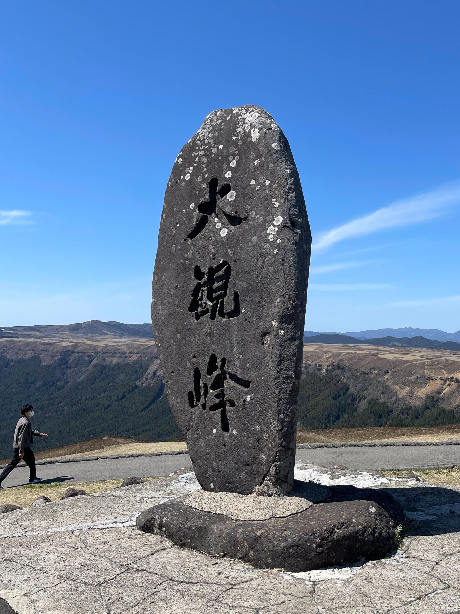
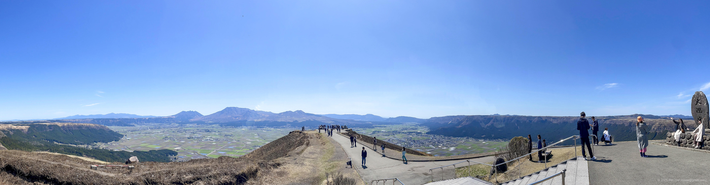

+++
title = '旅の写真: 阿蘇山（2024年3月）'
date = '2024-05-04'
categories = ['ブログ（旅行写真）']
tags = ['旅行', '写真', '熊本県', '山', '空', '景観道路', '展望台']

isCJKLanguage = true
description = '2024年3月に観光した阿蘇山の記事です。'
summary = '📍 阿蘇山、ミルクロード、大観峰'

draft = false

# Params
googlePhotoUrl = 'https://photos.app.goo.gl/7CN7KnVBrNiBtur69'
googleDriveUrl = 'https://drive.google.com/drive/folders/15jre1iIevkJH19ELPdTYY3BvIqDHtUnJ?usp=drive_link'
+++

## 概要

2024年3月下旬に熊本県の阿蘇山を観光しました。

阿蘇山は日本有数の活火山の一つで、現在も噴煙を上げる火口や、
周囲に広がる広大なカルデラ地形、それを囲む外輪山の雄大な景色を望むことができます。

私が訪れたときは、火口周辺への立ち入りが制限されていたため、
外輪山を走る「ミルクロード」で展望台を巡りました。
左右に広がる草原、遮るものがない景色、遠くに望む阿蘇山の噴煙 -- 天気にも恵まれ、
阿蘇カルデラの絶景を堪能できました。

## ギャラリー




  
  

  
  
  
  




## マップ

### 阿蘇山



### 場所の一覧



## 写真の詳細

### iPhone 12 mini


  
  


1. IMG\_2878-2.jpg (  ):  
    大観峰の石碑です。
1. IMG\_2880-2.jpg (  ):  
    大観峰の広場から撮影したパノラマ写真です。

### Sony α6500


    
    
    
    


1. DSC05433-Enhanced-NR.jpg (  /  ):  
    ミルクロードの途中にあるかぶと岩展望所から撮影した写真です。
1. DSC05454-Enhanced-NR.jpg (  /  ):  
    大観峰から稜線を走るミルクロードを撮影した写真です。
1. DSC05459-Enhanced-NR.jpg (  /  ):  
    大観峰から阿蘇山火口方面を撮影した写真です。
1. DSC05464-Enhanced-NR.jpg (  /  ):  
    大観峰から大観峰入口の駐車場方面を撮影した写真です。

## 編集履歴

- 2025/09/04: タグを修正。
- 2025/06/04: 文面を修正。
- 2025/05/28: 文章を修正。iPhoneの写真を追加。ページの構成を変更。
- 2024/06/28: 一部表現、メタ情報を修正。
- 2024/05/04: 初稿作成。

