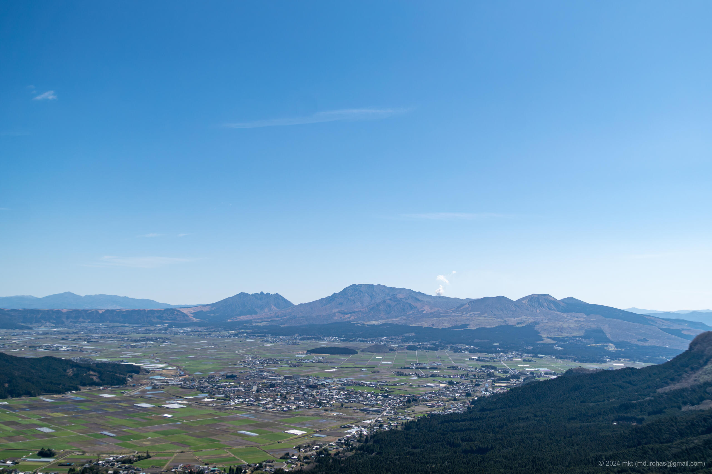

+++
title = '阿蘇山（2024年3月）'
date = '2024-05-04'
categories = ['ブログ（旅行写真）']
tags = ['旅行', '写真', '熊本県', '阿蘇山', 'ミルクロード', '大観峰']

isCJKLanguage = true
description = '2024年3月に観光した阿蘇山の記事です。'

draft = false

# Params
+++

2024年3月に熊本県の [阿蘇山 (Wikipedia)](https://ja.wikipedia.org/wiki/%E9%98%BF%E8%98%87%E5%B1%B1) を訪れました。

阿蘇山は日本有数の活火山の一つで、現在の噴火口、周辺のカルデラ地形、それらを囲む外輪山の雄大な景色を見ることができます。

私が訪れたときは火口周辺の立ち入りが制限されていたので、
阿蘇の外輪山の稜線を走る道路、通称「[ミルクロード (Wikipedia)](https://ja.wikipedia.org/wiki/%E7%86%8A%E6%9C%AC%E7%9C%8C%E9%81%93339%E5%8F%B7%E5%8C%97%E5%A4%96%E8%BC%AA%E5%B1%B1%E5%A4%A7%E6%B4%A5%E7%B7%9A)」を通って、展望台を巡りました。

## 写真


    
    
    
    


- Sony α6500
    1. DSC05433-Enhanced-NR.jpg (Google Drive: [JPG](https://drive.google.com/file/d/1Gl4lSEx2Ag1iCNr5lBGZHfCfsxh7ASJo/view?usp=drive_link) / [RAW (ARW)](https://drive.google.com/file/d/131-cCVsIqJVTk5I5IpCeONRP8zEF6Uf_/view?usp=drive_link)):  
       ミルクロードの途中にあるかぶと岩展望所から撮影した阿蘇山の写真です。
    1. DSC05454-Enhanced-NR.jpg (Google Drive: [JPG](https://drive.google.com/file/d/1yTZH0Qh84zjMcEKVsJNQgsWIYxnicNSp/view?usp=drive_link) / [RAW (ARW)](https://drive.google.com/file/d/1vzJ7xY0FBIoCsWUE_PLudP55GRys2R3b/view?usp=drive_link)):  
       [大観峰 (Wikipedia)](https://ja.wikipedia.org/wiki/%E5%A4%A7%E8%A6%B3%E5%B3%B0) から稜線を走るミルクロードを撮影した写真です。
    1. DSC05459-Enhanced-NR.jpg (Google Drive: [JPG](https://drive.google.com/file/d/1R5yyDEbGx_0e8u2C_sF2KUUKQimY3Fv2/view?usp=drive_link) / [RAW (ARW)](https://drive.google.com/file/d/1Rd7Z4zfskP3oPHQZH3-PbAdi-oG6wBJq/view?usp=drive_link)):  
       大観峰から阿蘇山を撮影した写真です。
    1. DSC05464-Enhanced-NR.jpg (Google Drive: [JPG](https://drive.google.com/file/d/1WlpeytN06xt-7EPwA6Xb-4WM0U0eZd0g/view?usp=drive_link) / [RAW (ARW)](https://drive.google.com/file/d/1yFJeteUhin3tUBcYgZ8D2KyfEX1QK-CI/view?usp=drive_link)):  
       大観峰から大観峰入口の駐車場の方向を撮影した写真です。

{}

## マップ

### 大観峰

<iframe src="https://www.google.com/maps/embed?pb=!1m18!1m12!1m3!1d13385.12084323811!2d131.0570098709315!3d32.99638717389749!2m3!1f0!2f0!3f0!3m2!1i1024!2i768!4f13.1!3m3!1m2!1s0x3541244778a75a13%3A0xd2d7c47437373478!2sDaikanbo!5e0!3m2!1sen!2sjp!4v1714806714570!5m2!1sen!2sjp" width="600" height="450" style="border:0;" allowfullscreen="" loading="lazy" referrerpolicy="no-referrer-when-downgrade"></iframe>

### ミルクロード

<iframe src="https://www.google.com/maps/embed?pb=!1m18!1m12!1m3!1d22746.157525460585!2d131.02425909386363!3d32.99683888994309!2m3!1f0!2f0!3f0!3m2!1i1024!2i768!4f13.1!3m3!1m2!1s0x354125fab825b67b%3A0x9db5ff3cfdeb1bbf!2z44Of44Or44Kv44Ot44O844OJ!5e0!3m2!1sen!2sjp!4v1714806753542!5m2!1sen!2sjp" width="600" height="450" style="border:0;" allowfullscreen="" loading="lazy" referrerpolicy="no-referrer-when-downgrade"></iframe>

### かぶと岩展望所

<iframe src="https://www.google.com/maps/embed?pb=!1m18!1m12!1m3!1d1673.3965547599419!2d131.0152839!3d32.9828598!2m3!1f0!2f0!3f0!3m2!1i1024!2i768!4f13.1!3m3!1m2!1s0x3541216b944f692f%3A0x6be271f76d71d0e6!2sKabutoiwa%20Scenic%20Overlook!5e0!3m2!1sen!2sjp!4v1714807241877!5m2!1sen!2sjp" width="600" height="450" style="border:0;" allowfullscreen="" loading="lazy" referrerpolicy="no-referrer-when-downgrade"></iframe>

## 編集履歴

- 2024/06/28: 一部表現、メタ情報を修正。
- 2024/05/04: 初稿作成。

