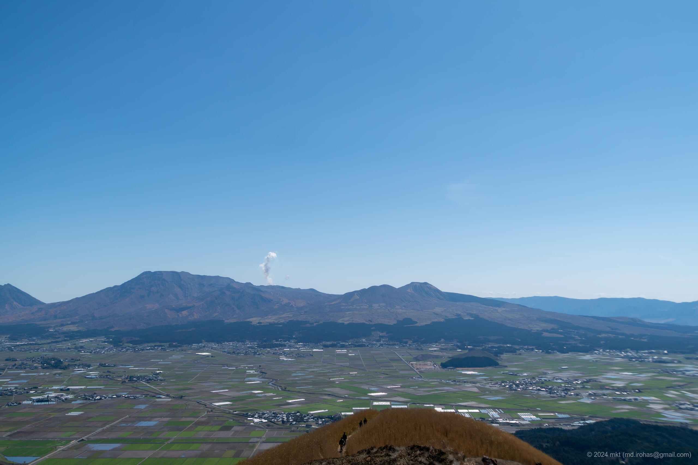

+++
title = '旅の写真: 阿蘇山（2024年3月）'
date = '2024-05-04'
categories = ['ブログ（旅の写真）']
tags = ['旅行', '写真', '熊本県', '山', '空', '景観道路', '展望台']

isCJKLanguage = true
description = '🌋 2024年3月に観光した阿蘇山の写真です。雄大なカルデラを眺めました。'
summary = '📍 阿蘇山、ミルクロード、大観峰'

draft = false

# Params
googlePhotoUrl = 'https://photos.app.goo.gl/7CN7KnVBrNiBtur69'
googleDriveUrl = 'https://drive.google.com/drive/folders/15jre1iIevkJH19ELPdTYY3BvIqDHtUnJ'
+++

## ストーリー

2024年3月下旬に熊本県の阿蘇山を観光しました。



阿蘇山は日本有数の活火山の一つで、現在も噴煙を上げる火口や、
周囲に広がる広大なカルデラ地形、それを囲む外輪山の雄大な景色を望むことができます。

私が訪れたときは、火口周辺への立ち入りが制限されていたため、
外輪山を走る「ミルクロード」で展望台を巡りました。
左右に広がる草原、遮るものがない景色、遠くに望む阿蘇山の噴煙 -- 天気にも恵まれ、
阿蘇カルデラの絶景を堪能できました。



特に「大観峰」から眺めた景色がとても良かったです。













## ギャラリー





### iPhone 12 mini


  
  


### α6500


    
    
    
    




## マップ

### 阿蘇山



### 大観峰



### 場所一覧



## 編集履歴

- 2025/09/11: 文章構成、細かな表現を修正。
- 2025/09/04: タグを修正。
- 2025/06/04: 文面を修正。
- 2025/05/28: 文章を修正。iPhoneの写真を追加。ページの構成を変更。
- 2024/06/28: 一部表現、メタ情報を修正。
- 2024/05/04: 初稿作成。
