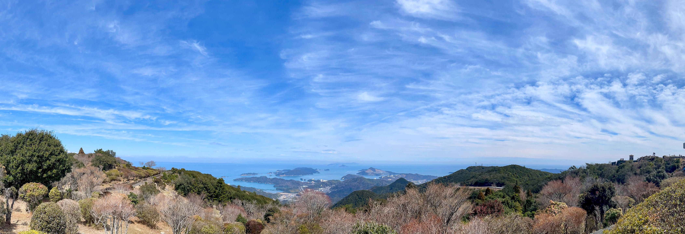
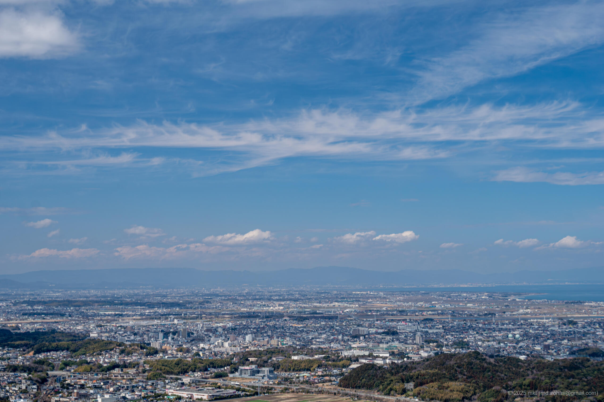
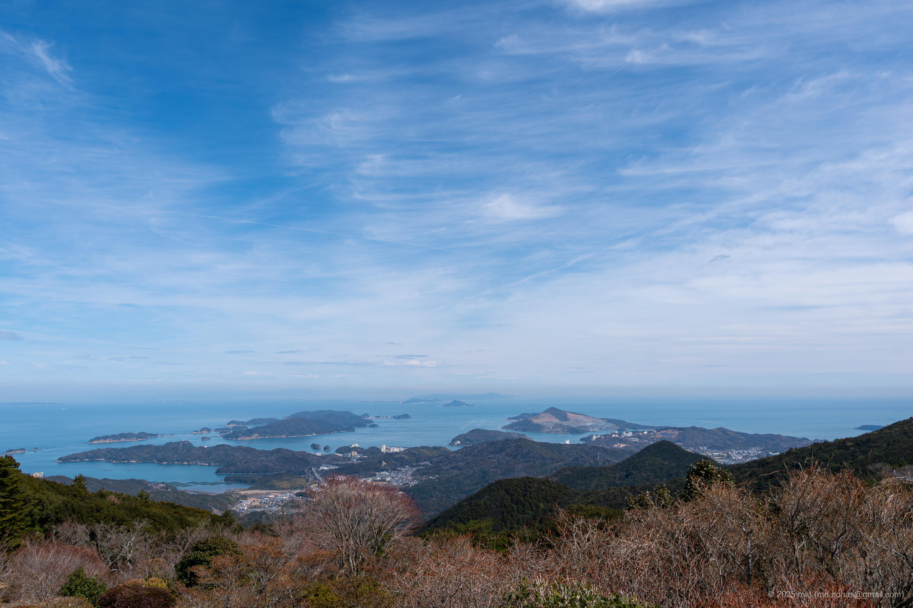
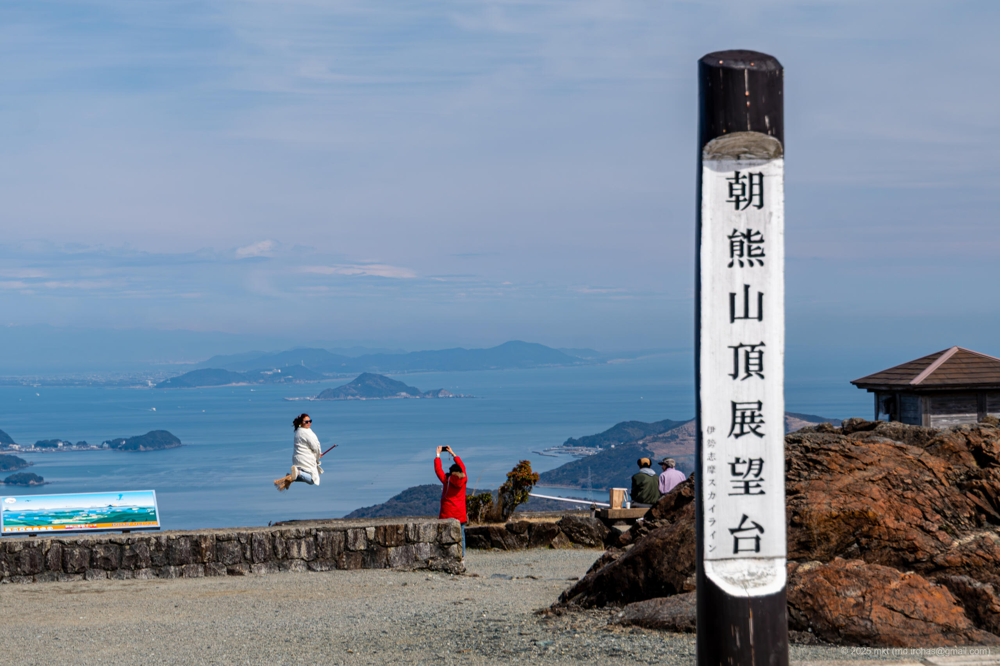
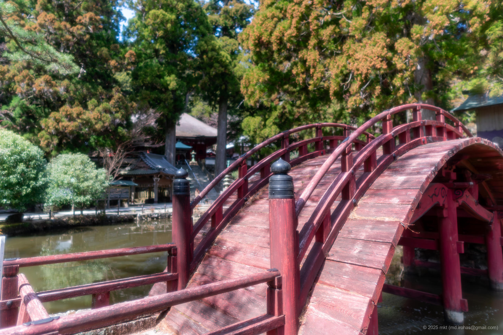
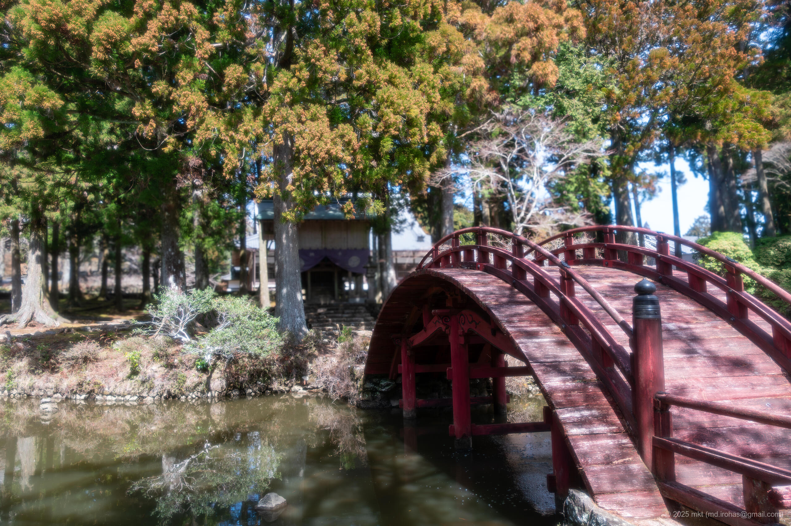
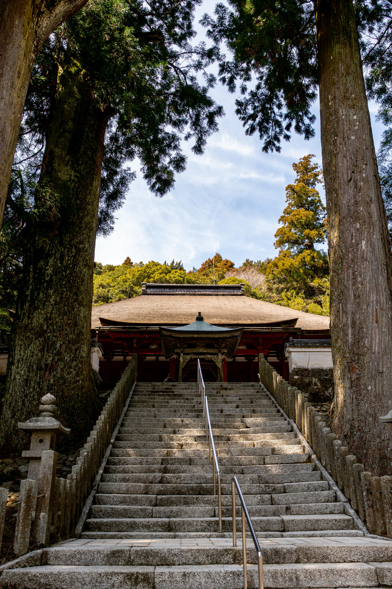
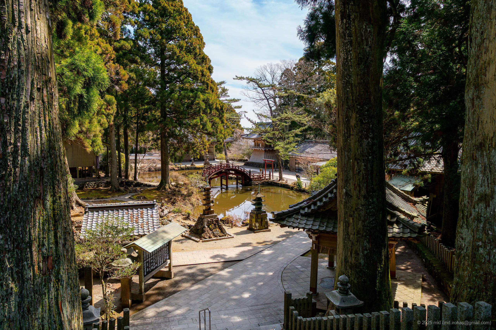

+++
title = 'Trip Photo: Iseshima Skyline (March, 2025)'
date = '2025-06-06'
categories = ['Blog (Trip Photo)']
tags = ['Trip', 'Photo', 'Mie', 'Iseshima Skyline']

isCJKLanguage = false
description = 'An article about Iseshima Skyline I drove along in March 2025.'

draft = false

# Params
googlePhotoUrl = 'https://photos.app.goo.gl/nLVD23M5XWVNMXuG7'
googleDriverl = 'https://drive.google.com/drive/folders/1Mu0Ws50iwn264XI5B4V5-U8Zio1AaDNm?usp=sharing'
+++

## Sumamry

In March 2025, after visiting Ise Shrine, I drove along the Iseshima Skyline.

The Iseshima Skyline is a toll road about 16 kilometers long that connects Ise and Toba.
It winds over Mount Asama, which stands at around 500 meters above sea level, and is often called a "sky-high drive" for its stunning views.
Along the route, there are scenic overlooks and the Asamayama Kongosho-ji Temple, making it a popular sightseeing road.

Every viewpoint along the way offered spectacular scenery,
but the summit observation area was particularly impressive.
There, you'll find a foot bath with a panoramic view of Ise Bay and the "Sky Postbox,"
which stands out vividly against the blue sky.
I also stopped by Kongosho-ji Temple on the way.
In contrast to the busy observation points,
the temple grounds were quiet and serene, with a solemn atmosphere.

I couldn't get any decent photos at Ise Shrine because of the crowds,
but Konggsho-ji was almost empty, which allowed me to fully enjoy the temple in peace.

The toll for the Iseshima Skyline was ¥1,270 for a standard car (as of March 2025),
which felt a bit pricey at first.
But after actually driving it,
I felt it was well worth it -- for the views, the temple visit, and the refreshing drive along the mountain ridgeline.

If you're planning a visit to the Ise Shrine,
I highly recommend adding the Iseshima Skyline to your itinerary.

Just a heads-up: even on a weekday morning, the Ise Shrine was incredibly crowded.

## Gallery

{}


  

  
  
  

  
  

  
  
  




## Map

### Iseshima Skyline



### Sites



## Photo Details

### iPhone 12 mini


  


1. IMG\_3134-2.jpg (  ):  
    A panoramic photo taken at the Asama Mountain View Point.

### Sony α6500


  


1. DSC05596-Enhanced-NR.jpg (  /  ):  
    A photo taken at the Ichiuda observatory.


  
  
  
  
  


1. DSC05609-Enhanced-NR.jpg  
   DSC05613-Enhanced-NR.jpg  
   DSC05616-Enhanced-NR.jpg  
   DSC05622-Enhanced-NR.jpg  
   DSC05632-Enhanced-NR.jpg  (  /  ):  
    Photos taken at the Kongosho-ji temple.


  
  


1. DSC05643-Enhanced-NR.jpg  
   DSC05671-Enhanced-NR.jpg (  /  ):  
    Photos taken at the Asama Mountain View Point.

## Change History

- 2025/06/06: First version.

