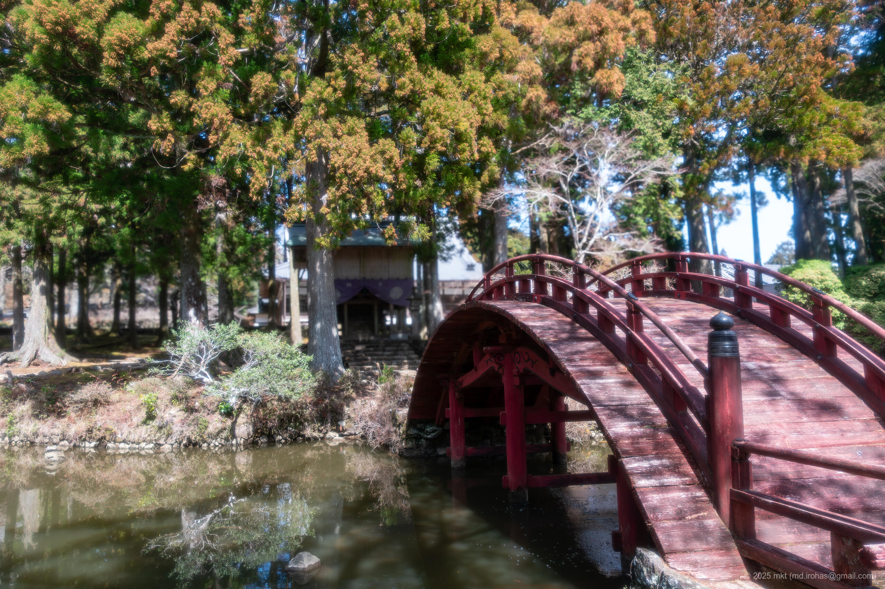

+++
title = '旅の写真: 伊勢志摩スカイライン（2025年3月）'
date = '2025-06-06'
categories = ['ブログ（旅の写真）']
tags = ['旅行', '写真', '三重県', '海', '空', '景観道路', '寺院', '展望台']

isCJKLanguage = true
description = '🏞️ 2025年3月に走った伊勢志摩スカイラインの写真です。'
summary = '📍 伊勢志摩スカイライン、朝熊岳金剛證寺、朝熊山頂展望台'

draft = false

# Parmas
googlePhotoUrl = 'https://photos.app.goo.gl/nLVD23M5XWVNMXuG7'
googleDriverl = 'https://drive.google.com/drive/folders/1Mu0Ws50iwn264XI5B4V5-U8Zio1AaDNm'
+++

## ストーリー

2025年3月、伊勢神宮を参拝したあと、伊勢志摩スカイラインを車で走りました。



- 伊勢志摩スカイライン: https://www.iseshimaskyline.com/

伊勢志摩スカイラインは、伊勢と鳥羽を結ぶ約16kmの有料道路で、
標高約500mの朝熊山を越える天空のドライブウェイです。
沿道には展望スポットや朝熊岳金剛證寺などがあり、観光道路としても知られています。

展望スポットいずれも良かったのですが、その中でも山頂の展望広場が素晴らしく、
伊勢湾を一望できる足湯や青空に映える「天空のポスト」などが整備されていました。









また、その途中で朝熊岳金剛證寺にも立ち寄りました。
こちらは展望スポットと一転、境内には静けさと厳かな雰囲気が漂っていました。
伊勢神宮は人が多すぎてここに載せる写真を撮る場所がなかったのですが、
金剛證寺は人がほとんどおらず寺院を満喫できました。











伊勢志摩スカイラインの通行料金は普通車で1270円（2025年3月現在）と走行前は少し高いなと思っていましたが、
実際に走ってみると、展望、寺院、山の尾根を走る爽快感など、十分にその価値がありました。

伊勢神宮に参拝する方はぜひ伊勢志摩スカイラインも合わせて走ってみてください。

## ギャラリー





### iPhone 12 mini


  


### α6500


  
  
  
  
  
  
  




## マップ

### 伊勢志摩スカイライン



### 場所一覧



## 編集履歴

- 2025/09/08: 文章構成、細かな表現を修正。
- 2025/09/04: タグを修正。
- 2025/06/06: 初稿作成。
