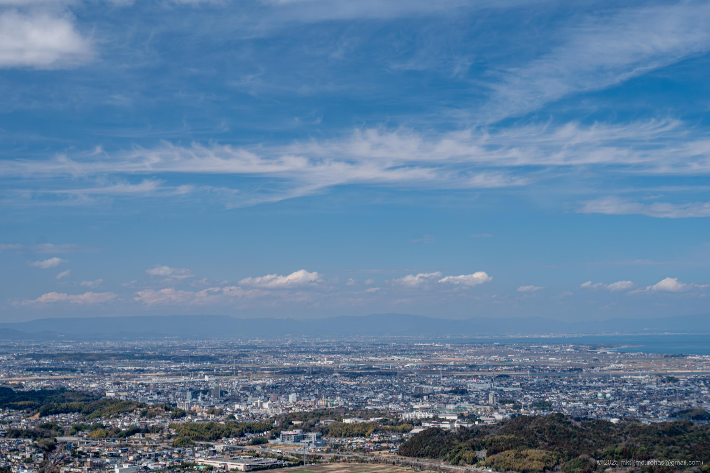
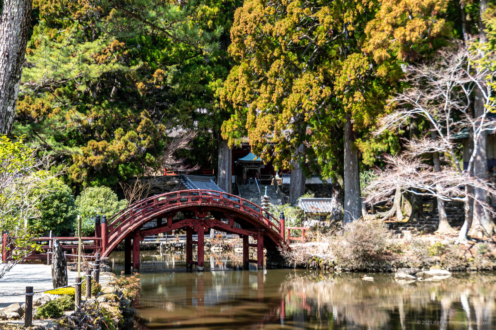

+++
title = '伊勢志摩スカイライン（2025年3月）'
date = '2025-06-06'
categories = ['ブログ（旅行写真）']
tags = ['旅行', '写真', '三重県', '伊勢志摩スカイライン']

isCJKLanguage = true
description = '2025年3月に走った伊勢志摩スカイラインの記事です。'

draft = false

# Parmas
googlePhotoUrl = 'https://photos.app.goo.gl/nLVD23M5XWVNMXuG7'
googleDriverl = 'https://drive.google.com/drive/folders/1Mu0Ws50iwn264XI5B4V5-U8Zio1AaDNm?usp=sharing'
+++

## 概要

2025年3月、伊勢神宮を参拝したあと、伊勢志摩スカイラインを車で走りました。

伊勢志摩スカイラインは、伊勢と鳥羽を結ぶ約16kmの有料道路で、
標高約500mの朝熊山を越える天空のドライブウェイです。
沿道には展望スポットや朝熊岳金剛證寺などがあり、観光道路としても知られています。

展望スポットいずれもその眺めは絶景でしたが、
その中でも山頂の展望広場が特に素晴らしく、
伊勢湾を一望できる足湯や青空に映える「天空のポスト」などが整備されていました。
また、その途中で朝熊岳金剛證寺にも立ち寄りました。
こちらは展望スポットと一転、境内には静けさと厳かな雰囲気が漂っていました。
伊勢神宮は人が多すぎてここに載せる写真を撮る場所がなかったのですが、
金剛證寺は人がほとんどおらず寺院を満喫できました。

伊勢志摩スカイラインの通行料金は普通車で1270円（2025年3月現在）と走行前は少し高いなと思っていましたが、
実際に走ってみると、展望、寺院、山の尾根を走る爽快感など、十分にその価値がありました。

伊勢神宮に参拝する方はぜひ伊勢志摩スカイラインも合わせて走ってみてください。
なお、伊勢神宮は平日早朝でも激混みでした。

## ギャラリー




  

  
  
  

  
  

  
  
  




## マップ

### 伊勢志摩スカイライン



### 場所の一覧



## 写真の詳細

### iPhone 12 mini


  


1. IMG\_3134-2.jpg (  ):  
    朝熊山頂展望台から撮影したパノラマ写真です。

### Sony α6500


  


1. DSC05596-Enhanced-NR.jpg (  /  ):  
    一宇田展望台で撮影した写真です。


  
  
  
  
  


1. DSC05609-Enhanced-NR.jpg  
   DSC05613-Enhanced-NR.jpg  
   DSC05616-Enhanced-NR.jpg  
   DSC05622-Enhanced-NR.jpg  
   DSC05632-Enhanced-NR.jpg  (  /  ):  
    金剛證寺の境内の写真です。


  
  


1. DSC05643-Enhanced-NR.jpg  
   DSC05671-Enhanced-NR.jpg (  /  ):  
    朝熊山頂展望台の写真です。

## 編集履歴

- 2025/06/06: 初稿作成。

