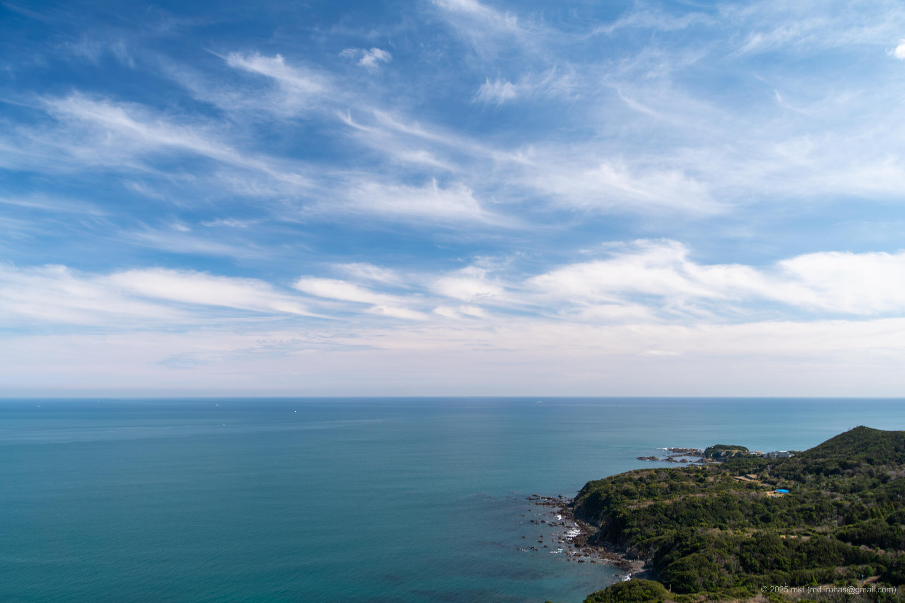

+++
title = 'Trip Photo: Iseshima (March, 2025)'
date = '2025-06-08'
categories = ['Blog (Trip Photo)']
tags = ['Trip', 'Photo', 'Mie', 'Iseshima', 'Toba Observatory Ama-no-Terrace', 'Yokoyama Observatory Deck']

isCJKLanguage = false
description = 'An article about Iseshima I visited in March 2025.'

draft = false

# Params
googlePhotoUrl = 'https://photos.app.goo.gl/9P6Bww7rkufrXg5Z7'
googleDriveUrl = 'https://drive.google.com/drive/folders/1SSRXTsav0iwnniD9OV1kKbzieHjmxWav?usp=sharing'
+++

## Sumamry

In March 2025, I took a drive along the Iseshima Skyline and continued on the
Pearl Road to explore the Ise-Shima area.

Ise-Shima, located in the southern part of Mie Prefecture, is part of Iseshima
National Park.
The region is known for its rugged coastline shaped by the interplay of
mountains and sea, forming what's called a ria coastline.

Along the way, I stopped at the Toba Observatory "Ama-no-Terrace" for a break
and enjoyed a relaxing lunch with an open view of the sea.
After that, I headed to the Yokoyama Observatory, which has a cafe with
terrace.
From there, I was treated to a panoramic view of Ago Bay and its beautiful ria
coastline.

## Gallery

{}


  
  
  
  




## Map

### Iseshima



### Sites



## Photo Details

### Sony α6500


  
  
  
  


1. DSC05685-Enhanced-NR.jpg  
   DSC05697-Enhanced-NR.jpg (  /  ):  
    Photos taken at Toba Observatory Ama-no-Terrace.
1. DSC05699-Enhanced-NR.jpg  
   DSC05725-Enhanced-NR.jpg (  /  ):  
    Photos taken at Yokoyama Observatory Deck.

## Change History

- 2025/06/08: First version.

