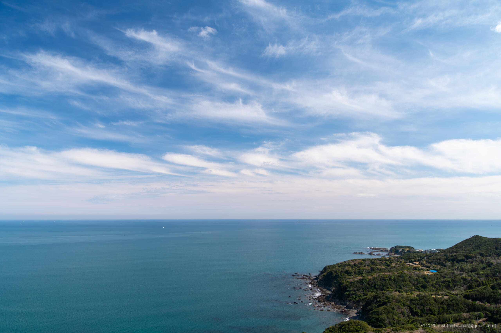
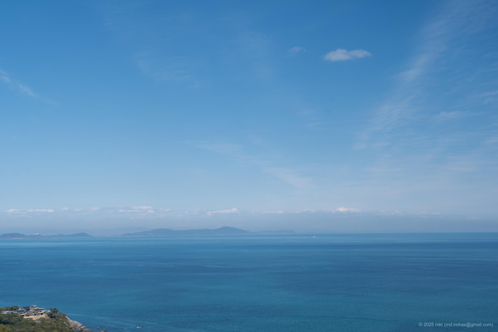
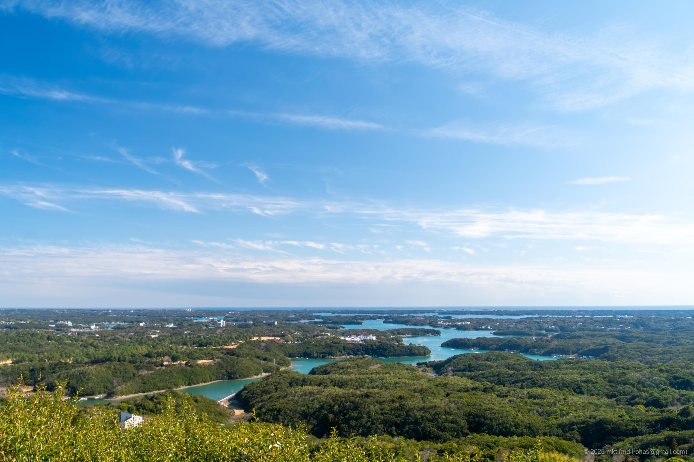

+++
title = '旅の写真: 伊勢志摩（2025年3月）'
date = '2025-06-08'
categories = ['ブログ（旅行写真）']
tags = ['旅行', '写真', '三重県', '海', '空', '展望台']

isCJKLanguage = true
description = '🏞️ 2025年3月に立ち寄った伊勢志摩の写真です。'
summary = '📍 伊勢志摩、鳥羽展望台 海女のテラス、横山展望台'

draft = false

# Params
googlePhotoUrl = 'https://photos.app.goo.gl/9P6Bww7rkufrXg5Z7'
googleDriveUrl = 'https://drive.google.com/drive/folders/1SSRXTsav0iwnniD9OV1kKbzieHjmxWav'
+++

## ストーリー

2025年3月、伊勢志摩スカイラインをドライブしたあと、そのままパールロードを通って伊勢志摩を巡りました。



伊勢志摩は、三重県南部に広がる伊勢志摩国立公園の一角をなす地域で、
リアス式海岸と呼ばれる海と山が織りなす複雑な地形が特徴的です。

途中、鳥羽展望台「海女のテラス」で休憩し、開放感あふれる海を眺めながら昼食をとりました。







その後、横山展望台へ移動しました。



横山展望台にはカフェも併設されていて、テラス席から英虞湾（あごわん）に広がるリアス海岸の風景を一望できました。





## ギャラリー





### α6500


  
  
  
  




## マップ

### 伊勢志摩



### 鳥羽展望台



### 横山展望台



### 場所一覧



## 編集履歴

- 2025/09/08: 文章構成、細かな表現を修正。
- 2025/09/04: タグを修正。
- 2025/06/08: 初稿作成。
