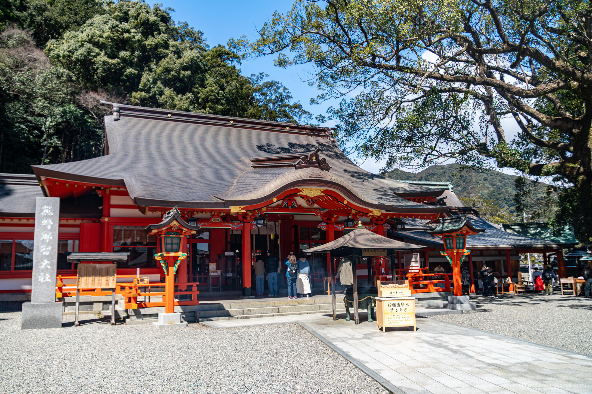
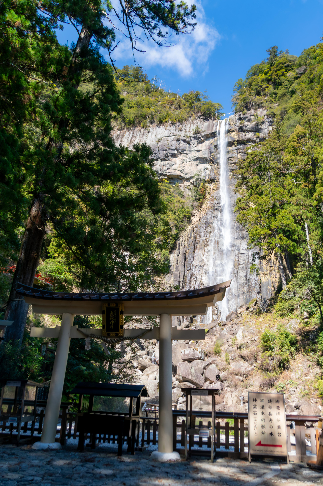

+++
title = 'Trip Photo: Kumano Nachi Taisha (March, 2025)'
date = '2025-06-12'
categories = ['Blog (Trip Photo)']
tags = ['Trip', 'Photo', 'Wakayama', 'Kumano Nachi Taisha', 'Nachi Waterfall']

isCJKLanguage = false
description = 'An article about Kumano Nachi Taisha I visited in March 2025.'

draft = false

# Params
googlePhotoUrl = 'https://photos.app.goo.gl/z4VYpdVxJn5Jhgb67'
googleDriveUrl = 'https://drive.google.com/drive/folders/1OwB9EZJ442IfOmjuN-TTa1qwh1bPh2z6?usp=sharing'
+++

## Sumamry

In March 2025, I visited Kumano Nachi Taisha in Wakayama Prefecture.

Kumano Nachi Taisha is one of the three grand shrines of Kumano and serves as a
major center of Kumano worship, attracting many visitors and pilgrims.
According to shrine tradition -- though mythical in nature -- the shrine's
origin dates back to 317 CE, when Emperor Jimmu is said to have worshiped Nachi
Falls during his eastern expedition.
The shrine and its surrounding area are part of the UNESCO World Heritage Site
"Sacred Sites and Pilgrimage Routes in the Kii Mountain Range."

After parking my car, I climbed the stone steps along the approach and visited
the main hall of the shrine.

Next to the shrine stands the three-storied pagoda of Seiganto-ji Temple, from
which I could enjoy a view of the pagoda with Nachi Falls in the background.
The pagoda is open to visitors, but on the day of my visit, the wind was quite
strong, so I chose to view it only from the outside.

Afterwards, I descended the old stone steps of the back approach to reach Hiro
Shrine (Hiro-jinja).

Hiro Shrine is a subsidiary shrine of Kumano Nachi Taisha and enshrines Nachi
Falls as its sacred object of worship.
With a drop of 133 meters, Nachi Falls is the tallest waterfall in Japan and
has been revered as a sacred presence since ancient times.

For a fee of 300 yen per adult, I was able to enter the viewing platform close
to the waterfall and experience its grandeur up close.

## Gallery

{}







## Map

### Kumano Nachi Taisha



### Sites



## Photo Details

### iPhone 12 mini





1. IMG\_3183.jpg (  ):  
    A photo taken at Torii gate at Kumano Nachi Taisha.
1. IMG\_3198.jpg (  ):  
    A photo taken at stone steps on the path to Nachi Waterfall.
1. IMG\_3199.jpg (  ):  
    A photo taken at torii gate at the entrance to Nachi Waterfall.
1. IMG\_3234.jpg (  ):  
    A photo taken at stone steps near Nachi Waterfall

### Sony α6500





1. DSC05746-Enhanced-NR.jpg (  /  ):  
    A photo taken at the worship hall of Kumano Nachi Taisha.
1. DSC05777-Enhanced-NR.jpg (  /  ):  
    A photo taken of Seiganto-ji's three-storied pagoda and Nachi Falls, right next to Kumano Nachi Taisha.
1. DSC05790-Enhanced-NR.jpg (  /  ):  
    A photo taken of the torii gate of Hiro Shrine and Nachi Waterfall.
1. DSC05801-Enhanced-NR.jpg (  /  ):  
    A photo taken of the viewing platform and Nachi Waterfall.
1. DSC05817-Enhanced-NR.jpg (  /  ):  
    A high-magnification, short-exposure (1/4000) photo of the top of Nachi Waterfall.
1. DSC05827-Enhanced-NR.jpg (  /  ):  
    A photo taken of the stone monument in front of the viewing platform and Nachi Waterfall.

## Change History

- 2025/06/12: First version.

