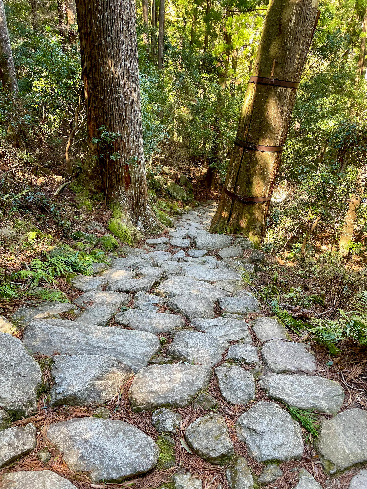
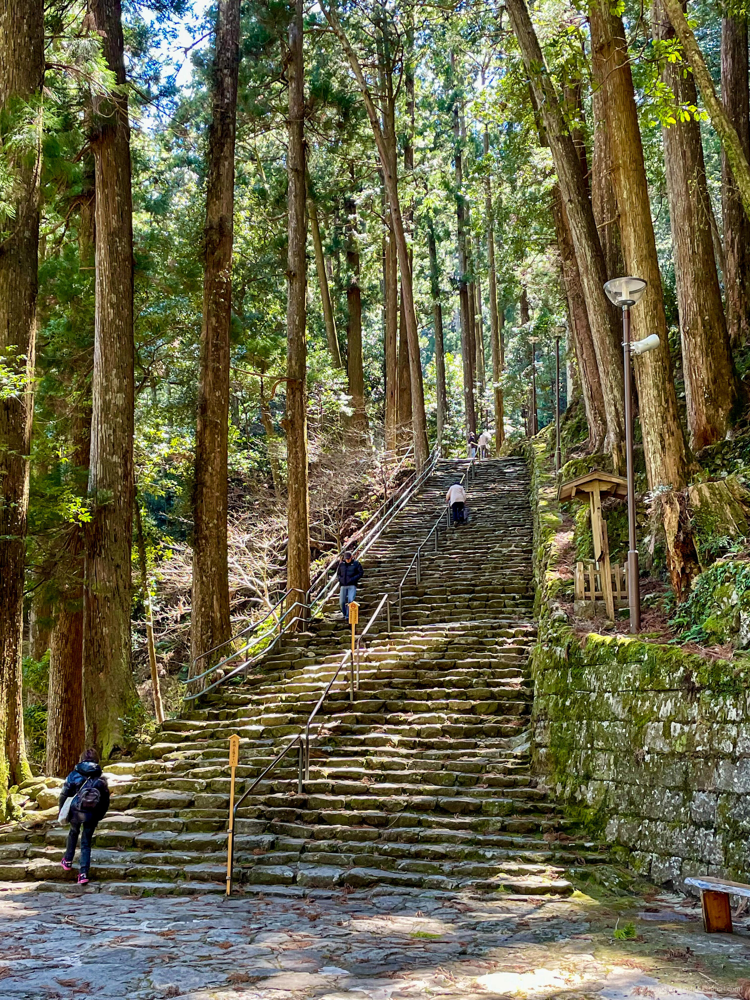
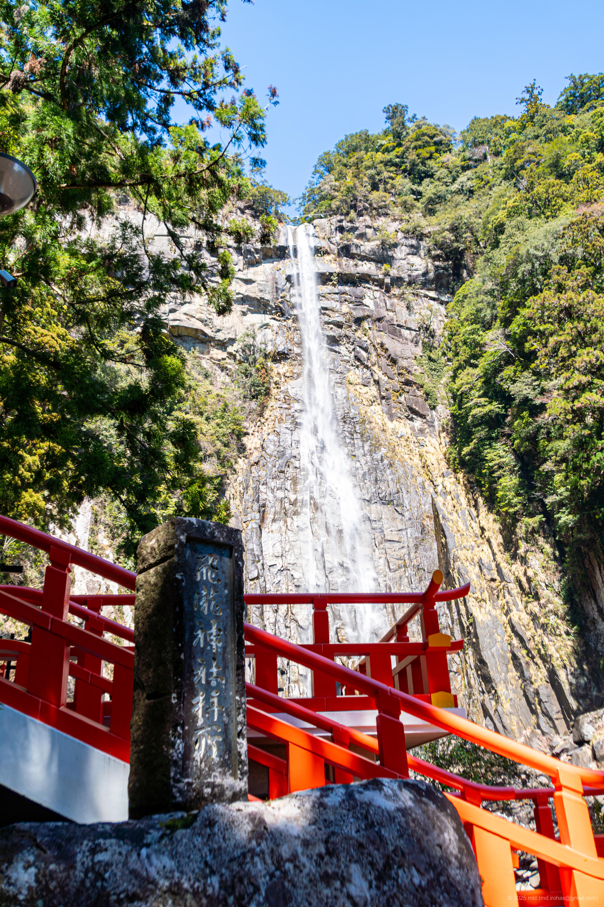

+++
title = '📸 Trip Photo: Kumano Nachi Taisha (March 2025)'
date = '2025-06-12'
categories = ['Blog (Trip Photo)']
tags = ['Trip', 'Photo', 'Wakayama', 'Shrine', 'Temple', 'Waterfall']

isCJKLanguage = false
description = '⛩️ A blog post about my photos I took at Kumano Nachi Taisha in March 2025.'
summary = '📍 Kumano Nachi Taisha, Nachi Waterfall'

draft = false

# Params
googlePhotoUrl = 'https://photos.app.goo.gl/z4VYpdVxJn5Jhgb67'
googleDriveUrl = 'https://drive.google.com/drive/folders/1OwB9EZJ442IfOmjuN-TTa1qwh1bPh2z6'
+++

## Story

In March 2025, I visited Kumano Nachi Taisha in Wakayama Prefecture.



- Kumano Nachi Taisha: https://kumanonachitaisha.or.jp/

Kumano Nachi Taisha is one of the three grand shrines of Kumano and serves as a
major center of Kumano worship, attracting many visitors and pilgrims.
According to shrine tradition -- though mythical in nature -- the shrine's
origin dates back to 317 AD, when Emperor Jimmu is said to have worshiped Nachi
Falls during his eastern expedition.
The shrine and its surrounding area are part of the UNESCO World Heritage Site
"Sacred Sites and Pilgrimage Routes in the Kii Mountain Range."

First, I parked my car and climbed the stairs along the approach to pay my respects at the main shrine.



The stairs leading up to the main shrine were fairly long and steep.



Next to the shrine stands the three-storied pagoda of Seiganto-ji Temple, from
which I could enjoy a view of the pagoda with Nachi Falls in the background.



The pagoda is open to visitors, but on the day of my visit, the wind was quite
strong,  so I only viewed it from outside.

Afterwards, I descended the old stone steps of the back approach to reach Hiro
Shrine (Hiro-jinja).
The back approach was made of uneven, old stone steps and was a bit tough to walk on, but it had a nice atmosphere.



Hiro Shrine is a subsidiary shrine of Kumano Nachi Taisha and enshrines Nachi
Falls as its sacred object of worship.





With a drop of 133 meters, Nachi Falls is the tallest waterfall in Japan and
has been revered as a sacred presence since ancient times.





For a fee of 300 yen per adult, I was able to enter the viewing platform close
to the waterfall and experience its grandeur up close.





Finally, I returned to the parking lot and had udon noodles at the shop.
I personally really liked the udon broth.



## Gallery

{}



### iPhone 12 mini





### α6500







## Map

### Kumano Nachi Taisha



### Sites



## Change History

- 2025/09/07: Fix sentence structure and minor wording issues.
- 2025/09/04: Reogranize tags.
- 2025/06/12: First version.
