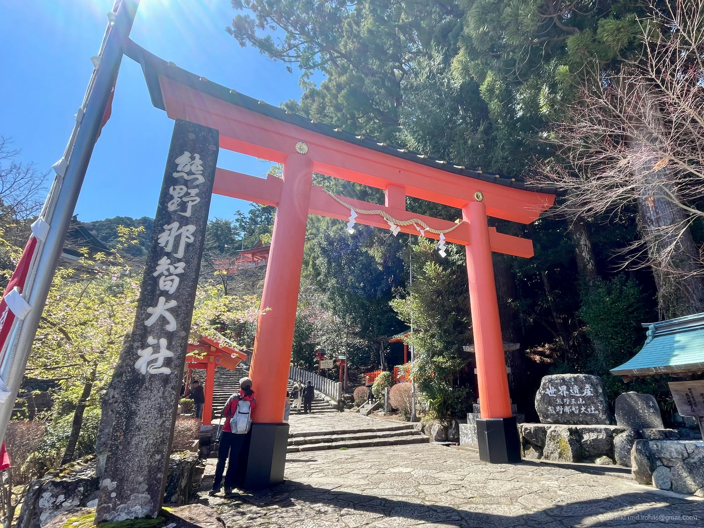
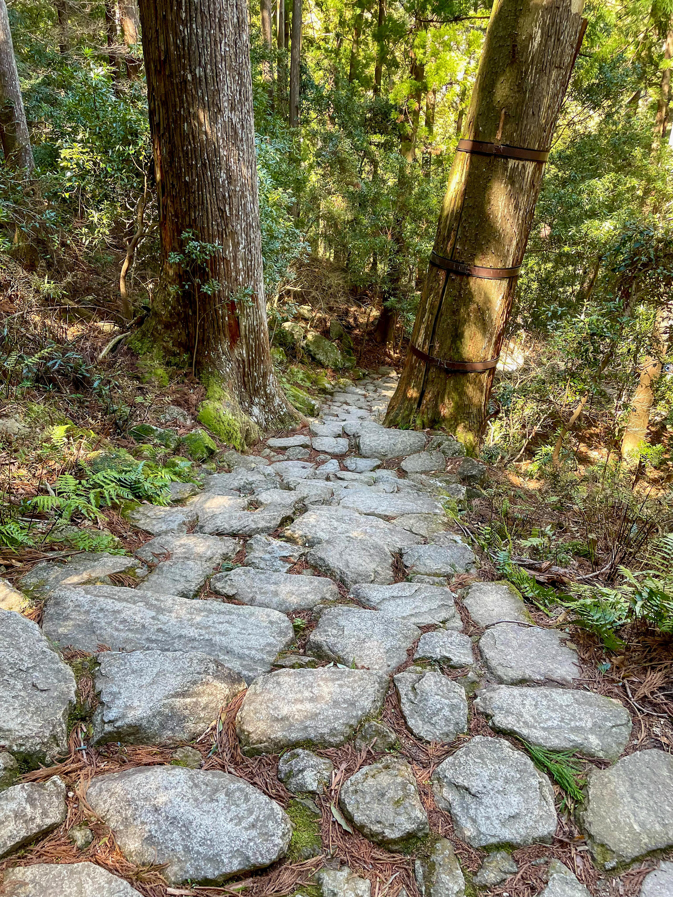
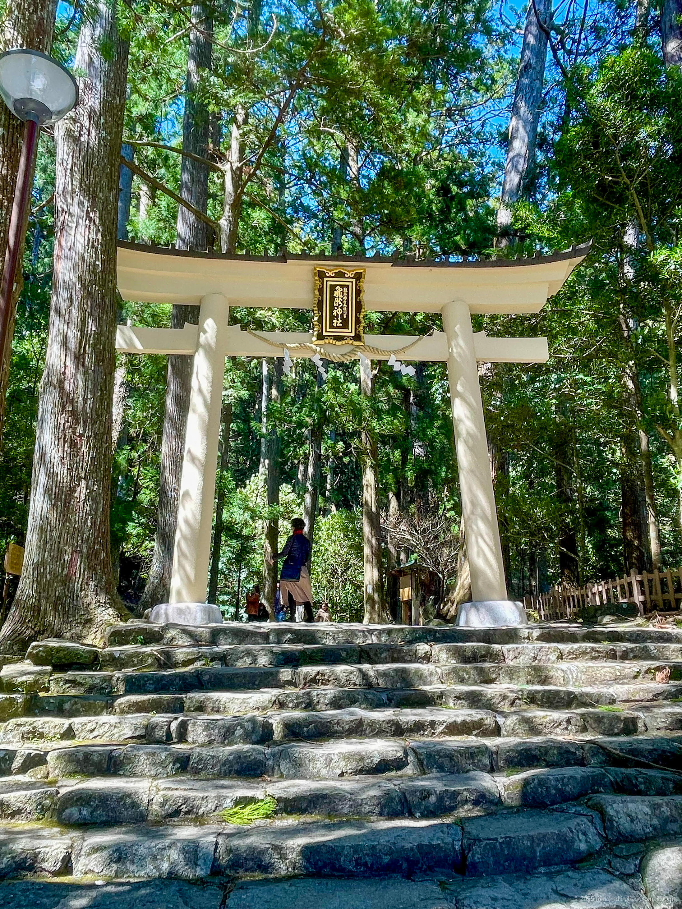
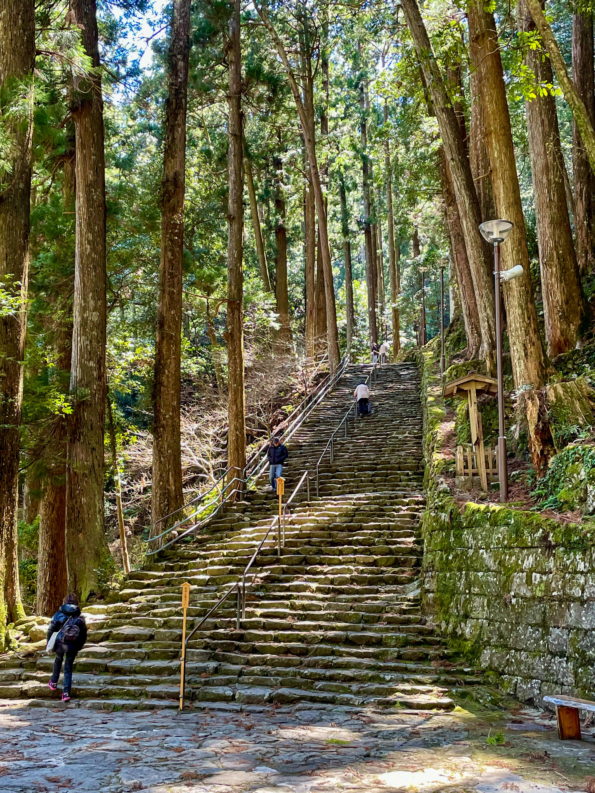
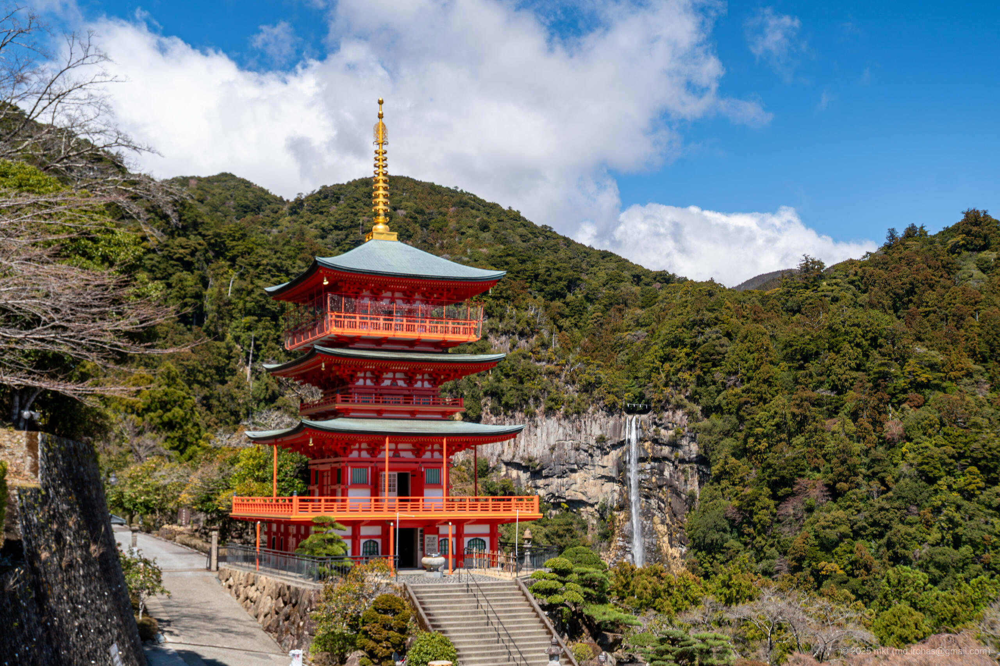
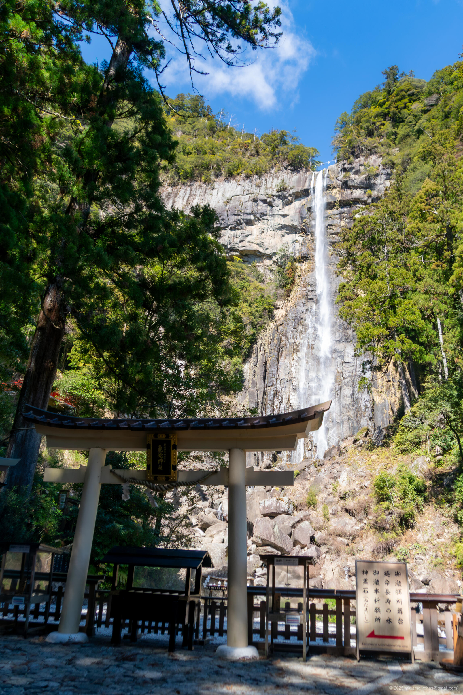
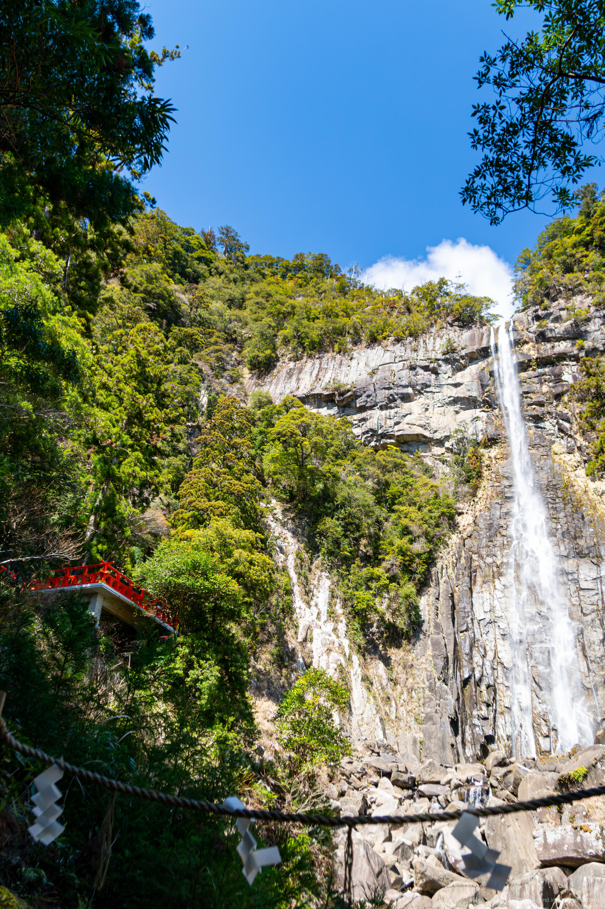
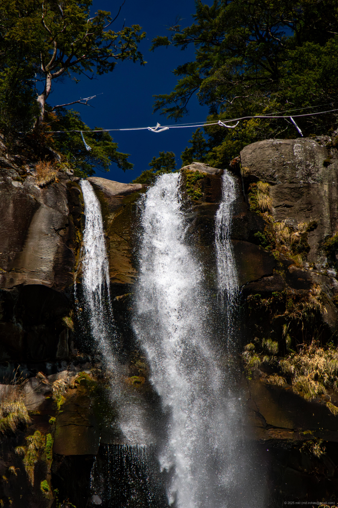
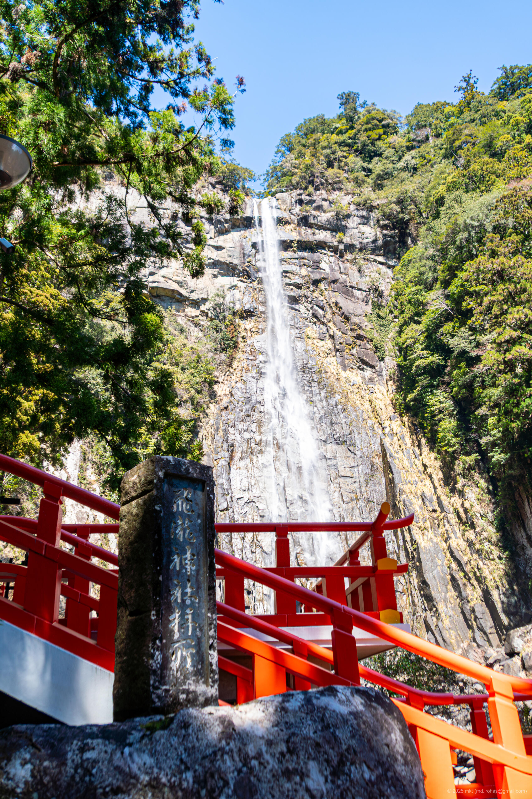

+++
title = '旅の写真: 熊野那智大社（2025年3月）'
date = '2025-06-12'
categories = ['ブログ（旅行写真）']
tags = ['旅行', '写真', '和歌山県', '熊野那智大社', '那智の滝']

isCJKLanguage = true
description = '2025年3月に参拝した熊野那智大社の記事です。'

draft = false

# Params
googlePhotoUrl = 'https://photos.app.goo.gl/z4VYpdVxJn5Jhgb67'
googleDriveUrl = 'https://drive.google.com/drive/folders/1OwB9EZJ442IfOmjuN-TTa1qwh1bPh2z6?usp=sharing'
+++

## 概要

2025年3月、和歌山県にある熊野那智大社を参拝しました。

熊野那智大社は熊野三山の一つで、熊野信仰の中心地として多くの参拝者を集める神社です。
社伝によれば、（神話上のことですが）那智大社は神武天皇が東征の際に那智の滝を遥拝したことに始まり、その創建は西暦317年と伝えられています。
また、那智大社の一帯は「紀伊山地の霊場と参詣道」としてユネスコ世界遺産にも登録されています。

駐車場に車を停め、参道の階段を上って本殿を参拝しました。

那智大社の隣には青岸渡寺の三重塔があり、那智の滝を背に三重塔を眺めることができました。
塔を登ることもできますが、参拝した日は風がとても強く、外観の見学のみにしました。

その後、裏参道にあたる石段を下り、飛瀧神社へ向かいました。

飛瀧神社は熊野那智大社の別宮で、那智の滝を御神体とする神社です。
那智の滝は日本一の落差（133メートル）を誇り、古代より滝そのものが御神体として神聖視されてきました。

大人1人300円で御瀧拝所の舞台まで行くことができ、壮大な那智の滝を間近で見ることができました。

## ギャラリー









## マップ

### 熊野那智大社



### 場所一覧



## 写真の詳細

### iPhone 12 mini





1. IMG\_3183.jpg (  ):  
    熊野那智大社の入口の鳥居の写真です。
1. IMG\_3198.jpg (  ):  
    那智大社から那智の滝へ向かう山道の石段の写真です。
1. IMG\_3199.jpg (  ):  
    那智の滝の入口の鳥居の写真です。
1. IMG\_3234.jpg (  ):  
    那智の滝付近の石段の写真です。

### Sony α6500





1. DSC05746-Enhanced-NR.jpg (  /  ):  
    熊野那智大社の礼殿の写真です。
1. DSC05777-Enhanced-NR.jpg (  /  ):  
    熊野那智大社のすぐ隣にある青岸渡寺三重塔と那智の滝の写真です。
1. DSC05790-Enhanced-NR.jpg (  /  ):  
    飛瀧神社の鳥居と那智の滝の写真です。
1. DSC05801-Enhanced-NR.jpg (  /  ):  
    御瀧拝所舞台と那智の滝の写真です。
1. DSC05817-Enhanced-NR.jpg (  /  ):  
    那智の滝の落口を高倍率で短時間露光（1/4000）で撮影した写真です。
1. DSC05827-Enhanced-NR.jpg (  /  ):  
    御瀧拝所舞台前の石碑と那智の滝の写真です。

## 編集履歴

- 2025/06/12: 初稿作成。

