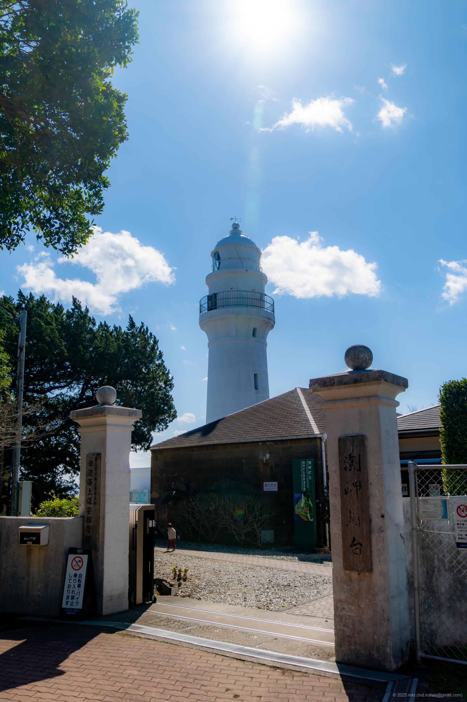

+++
title = '📸 Trip Photo: Cape Shionomisaki & Shionomisaki Lighthouse (March 2025)'
date = '2025-06-15'
categories = ['Blog (Trip Photo)']
tags = ['Trip', 'Photo', 'Wakayama', 'Sea', 'Sky', 'Cape', 'Lighthouse']

isCJKLanguage = false
description = '⚓️ A blog post about my photos I took at Cape Shionomisaki & Shionomisaki Lighthouse in March 2025.'
summary = '📍 Cape Shionomisaki, Shionomisaki Lighthouse'

draft = false

# Params
googlePhotoUrl = 'https://photos.app.goo.gl/1oysXXgnVbKfymP18'
googleDriveUrl = 'https://drive.google.com/drive/folders/1Us7QHXM7eqDfIP178VaqKPAoE7-FAs1G'
+++

## Summary

In March 2025, I visited Cape Shionomisaki and the Shionomisaki Lighthouse
in Wakayama Prefecture during my travels.



Cape Shionomisaki is the southernmost point of Honshu, located in Kushimoto Town, Wakayama Prefecture.
The cape juts out from the mainland like a small island,
and features a spacious park area and the Shionomisaki Lighthouse, which was built in 1873 (Meiji 6).

### Cape Shionomisaki

First, I headed for the southernmost tip of Honshu at Shionomisaki Cape.

Wakayama was much larger than I had imagined,
and after driving south, I arrived in the city center of Kushimoto.
Continuing further south, I found myself surrounded by the ocean, a grassy field, and wide open spaces.

There was a parking lot nearby,
so I parked my car and walked toward the sea.





Behind the building at the far end of the field,
there is a monument marking the southernmost point of Honshu.



From the deck behind the monument,
you can look out over the vast Pacific Ocean, with nothing but water stretching out before you.



### Shionomisaki Lighthouse

Next, I visited Shionomisaki Lighthouse.



Shionomisaki Lighthouse is a historic lighthouse built in 1873, and is one of 16 "climbable lighthouses" in Japan.



Admission was 300 yen per adult.
In addition to the lighthouse, there was a small museum and a mural of [Swimmy (Wikipedia)]https://en.wikipedia.org/wiki/Swimmy_(book)) made by local elementary school students.



Climbing to the top of the lighthouse, I was treated to a spectacular 360-degree view.
However, the wind was extremely strong that day,
and I was too scared to walk around the outside deck at the top.



## Gallery

{}



### iPhone 12 mini





### α6500







## Map

### Cape Shionomisaki



### Sites



## Change History

- 2025/09/07: Fix sentence structure and minor wording issues.
- 2025/09/04: Reorganize tags.
- 2025/06/15: First version.
