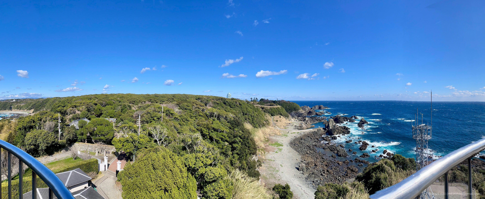

+++
title = 'Trip Photo: Cape Shionomisaki & Shionomisaki Lighthouse (March, 2025)'
date = '2025-06-15'
categories = ['Blog (Trip Photo)']
tags = ['Trip', 'Photo', 'Wakayama', 'Sea', 'Sky', 'Cape', 'Lighthouse']

isCJKLanguage = false
description = 'An article about Cape Shionomisaki & Shionomisaki Lighthouse I visited in March 2025.'
summary = '📍 Cape Shionomisaki, Shionomisaki Lighthouse'

draft = false

# Params
googlePhotoUrl = 'https://photos.app.goo.gl/1oysXXgnVbKfymP18'
googleDriveUrl = 'https://drive.google.com/drive/folders/1Us7QHXM7eqDfIP178VaqKPAoE7-FAs1G'
+++

## Summary

In March 2025, I visited Cape Shionomisaki and the Shionomisaki Lighthouse
in Wakayama Prefecture.

Cape Shionomisaki is the southernmost point of Honshu, Japan’s main island.
It sits on a stretch of land that juts out from the mainland, almost like a
small island.
The cape features a grassy open area, and at the far end of it stands a
monument marking the southernmost tip of Honshu.
Near the cape is the Shionomisaki Lighthouse, a historic structure built in
1873 during the Meiji era.
It's one of only 16 lighthouses in Japan that are open to the public for
climbing.

I first parked at the cape's parking lot and walked toward the southernmost
point.
The grassy field felt very open and spacious, and from the viewing deck next to
the monument, I was able to take in a wide view of the Pacific Ocean -- with no
land visible beyond the horizon.

Next, I headed to the Shionomisaki Lighthouse.
The entrance fee was 300 yen per adult.
In addition to the lighthouse itself, the grounds included a small exhibition
room and a mural of Swimmy (a children's book character by Leo Lionni) created
by local elementary school students.
Climbing to the top of the lighthouse, I was rewarded with a stunning
360-degree panoramic view of the ocean and coastline.

## Gallery

{}







## Map

### Cape Shionomisaki



### Sites



## Photo Details

### iPhone 12 mini





1. IMG\_3239.jpg (  ):  
    A panoramic photo of the grassy field at Cape Shionomisaki.
1. IMG\_3235.jpg (  ):  
    A panoramic photo taken from the top of the Shionomisaki Lighthouse.
1. IMG\_3249.jpg (  ):  
    A mural of Swimmy (by Leo Lionni) located within the grounds of the Shionomisaki Lighthouse.
1. IMG\_3250.jpg (  ):  
    There are [16 climbable lighthouses](https://www.tokokai.org/tourlight/)) across Japan.

### Sony α6500





1. DSC05833-Enhanced-NR.jpg (  /  ):
    A photo of the grassy field at Cape Shionomisaki.
1. DSC05834-Enhanced-NR.jpg (  /  ):
    A photo taken from the observation deck at the southernmost point of Honshu.
1. DSC05841-Enhanced-NR.jpg (  /  ):
    A photo of the monument marking the southernmost point of Honshu.
1. DSC05850-Enhanced-NR.jpg (  /  ):
    A photo of the entrance to the Shionomisaki Lighthouse.
1.  DSC05857-Enhanced-NR.jpg (  /  ):
    A photo taken from the top of the Shionomisaki Lighthouse.

## Change History

- 2025/09/04: Reorganize tags.
- 2025/06/15: First version.
