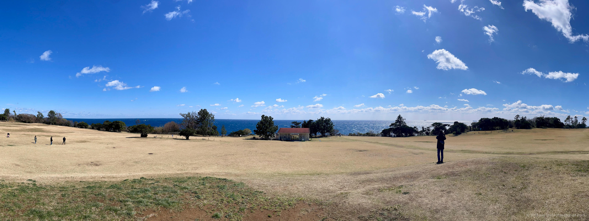
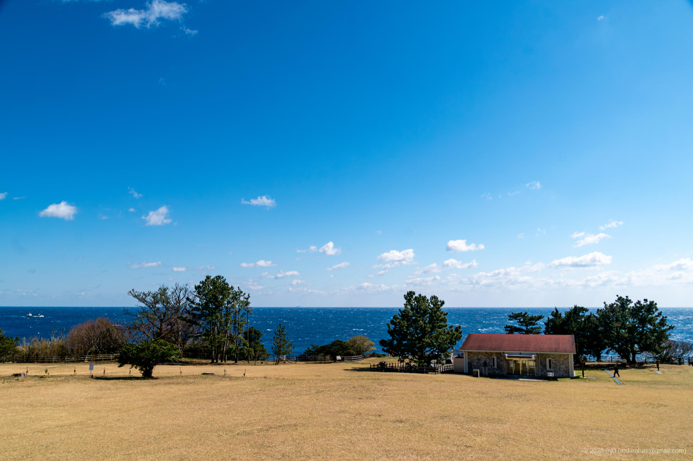
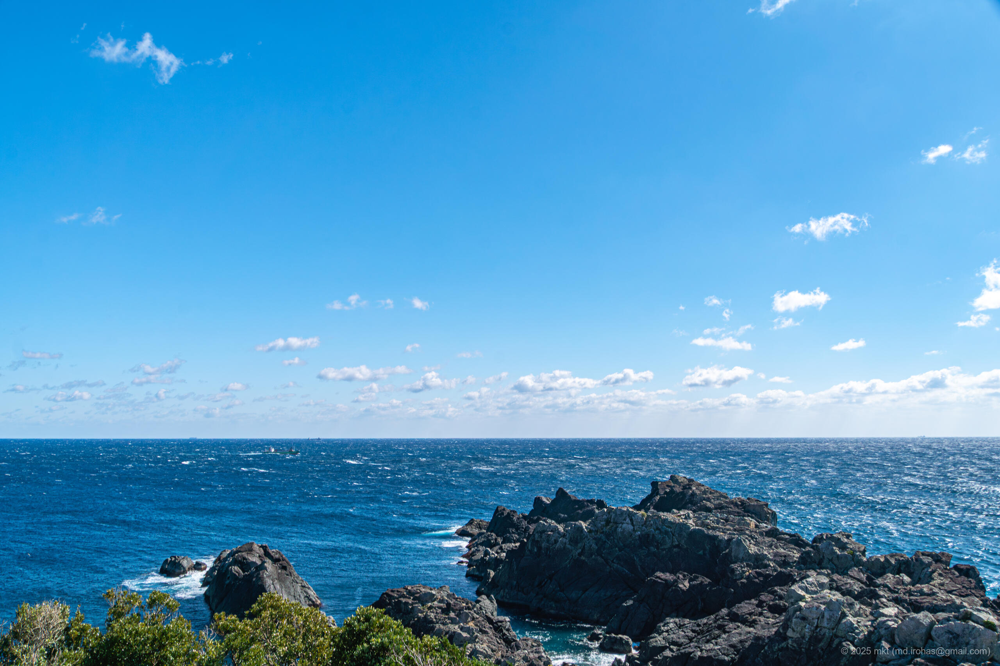
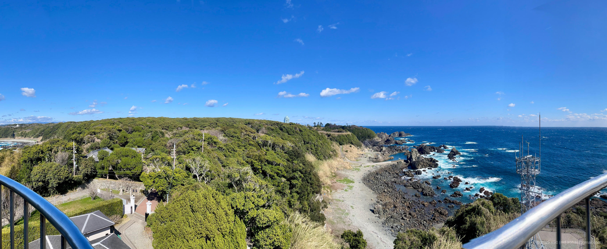
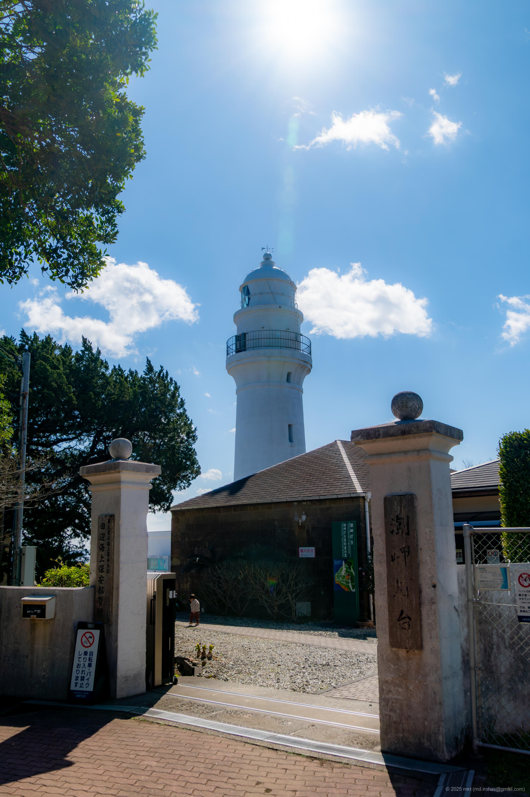
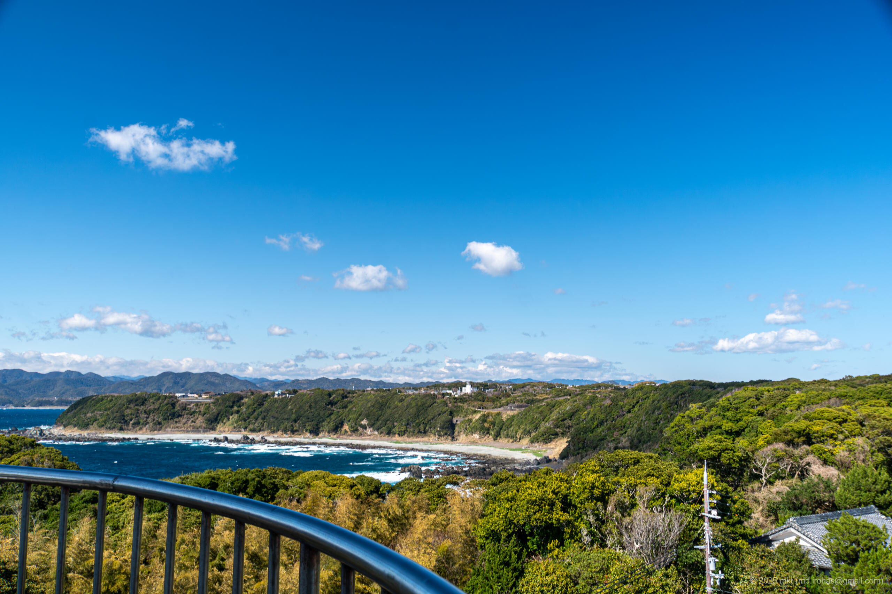
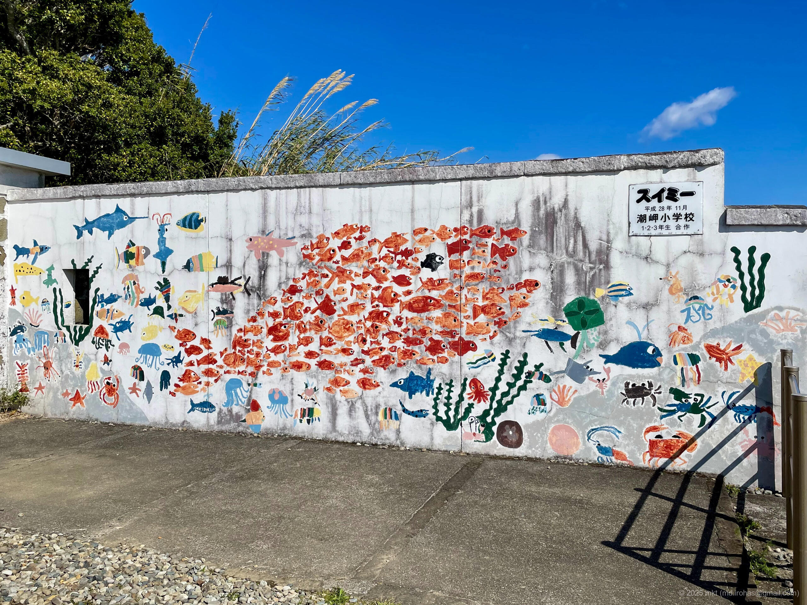
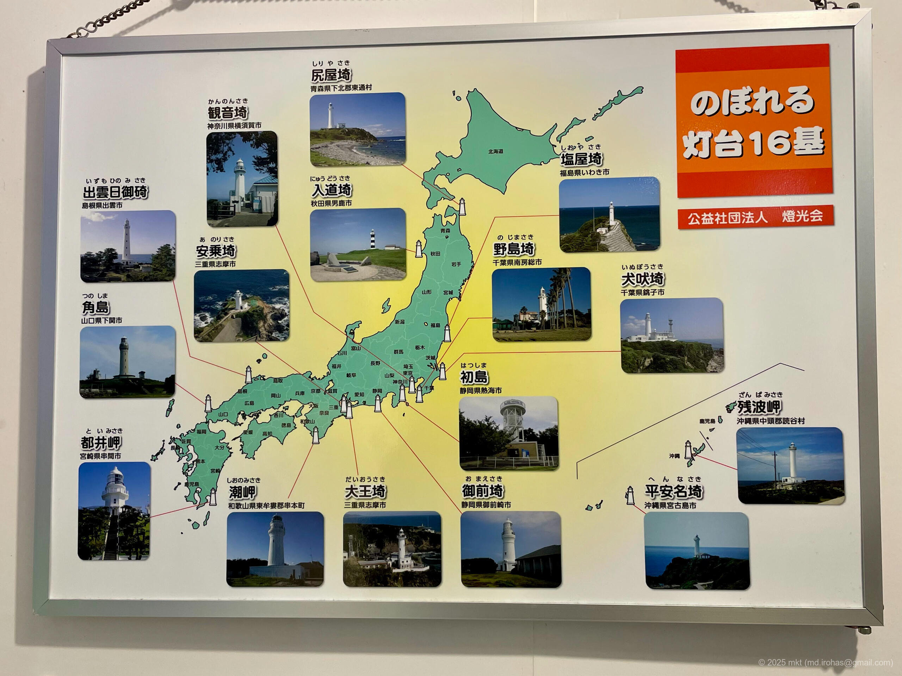

+++
title = '旅の写真: 潮岬・潮岬灯台（2025年3月）'
date = '2025-06-15'
categories = ['ブログ（旅行写真）']
tags = ['旅行', '写真', '和歌山', '潮岬', '潮岬灯台']

isCJKLanguage = true
description = '2025年3月に立ち寄った潮岬・潮岬灯台の記事です。'

draft = false

# Params
googlePhotoUrl = 'https://photos.app.goo.gl/1oysXXgnVbKfymP18'
googleDriveUrl = 'https://drive.google.com/drive/folders/1Us7QHXM7eqDfIP178VaqKPAoE7-FAs1G?usp=sharing'
+++

## 概要

2025年3月、和歌山県の潮岬と潮岬灯台に立ち寄りました。

潮岬は本州最南端に位置する岬で、本土から少し突き出た島のような陸地の上にあります。
岬には芝生の広場があり、その広場の奥には「本州最南端の碑」が設置されています。
また、岬には潮岬灯台があります。この灯台は明治6年（1873年）に建てられた歴史の長い灯台で、全国に16基ある「登れる灯台」のひとつです。

まず、潮岬の駐車場に車を停めて、本州最南端を目指しました。
岬の芝生の広場はとても開放感があり、本州最南端の碑のそばのデッキからは、その先に陸地のない太平洋を見渡すことができました。

次に潮岬灯台へ向かいました。
入場料は大人一人300円で、灯台の他に、小さな資料館や近所の小学生が製作したスイミーの壁画がありました。
そして灯台の上に登ると、そこからは360度広がる絶景を見ることができました。

## ギャラリー









## マップ

### 潮岬



### 場所一覧



## 写真の詳細

### iPhone 12 mini





1. IMG\_3239.jpg (  ):  
    潮岬の芝生の広場のパノラマ写真です。
1. IMG\_3235.jpg (  ):  
    潮岬灯台の上から撮ったのパノラマ写真です。
1. IMG\_3249.jpg (  ):  
    潮岬灯台の敷地内にある「スイミー」の壁画です。
1. IMG\_3250.jpg (  ):  
    日本全国には[16基の登れる灯台](https://www.tokokai.org/tourlight/)があるそうです。

### Sony α6500





1. DSC05833-Enhanced-NR.jpg (  /  ):  
    潮岬の芝生の広場の写真です。
1. DSC05834-Enhanced-NR.jpg (  /  ):  
    本州最南端のデッキから撮影したの写真です。
1. DSC05841-Enhanced-NR.jpg (  /  ):  
    本州最南端の石碑の写真です。
1. DSC05850-Enhanced-NR.jpg (  /  ):  
    潮岬灯台の入口の写真です。
1. DSC05857-Enhanced-NR.jpg (  /  ):  
    潮岬灯台の上から撮った写真です。

## 編集履歴

- 2025/06/15: 初稿作成。

