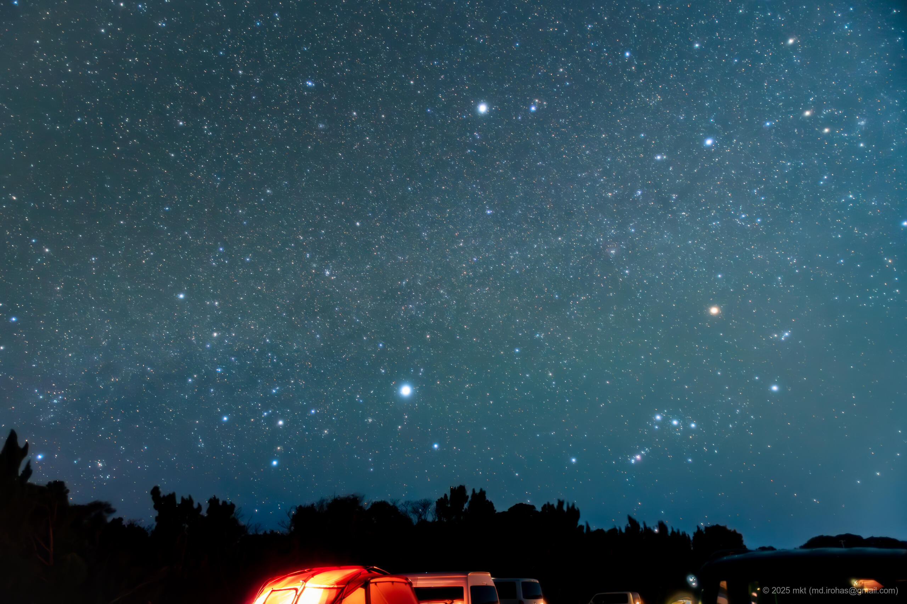
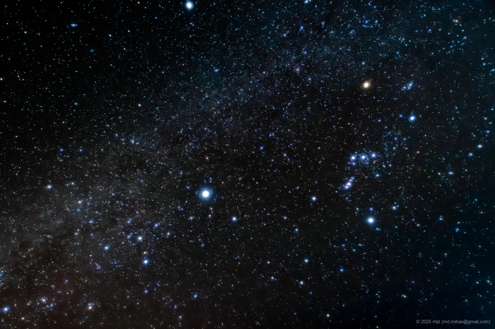

+++
title = 'Camping: Camp Resort Ohshima (March, 2025)'
date = '2025-07-20'
categories = ['Blog (Camping)']
tags = ['Camping', 'Photo', 'Wakayama', 'Camp Resort Ohshima']

isCJKLanguage = false
description = 'An article about camping I stayed in March, 2025.'

draft = false

# Params
googlePhotoUrl = 'https://photos.app.goo.gl/oVcZiZd3xSqPNvm96'
googleDriveUrl = 'https://drive.google.com/drive/folders/1yEnrWX32ib-ChWhSRrkNTPPWame7ytP4?usp=drive_link'
+++

## Sumamry

In March 2025, I stayed one night at a campsite called Nanki Kushimoto Resort
Oshima while traveling along the coastline of Wakayama Prefecture.

Nanki Kushimoto Resort Oshima is located on a small island just off Cape
Shionomisaki, the southernmost point of Japan's main island, Honshu.
While planning my route through Wakayama, I happened to discover that there was
a campsite on the island next to the cape -- and I thought, why not go for a
solo camping trip there?

Wakayama... is big.

The campsite sits on a hill with an ocean view.
Like Cape Shionomisaki, the land ends here -- beyond it lies nothing but the
vast Pacific Ocean.
With no man-made obstructions in sight, it's an incredibly open and freeing
location.

There's also a small open-air bath on the grounds.
From the tub, you get a sweeping view of the Pacific, beyond steep cliffs.
It's truly a spectacular view.

The wind was strong that day, and I struggled a bit with cooking since the
flames wouldn't catch well.
But at night, the sky was filled with stars, and I found myself quietly staring
up at them, lost in thought.

It's quite far from Tokyo, but I'd love to come back someday and take my time
here again.

## Gallery

{}







## Map



## Photo Details

### Sony α6500





1. DSC05882-Enhanced-NR.jpg (  /  ):  
   SIGMA 16mm F1.4 DC DN (Kenko MC Prosofton (N) A + Kenko Starry Night) / F1.4 / ISO3200 / 15s / Edited in Lightroom
1. DSC05932-Enhanced-NR-2.jpg (  /  ):  
   SIGMA 16mm F1.4 DC DN (Kenko MC Prosofton (N) A + Kenko Starry Night) / F1.4 / ISO3200 / 15s / Edited in Lightroom

## Change History

- 2025/07/20: First version.

