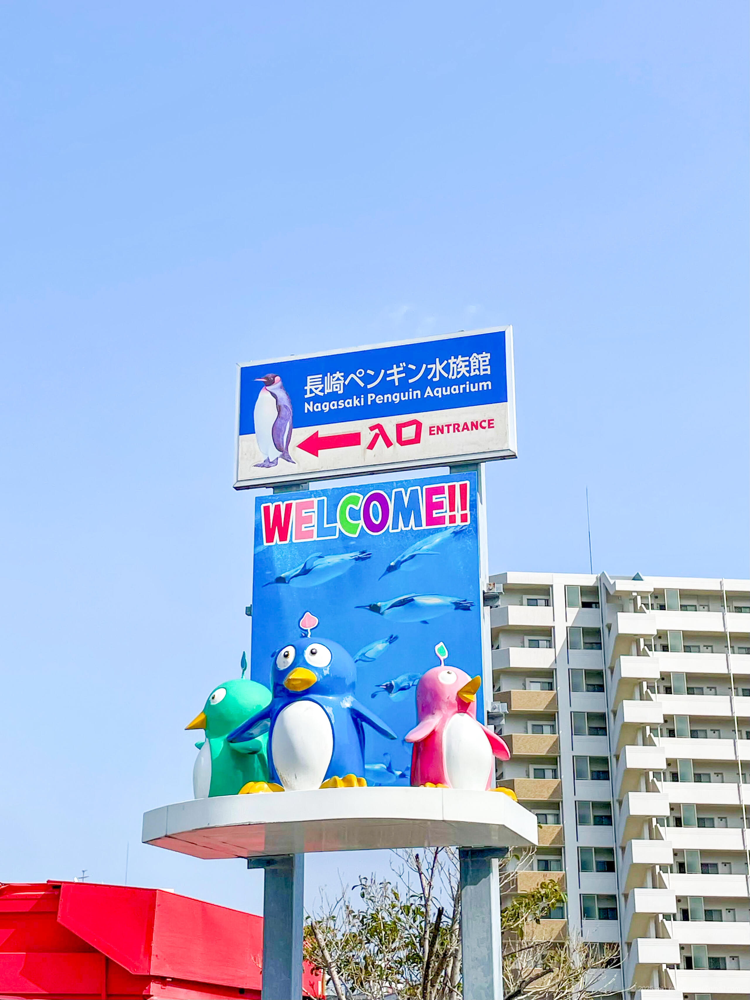
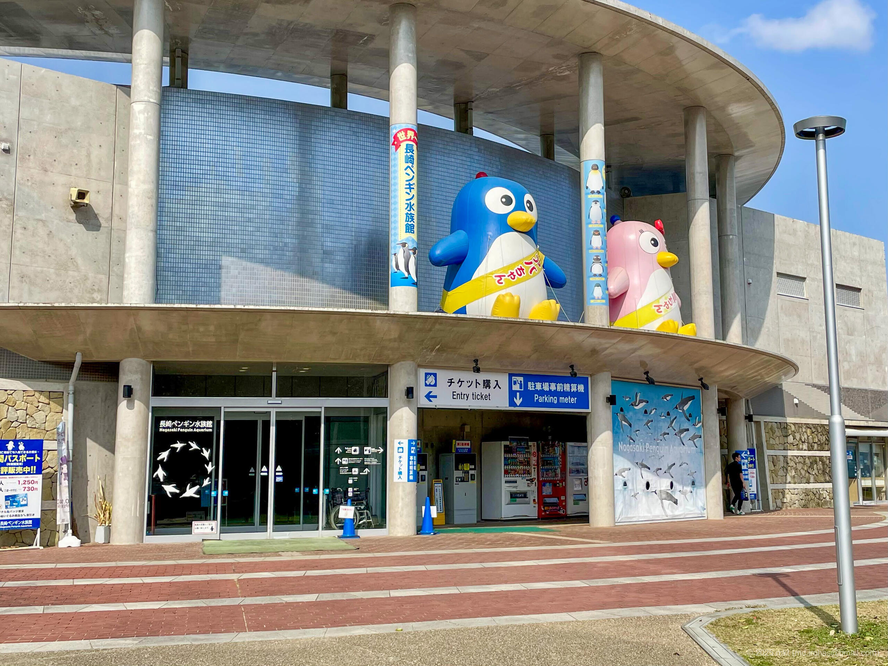
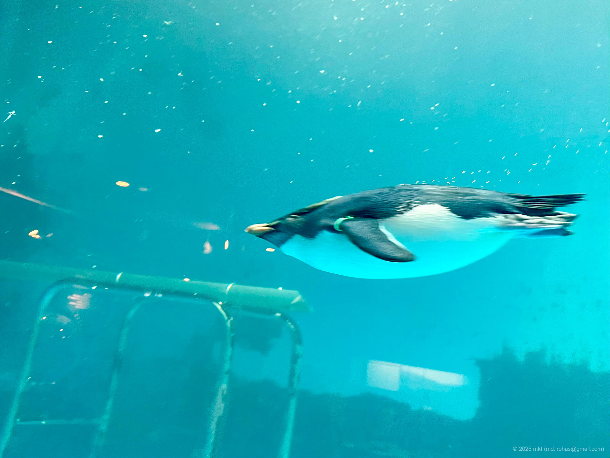
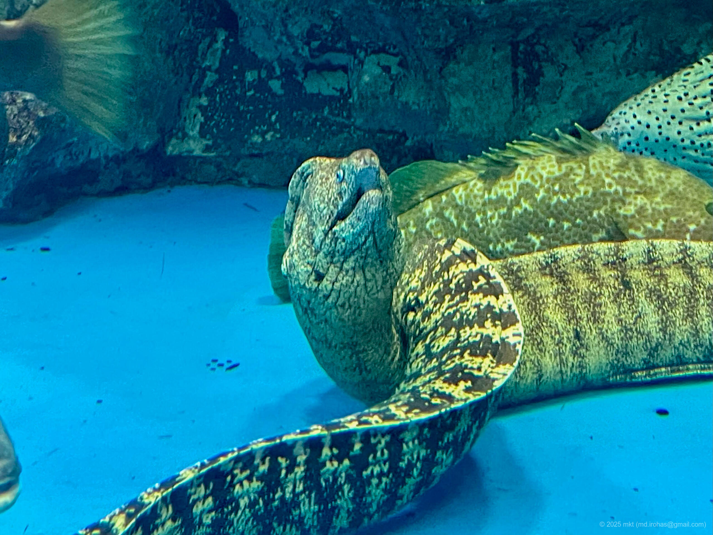
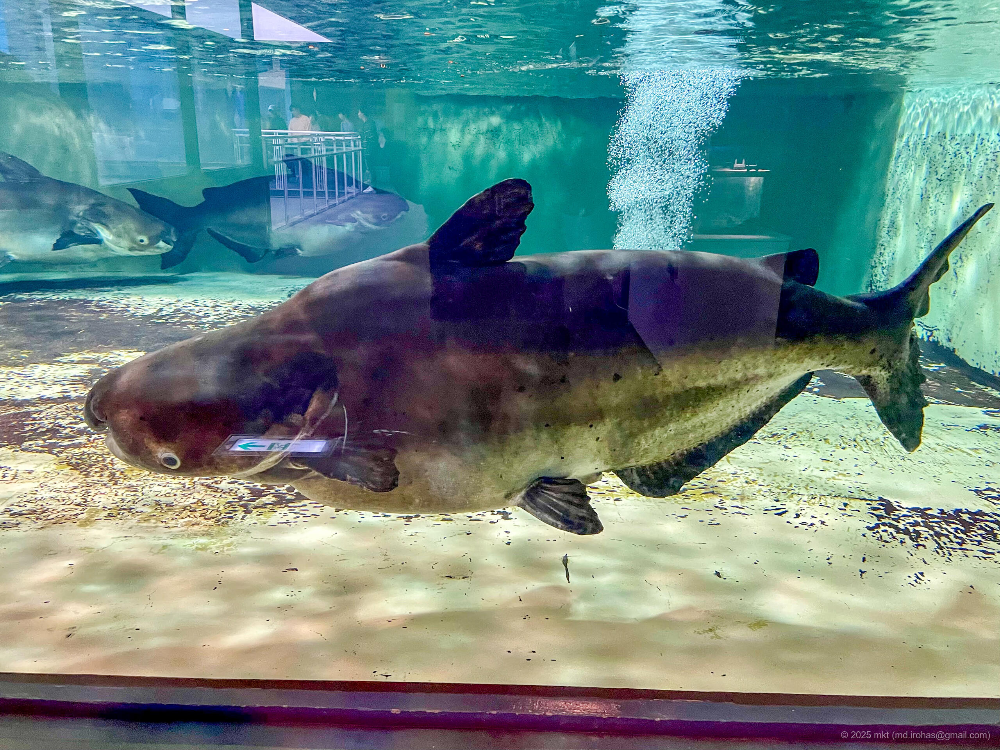
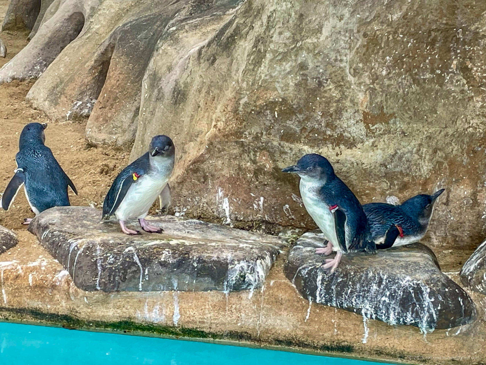
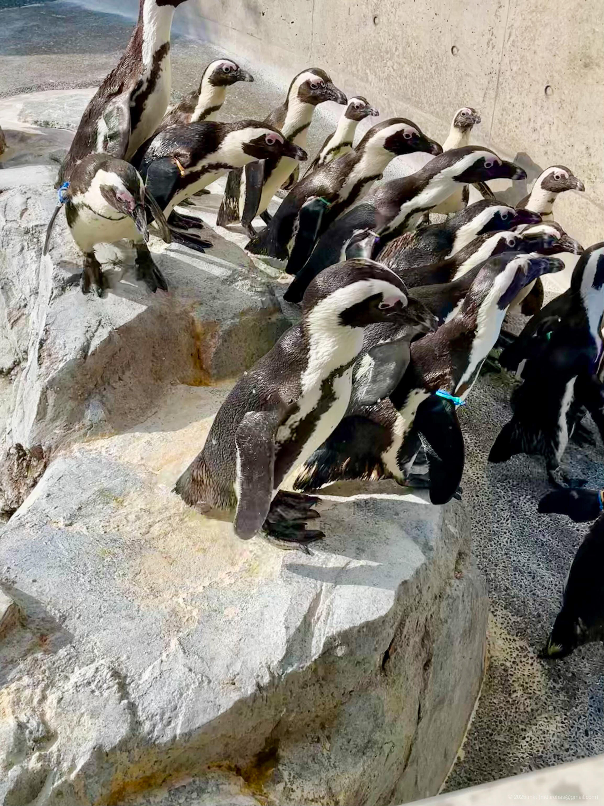

+++
title = 'Trip Photo: Nagasaki Penguin Aquarium (March, 2025)'
date = '2025-07-26'
categories = ['Blog (Trip Photo)']
tags = ['Trip', 'Photo', 'Nagasaki', 'Nagasaki Penguin Aquarium']

isCJKLanguage = false
description = "🐧 A blog post about my visit to the Nagasaki Penguin Aquarium in March 2025. The penguins were adorable."

draft = false

# Params
googlePhotoUrl = 'https://photos.app.goo.gl/7xha8tf4f2DUipzt7'
+++

## Summary

In March 2025, I visited the Nagasaki Penguin Aquarium.

- Official website: https://penguin-aqua.jp/

The Nagasaki Penguin Aquarium is a municipal aquarium located in Nagasaki City.
As its name suggests, the highlight is its penguin-focused exhibits.
As of 2025, it houses nine different species of penguins
-- among the largest collections in the world.

Since the aquarium is a little outside the city center,
you'll need to get there by car or bus.



After a short walk from the parking area,
the entrance to the aquarium comes into view.

Admission was 520 yen for adults and 310 yen for children.



The aquarium isn't very large,
so you can see everything in about one to two hours.
Inside, you'll find penguins of various sizes,
and the viewing areas let you get quite close.
This makes it easy to observe their individual personalities and facial expressions.

Among them, the [Little Penguin (Wikipedia)](https://en.wikipedia.org/wiki/Little_penguin) was especially tiny and adorable.







In addition to penguins,
the aquarium also features other marine creatures such as moray eels,
as well as the [Mekong giant catfish (Wikipedia)](https://en.wikipedia.org/wiki/Mekong_giant_catfish),
one of the largest freshwater fish in the world.





## Gallery

{}


  
  
  
  
  
  
  




## Map



## Change History

- 2025/08/22: First version.

