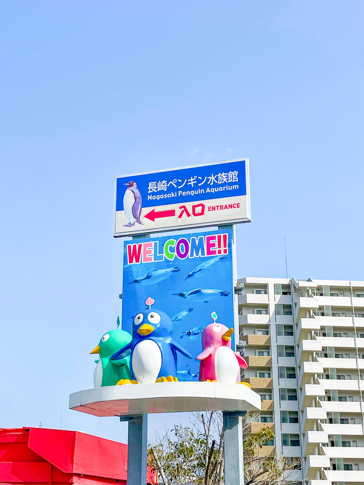
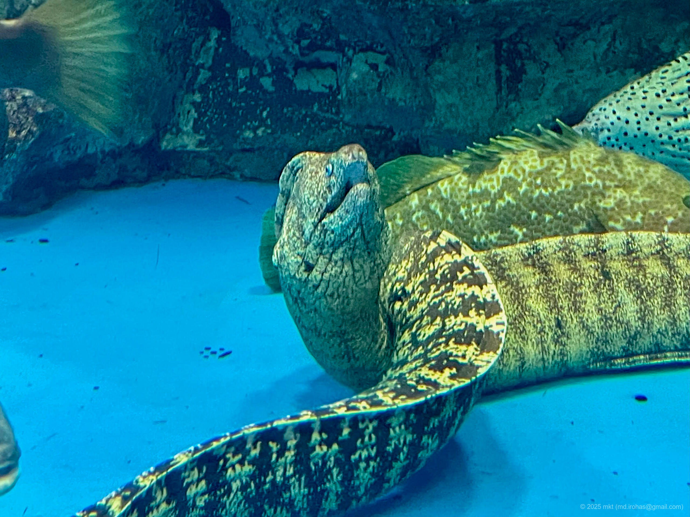
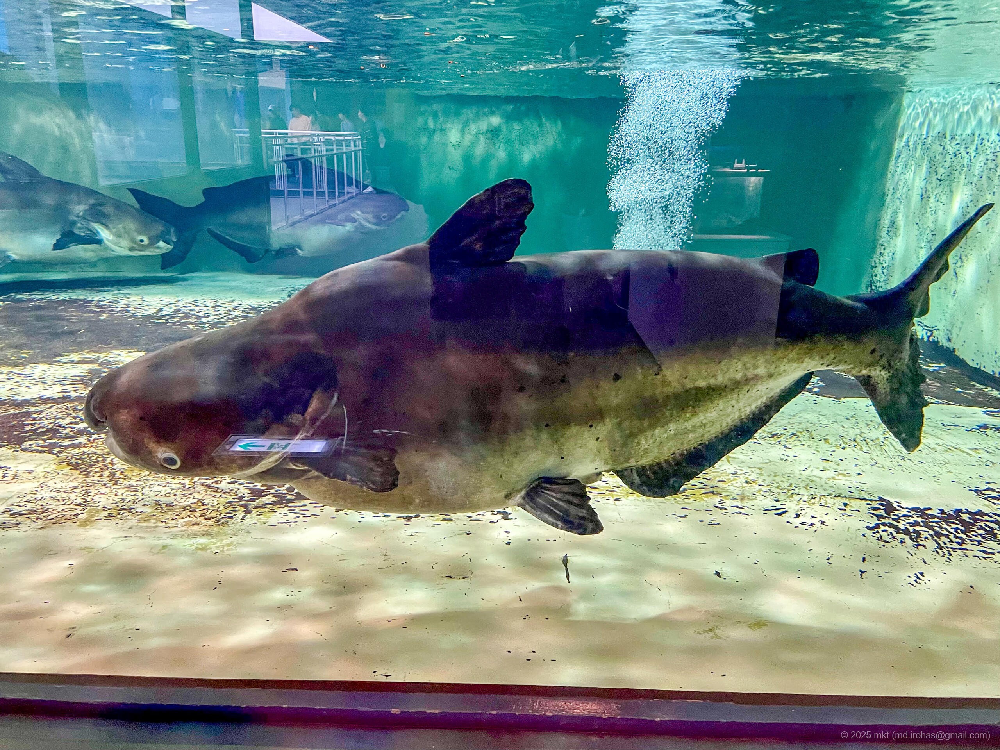
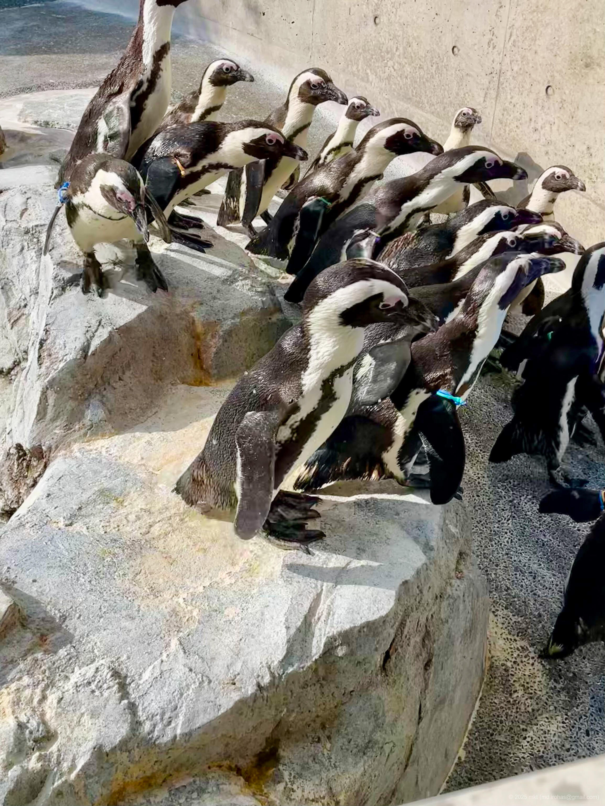

+++
title = '📸 旅の写真: 長崎ペンギン水族館（2025年3月）'
date = '2025-07-26'
categories = ['ブログ（旅の写真）']
tags = ['旅行', '写真', '長崎県', '水族館']

isCJKLanguage = true
description = '🐧 2025年3月に訪れた長崎ペンギン水族館で撮影した写真です。ペンギン可愛い 🐧🐧🐧'
summary = '📍 長崎ペンギン水族館'

draft = false

# Params
googlePhotoUrl = 'https://photos.app.goo.gl/7xha8tf4f2DUipzt7'
googleDriveUrl = ''
+++

## ストーリー

2025年3月、長崎ペンギン水族館を訪れました。

- 長崎ペンギン水族館: https://penguin-aqua.jp/



長崎ペンギン水族館は長崎市にある市立の水族館です。
名前の通り、ペンギンの特化した展示が特徴で、2025年現在、世界最多クラスとなる9種類のペンギンが飼育されているそうです。

水族館は長崎市中心部から少し離れているため、車やバスで行く必要があります。



駐車場から少し歩くと、水族館の入り口が見えてきます。

入場料は大人520円、子供310円でした。



水族館の規模はそこまで大きくなく、1〜2時間でひと通り見て回ることができます。
館内には大小様々なペンギンが飼育されていて、ペンギンまでの距離も近く、一匹一匹の個性や表情を観察できました。

なかでも、[コガタペンギン（Wikipedia）](https://ja.wikipedia.org/wiki/%E3%82%B3%E3%82%AC%E3%82%BF%E3%83%9A%E3%83%B3%E3%82%AE%E3%83%B3) は小さくてとても可愛かったです。







ペンギンのほかにも、ウツボなどの海の生物や、世界最大級の淡水魚である [メコンオオナマズ（Wikipedia）](https://ja.wikipedia.org/wiki/%E3%83%A1%E3%82%B3%E3%83%B3%E3%82%AA%E3%82%AA%E3%83%8A%E3%83%9E%E3%82%BA) が飼育されていました。





## ギャラリー





### iPhone 12 mini


  
  
  
  
  
  
  


## マップ

### 長崎ペンギン水族館



## 編集履歴

- 2025/09/06: 細かな表現を修正。
- 2025/09/04: タグを修正
- 2025/08/22: 初稿作成。
