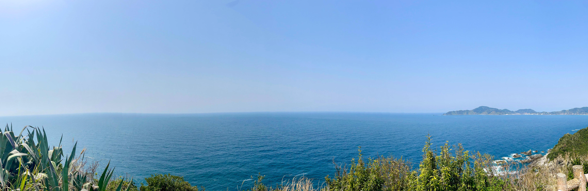
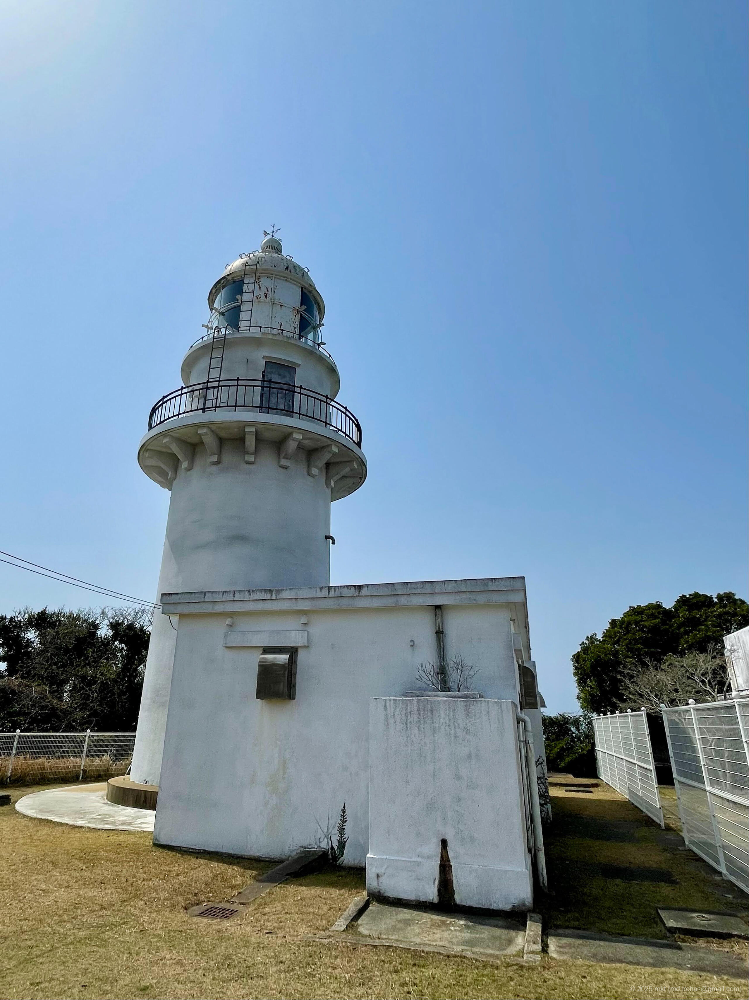
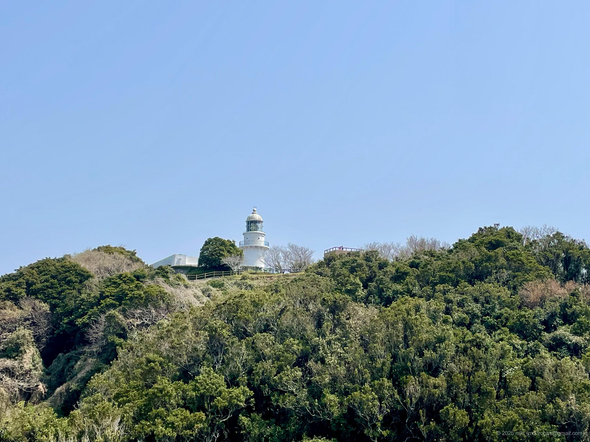
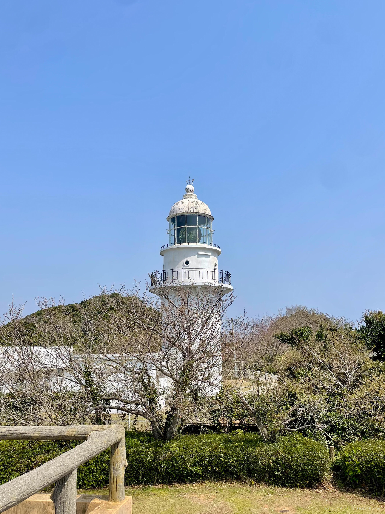
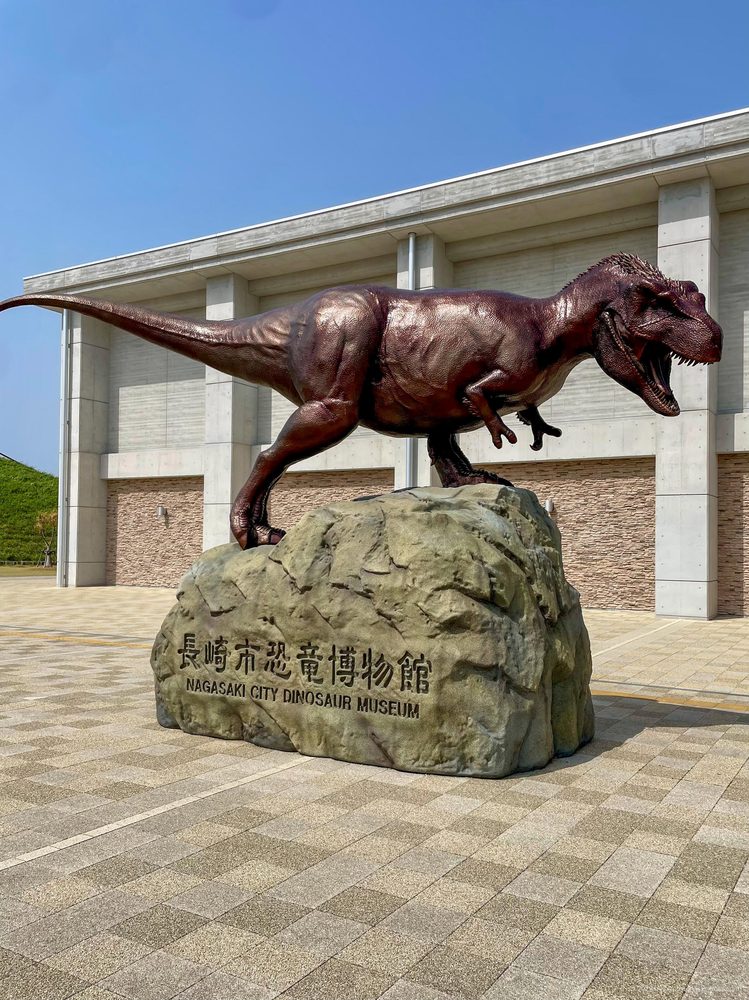
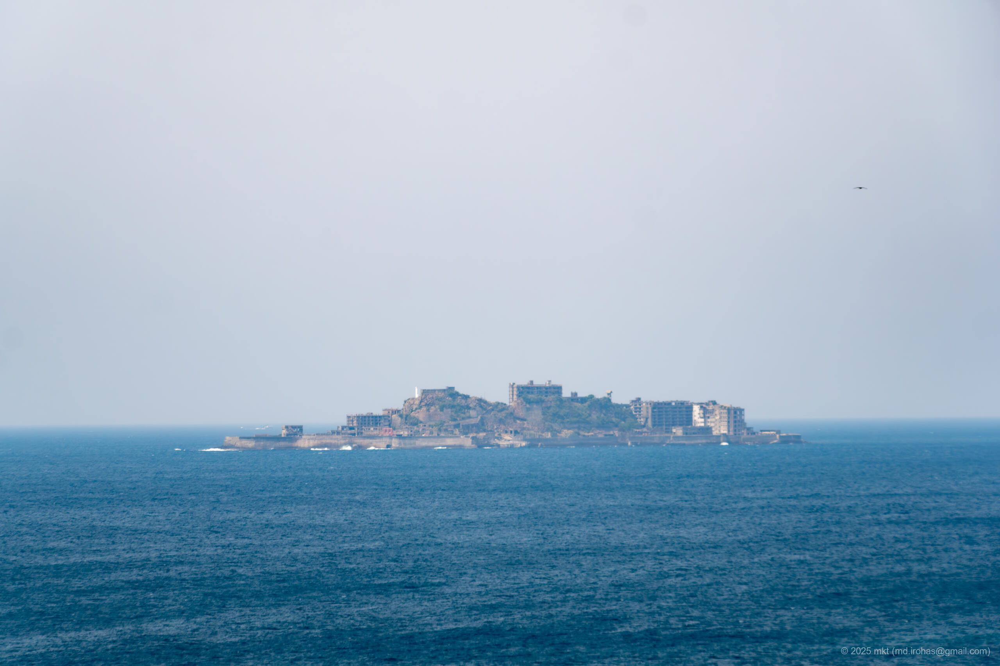

+++
title = 'Trip Photo: Nagasaki Peninsula (March 2025)'
date = '2025-08-22'
categories = ['Blog (Trip Photo)']
tags = ['Trip', 'Photo', 'Nagasaki', 'Sea', 'Sky', 'Lighthouse', 'Park', 'Museum', 'Historic Spot']

isCJKLanguage = false
description = "🦖 A blog post about my photos in the Nagasaki Peninsula in March2025, featuring Kabashima Lighthouse and Nagasaki Nomozaki Dinosaur Park."
summary = '📍 Nagasaki Peninsula, Kabashima Lighthouse, Nomozaki Peninsula, Nagasaki Nomozaki Dinosaur Park, Nagasaki City Dinosaur Museum, Gunkanjima (Hashima)'

draft = false

# Params
googlePhotoUrl = 'https://photos.app.goo.gl/pjuT3UV5fmNKwuGy6'
googleDriveUrl = 'https://drive.google.com/drive/folders/1YZi6YZ-eDuyQ-MLbn_jwIHInXYbuF5Qz'
+++

## Story

In March 2025, I took a drive around the Nagasaki Peninsula in Nagasaki Prefecture.

The Nagasaki Peninsula juts out to the south of Nagasaki City.
At its tip, you'll find the Nagasaki City Dinosaur Museum, beaches,
and further out, an island called Kabashima (Kaba Island).

### Kabashima Lighthouse

First, I headed to Kabashima Lighthouse, located on Kabashima Island.



Kabashima Lighthouse is a white concrete structure built in 1932.

I drove across the Kabashima Bridge to reach the island.
That part went smoothly,
but to get to the lighthouse, I had to continue about three kilometers on a narrow, badly worn road
-- it was the kind of road that made you want to turn back (though turning back wouldn't have been easy either).
Still, once I made it through, the area around the lighthouse was well maintained as a park, complete with restrooms and parking.

From the parking lot, a short climb up some stairs brought the lighthouse into full view.
The inside wasn't open to visitors, but I was able to admire the exterior up close.



Behind the lighthouse was an observation plaza that offered sweeping views of the sea.



Beyond that point, a steep stairway led down and then back up to another path
that ended at an observation deck at the very tip of the island.
I hesitated at first since it was a bit of a walk,
but it turned out to be worth it.
From there, the view opened into a vast, unobstructed panorama.









### Nagasaki Nomozaki Dinosaur Park

After leaving Kabashima, I headed to Nagasaki Nomozaki Dinosaur Park on the Nomozaki Peninsula.



Since I was hungry, I stopped at the cafe first for lunch.



The park has a hillside observation deck where you can spot [Hashima Island (Gunkanjima)](https://en.wikipedia.org/wiki/Hashima_Island) -- a UNESCO World Heritage Site -- in the distance.





Finally, I visited the Nagasaki City Dinosaur Museum.

The museum, which opened in 2021, is dedicated to dinosaurs.
Its exhibits include a full-scale 13-meter Tyrannosaurus skeleton replica,
as well as various dinosaur skeleton models and fossils.

- Nagasaki City Dinosaur Museum: https://nd-museum.jp/





Admission fee is 500 yen for adults and 200 yen for children.
The museum isn't very large,
but it houses a wide range of displays,
including exhibits on Nagasaki's geological layers and dinosaur skeleton replicas.
The highlight for me was the moving dinosaur robot on the second floor -- it was quite fun to see.

## Gallery

{}



### iPhone 12 mini





### α6500







## Map

### Kabashima Lighthouse



### Nagasaki Nomozaki Dinosaur Park



### Sites



## Change History

- 2025/09/06: Fixed minor wording issues.
- 2025/09/04: Reorganize tags.
- 2025/08/25: Add a link to RAW images.
- 2025/08/24: First version.
