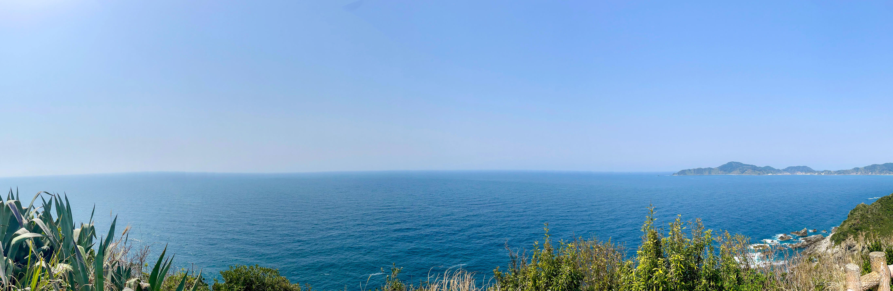
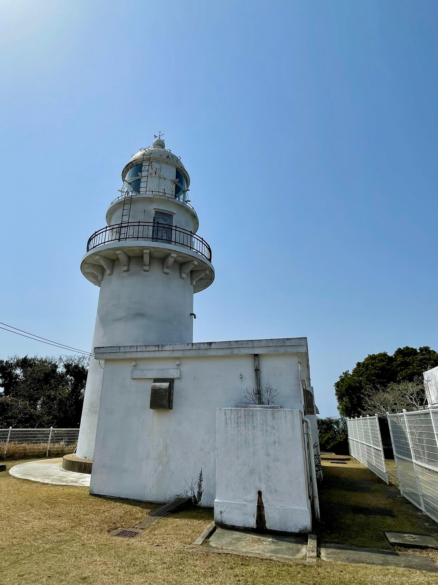
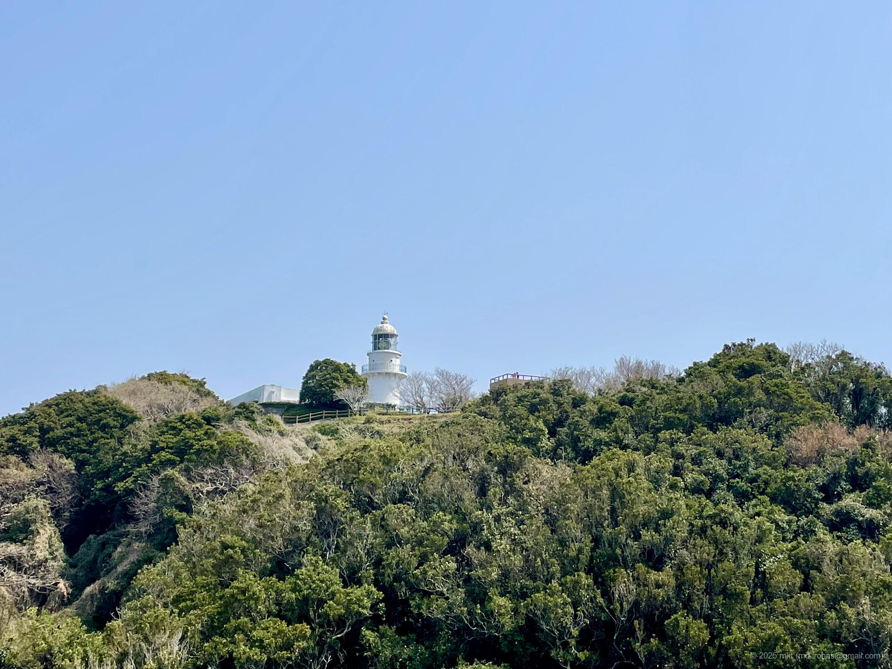
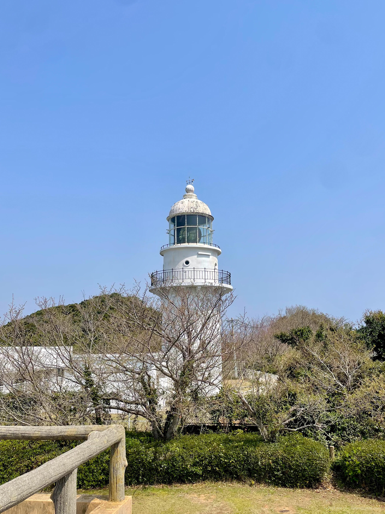
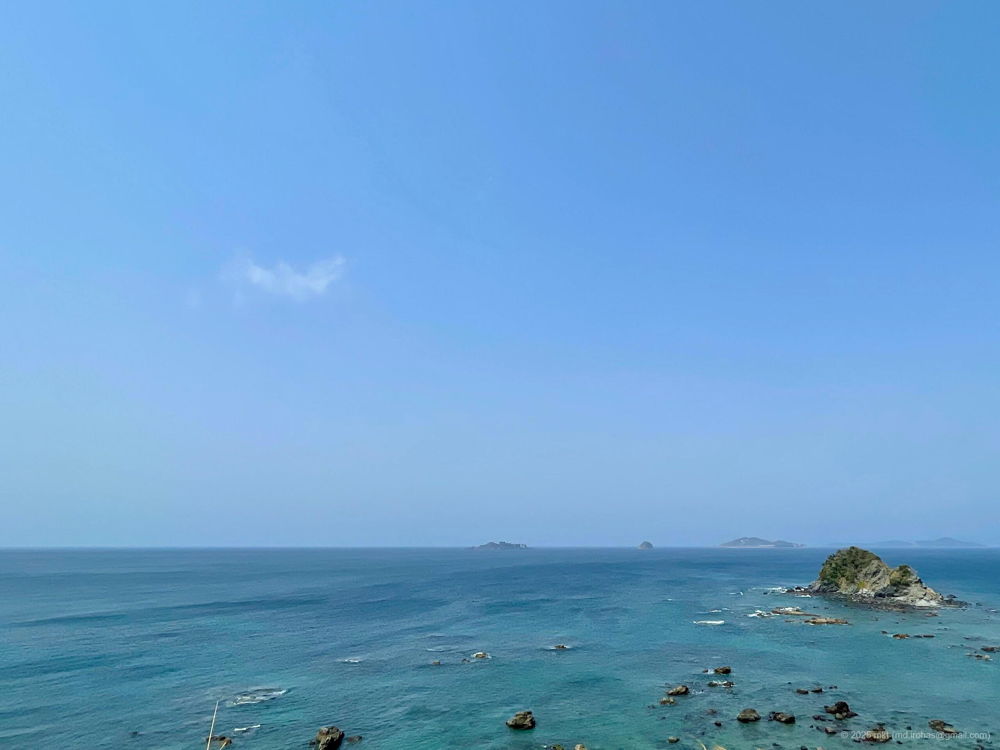
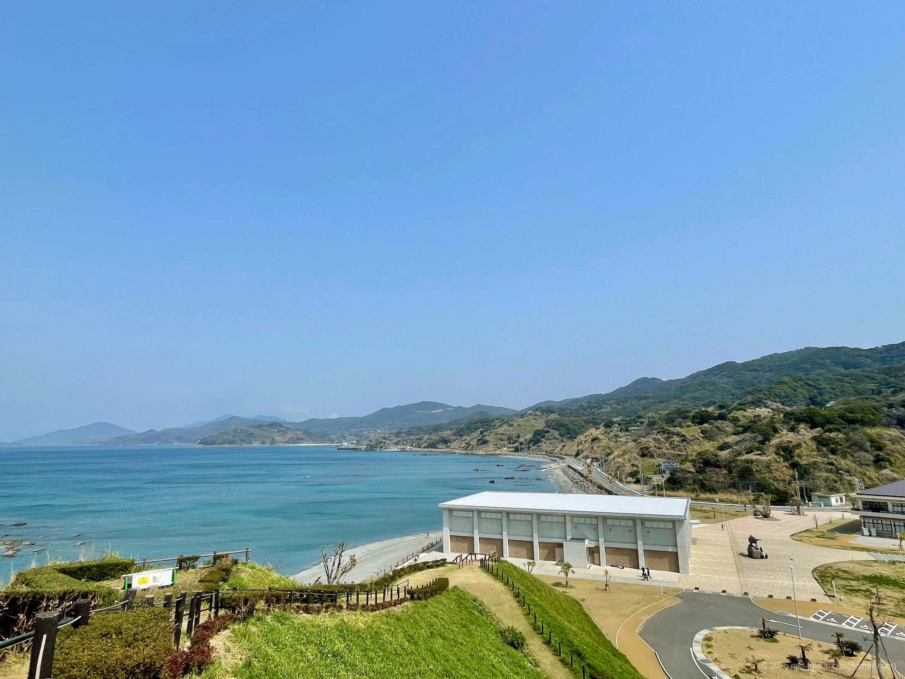
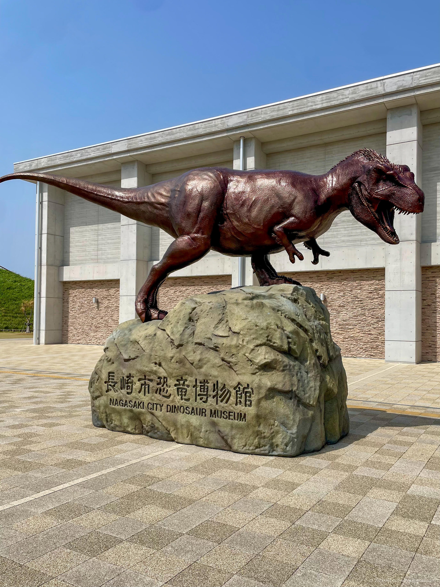
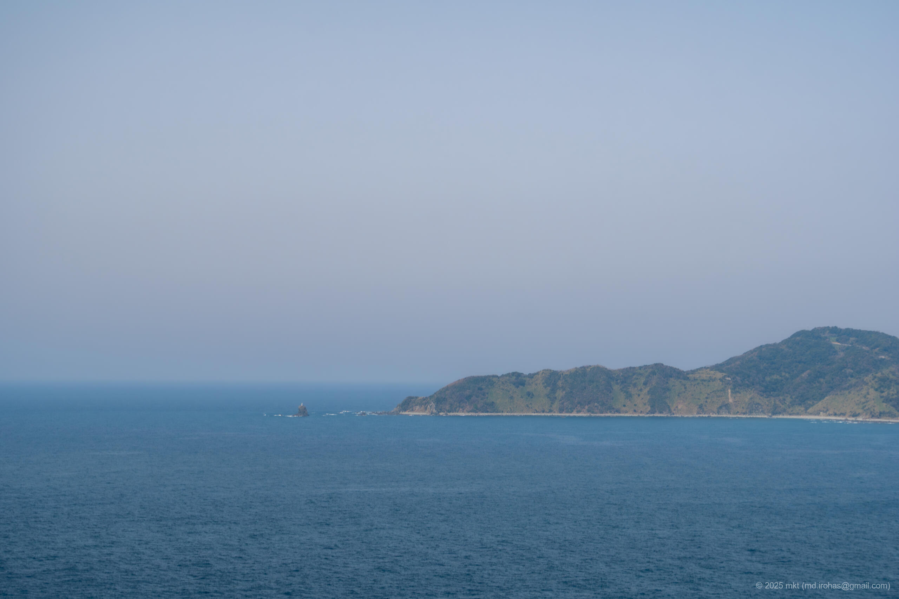
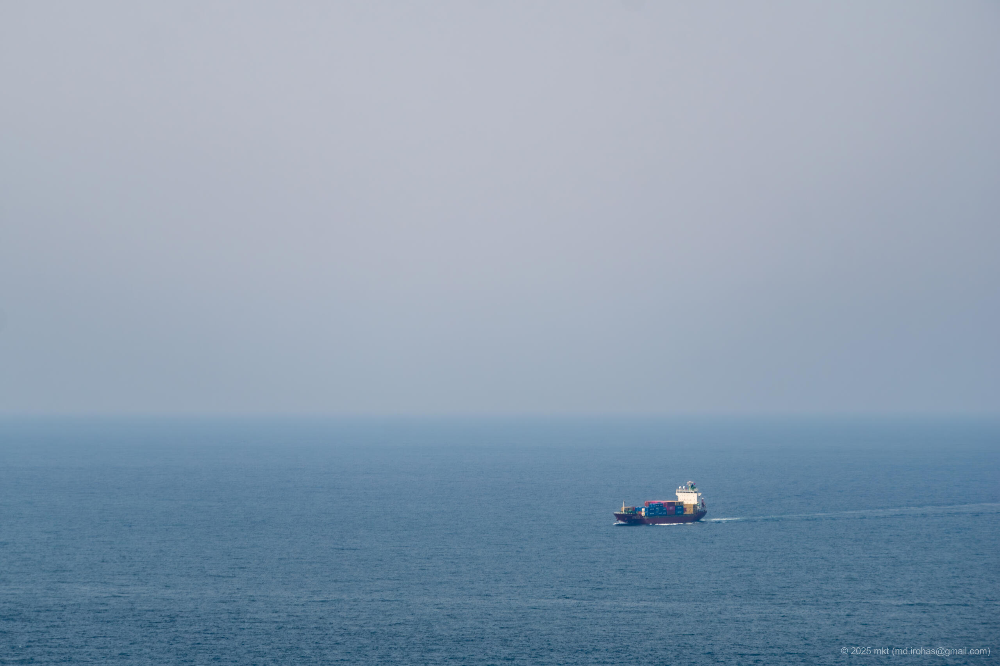
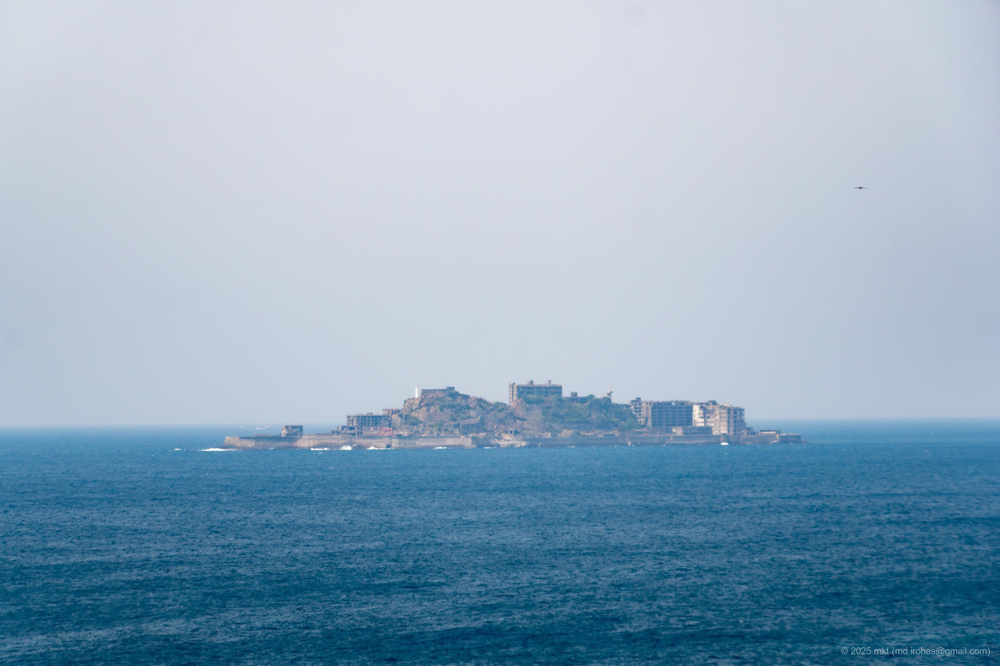

+++
title = '旅の写真: 長崎半島（2025年3月）'
date = '2025-08-22'
categories = ['ブログ（旅の写真）']
tags = ['旅行', '写真', '長崎県', '長崎半島', '樺島灯台', '野母崎半島', '長崎のもざき恐竜パーク', '長崎市恐竜博物館', '軍艦島（端島）']

isCJKLanguage = true
description = '🦖 2025年3月に観光した長崎半島の記事です。樺島灯台、長崎のもざき恐竜パークを巡りました。'

draft = false

# Params
googlePhotoUrl = 'https://photos.app.goo.gl/pjuT3UV5fmNKwuGy6'
googleDriveUrl = 'https://drive.google.com/drive/folders/1YZi6YZ-eDuyQ-MLbn_jwIHInXYbuF5Qz'
+++

## ストーリー

2025年3月、長崎県の長崎半島を車で巡りました。

長崎半島は長崎市の南に突き出た半島で、
長崎市恐竜博物館や海水浴場、その奥には樺島と呼ばれる島があります。

### 樺島灯台

まずはじめに、樺島にある「樺島灯台」へ向かいました。



樺島灯台は1932年に建てられたコンクリート造りの白い灯台です。

樺島大橋を車で渡って島へ到着。
そこまでは順調でしたが、
灯台までは舗装のいたんだ狭い道を3キロメートル程進む必要があり、
途中で引き返したくなるほどでした（引き返すのも大変そうですが...）。
それでも、悪路を抜けた先の樺島灯台周辺は公園として整備されていて、お手洗いや駐車場もありました。

駐車場から階段を上ると、すぐに目の前に樺島灯台がありました。
灯台の内部は見学できませんでしたが、外観は間近で見ることができました。



灯台の奥に展望広場があり、そこから海を一望することができました。



そのさらに奥には、急な階段を下ってまた上る道があり、
その道の先には島の先端に位置する展望台がありました。
少し距離がありそこまで行くか迷いましたが、行ってみて正解。
そこからの景色は、遮るものが何もない大パノラマでした。









### 長崎のもざき恐竜パーク

樺島をあとにして、野母崎半島にある「長崎のもざき恐竜パーク」へ向かいました。



お腹が空いていたので、先にカフェでお昼にしました。



恐竜パークには高台の展望台があり、
そこからは世界文化遺産の [軍艦島（Wikipedia）](https://ja.wikipedia.org/wiki/%E7%AB%AF%E5%B3%B6_%28%E9%95%B7%E5%B4%8E%E7%9C%8C%29) を遠くに眺めることができました。





最後に長崎市恐竜博物館を見学しました。

長崎市恐竜博物館は2021年のオープンした恐竜専門の博物館で、
全長約13mのティラノサウルスの全身骨格レプリカをはじめ、恐竜の骨格模型や化石等が展示されています。

- 公式Webサイト: https://nd-museum.jp/





観覧料は大人500円、子供200円。
館内はそれほど大きくありませんが、
長崎の地層や恐竜骨格のレプリカ等が多く展示されており、
そのなかでも、2階の動く恐竜ロボットが面白かったです。

## ギャラリー





### iPhone 12 mini





### α6500







## マップ

### 樺島灯台



### 長崎のもざき恐竜パーク



### 場所一覧



## 編集履歴

- 2025/08/24: 初稿作成。

