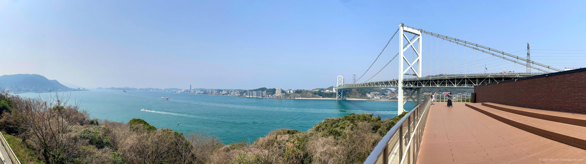

+++
title = 'Trip Photo: Kanmon Straits (March, 2025)'
date = '2025-08-25'
categories = ['Blog (Trip Photo)']
tags = ['Trip', 'Photo', 'Fukuoka', 'Yamaguchi', 'Kanmon Straits', 'Kanmon Bridge', 'Mekari PA']

isCJKLanguage = false
description = '🌁 A blog post about my visit to Mekari PA in March 2025, where I enjoyed views of the Kanmon Straits and the Kanmon Bridge.'

draft = true

# Params
googlePhotoUrl = 'https://photos.app.goo.gl/VKY8NL5UMM76LCC7A'
googleDriveUrl = 'https://drive.google.com/drive/folders/1aB3l9StwcJPqt-Zn3ancYx__dMqSkjn7'
+++

## Story

In March 2025, I stopped by Mekari Parking Area (PA) during a trip.



Mekari PA is located at the foot of [the Kanmon Bridge (Wikipedia)](https://en.wikipedia.org/wiki/Kanmon_Bridge),
which spans [the Kanmon Straits (Wikipedia)](https://en.wikipedia.org/wiki/Kanmon_Straits).

I hadn't originally planned to stop, but I decided to take a short break.
Inside the building, I found an observation deck.
From there, I could see the 1,068-meter-long Kanmon Bridge and the Kanmon Straits,
a key hub for maritime traffic.









## Gallery





### iPhone 12 mini





### α6500







## Map



## Change History

- 2025/08/26: First version.

