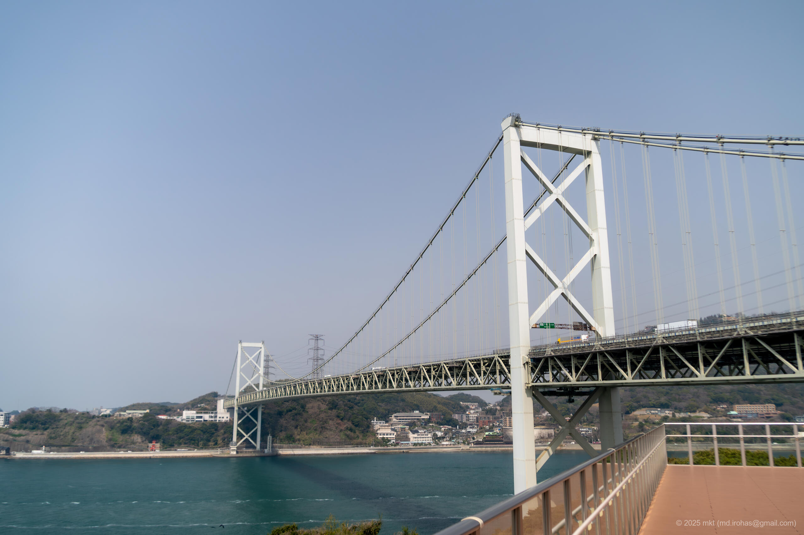

+++
title = '旅の写真: 関門海峡（2025年3月）'
date = '2025-08-25'
categories = ['ブログ（旅の写真）']
tags = ['旅行', '写真', '福岡県', '山口県', '海', '橋', '海峡', 'サービスエリア']

isCJKLanguage = true
description = '🌉 2025年3月に立ち寄っためかりPAの記事です。関門海峡や関門橋を眺めることができました。'
summary = '📍 関門海峡、関門橋、めかりPA'

draft = false

# Params
googlePhotoUrl = 'https://photos.app.goo.gl/VKY8NL5UMM76LCC7A'
googleDriveUrl = 'https://drive.google.com/drive/folders/1aB3l9StwcJPqt-Zn3ancYx__dMqSkjn7'
+++

## ストーリー

2025年3月、移動の途中でめかりパーキングエリア（PA）へ立ち寄りました。



めかりPAは、 [関門海峡（Wikipedia）](https://ja.wikipedia.org/wiki/%E9%96%A2%E9%96%80%E6%B5%B7%E5%B3%A1) に架かる [関門橋（Wikipedia）](https://ja.wikipedia.org/wiki/%E9%96%A2%E9%96%80%E6%A9%8B) のたもとにあるパーキングエリアです。

当初は立ち寄る予定はなかったのですが、休憩を兼ねて入ってみると、建物の中に展望デッキがありました。
そこからは全長1068メートルの関門橋と、海上交通の要衝として知られる関門海峡を一望できました。









## ギャラリー





### iPhone 12 mini





### α6500







## マップ



## 編集履歴

- 2025/09/04: タグを修正。
- 2025/08/26: 初稿作成。
