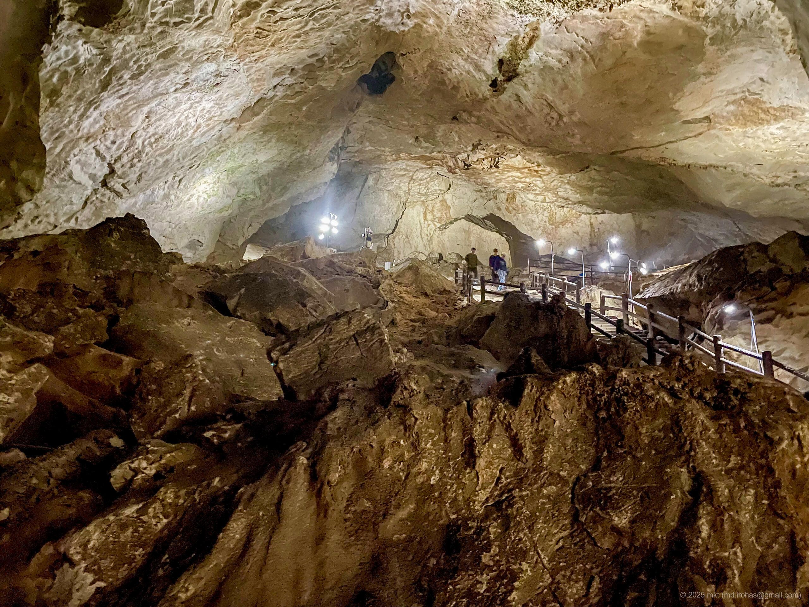
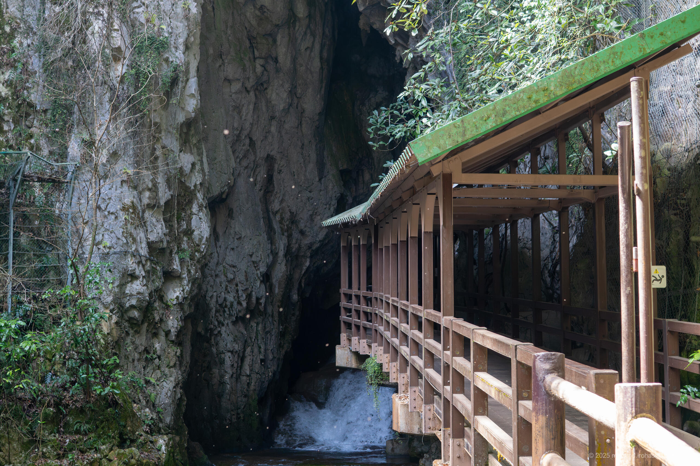
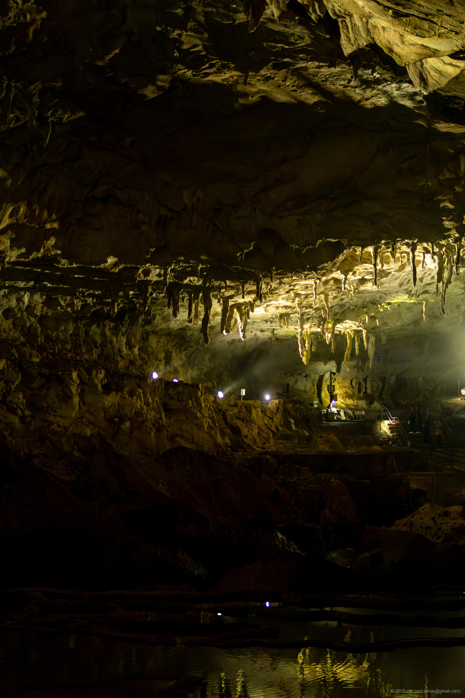
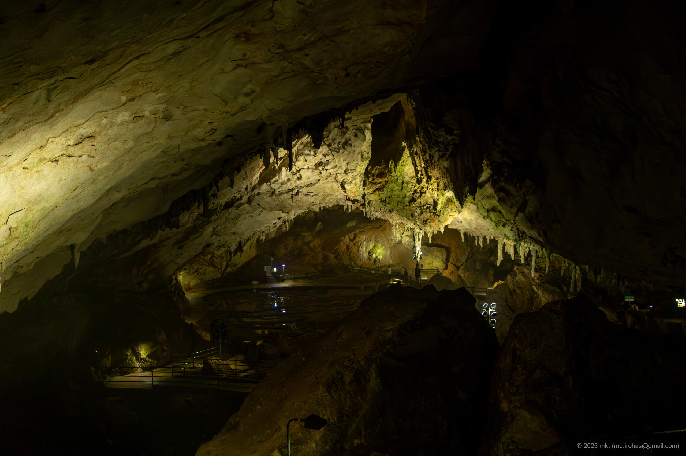

+++
title = 'Trip Photo: Akiyoshido Cave (March, 2025)'
date = '2025-08-26'
categories = ['Blog (Trip Photo)']
tags = ['Trip', 'Photo', 'Yamaguchi', 'Cave', 'Grassland']

isCJKLanguage = false
description = '🔦 A blog post about my visit to Akiyoshido Cave in March 2025. It was a fantastical and majestic space.'
summary  = '📍 Akiyoshido, Akiyoshidai Karst Observatory'

draft = false

# Params
googlePhotoUrl = 'https://photos.app.goo.gl/hmZimfNAeSwijxcE9'
googleDriveUrl = 'https://drive.google.com/drive/folders/1sZqxEe1eKhc5KFmviL429lxIokl9ygoQ'
+++

## Story

In March 2025, I visited Akiyoshido Cave,
located in Akiyoshidai Quasi-National Park in Yamaguchi Prefecture, Japan.



- Akiyoshidai Quasi-National Park: https://akiyoshidai-park.com/en/
- Akiyoshido Cave: https://en.karusuto.com/spot/akiyoshido/
    - A cave map is available online, and it's worth checking beforehand. I didn't look carefully and regretted it a little during my visit.

Akiyoshido is one of the largest limestone caves in Japan,
stretching about 11.2 km in total length.
It was designated a Special Natural Monument in 1952 and later became part of Akiyoshidai Quasi-National Park in 1955.
Today, about 1 km of the cave is maintained and open to visitors as a tourist route.

### Akiyoshido: Approaching the Main Entrance

Since the park is located a little away from the city center,
I drove there and parked nearby.

From the parking lot to the entrance gate,
a nostalgic shopping street lined with traditional souvenir shops led the way.
Passing through it brought me to the gate.
Admission was 1,300 yen for adults.

After passing the gate and walking along a riverside path,
I finally reached the cave's main entrance.



Surprisingly, the river here originates from water flowing out of the cave itself.

A pathway next to the entrance led directly into the cave.



### Akiyoshido: Near the Main Entrance

Inside the cave, it was dark and cool.



The tourist route stretches about 1 km one way,
with sections where the ceiling rises over 10 meters high.
The scale was truly overwhelming.





### Akiyoshido: Around Chimachida (Hyakumai-zara)

The cave interior was beautifully illuminated, and free Wi-Fi was even available.



A short walk brought me to a unique formation known as "Chimachida".







Deeper inside, I came across a vast chamber with stalactites hanging from the ceiling.





Eventually, I reached a long staircase...



I thought it might be the exit,
but it turned out to be only the halfway point, where the path branched.
Visitors can either take an elevator to another exit or continue farther into the cave.

### Akiyoshido: Near the Kurotani Entrance

I decided to continue deeper inside.

There, I found several striking natural formations.







Further ahead was an installation called the "300-Million-Year Time Tunnel.”
Passing through it brought me to the Kurotani Entrance of the cave.

From here, it was possible to exit directly or re-enter and walk back to the main entrance.

I chose to turn back and return to the main entrance.

The official guide suggested a round trip would take about 90 minutes,
but since I stopped often to take photos, it took me over two hours.

Although the cave was illuminated, it was still quite dark.
With a DSLR camera and telephoto lens, I needed exposures of several seconds
(even an iPhone 12 mini required about a 1-second exposure).
Since tripods aren't practical along the walkway,
I relied on a bright prime lens with an aperture of f/1.4.



A fast (wide-aperture) lens is recommended for taking photos inside the cave.

Although the cave is illuminated, it's still very dark,
so bringing a lens that handles low light will make shooting much easier.
 
I used an f/1.4 prime lens.
I also tried a telephoto (Sony SEL18200LE),
but in auto mode it called for about a 1-second exposure,
which is difficult without a tripod
(tripods should not be used inside the cave due to the narrow walkways).
Even with an iPhone 12 mini, an exposure time of about 1 second was necessary.



### Akiyoshidai Karst Observatory

Because the Kurotani Entrance was some distance from the Akiyoshidai Karst Observatory,
I returned to the main entrance and drove there.



From the observatory, I enjoyed a panoramic view of the vast karst plateau.



Afterward, I stopped for a light meal at a cafe near the observatory,
then drove along the scenic Karst Road to my next destination.
The open landscape along the drive was also very refreshing.

## Gallery





### iPhone 12 mini





### α6500







## Map



## Change History

- 2025/09/04: Reorganize tags.
- 2025/08/28: First version.
