+++
title = '旅の写真: 秋芳洞（2025年3月）'
date = '2025-08-26'
categories = ['ブログ（旅の写真）']
tags = ['旅行', '写真', '山口県', '洞窟', '草原']

isCJKLanguage = true
description = '🔦 2025年3月に訪れた秋芳洞の記事です。幻想的で雄大な空間でした。'
summary = '📍 秋芳洞、秋吉台展望台'
draft = false

# Params
googlePhotoUrl = 'https://photos.app.goo.gl/hmZimfNAeSwijxcE9'
googleDriveUrl = 'https://drive.google.com/drive/folders/1sZqxEe1eKhc5KFmviL429lxIokl9ygoQ'
+++

## ストーリー

2025年3月、山口県の秋吉台国定公園にある秋芳洞を訪れました。



- 秋吉台国定公園: https://akiyoshidai-park.com/
- 秋芳洞: https://karusuto.com/spot/akiyoshido/
    - 洞窟マップが公開されているので、事前に確認しておくと便利です。私はあまり確認せずに行ってちょっと後悔しました。

秋芳洞は、総延長が約11.2kmにおよぶ日本最大級の鍾乳洞です。
1952年に国の特別天然記念物に指定され、1955年には秋吉台国定公園の一部となりました。
現在は、そのうちの約1kmが観光ルートとして整備・公開されています。

### 秋芳洞: 正面入口まで

秋吉台国定公園は市街地から少し離れたところにあったため、
車で移動し、近くの駐車場に停めて観光しました。

駐車場から秋芳洞の入場ゲートまでは、昔ながらの観光地らしい商店街が続いていました。
商店街を抜けると入場ゲートに到着しました。
入場料は大人1300円でした。

入場ゲートを通過して川沿いをしばらく歩くと、秋芳洞の入口が見えてきます。



川の水源は意外にも鍾乳洞から流れ出る水だったようです。

洞窟の入口横にある通路を進むと、中へ入ることができます。



### 秋芳洞: 正面入口付近

洞窟内は暗く、ひんやりとしていました。



観光ルートは片道約1kmあり、天井の高さが十数mに達する場所もありました。
その規模に圧倒されました。





### 秋芳洞: 百枚皿付近

洞窟内は幻想的にライトアップされ、フリーWiFiも整備されていました。



しばらく進むと、「百枚皿」と呼ばれる独特の地形がありました。







さらに奥へ進むと、広い空間に天井から垂れ下がる鍾乳石をみることができました。





そして、少し長い階段があり...



ここがゴールかと思いましたが、まだ中間地点で、分岐がありました。

エレベーターで別の出口へ進むこともできますし、さらに奥へ進むこともできます。

### 秋芳洞: 黒谷入口付近

私はそのまま洞窟の奥へ進みました。

奥には、特徴的な自然の造形物がありました。







さらに進むと「三億年のタイムトンネル」と名付けられたアートがあり、
それを抜けると秋芳洞黒谷入口に到着しました。

黒谷入口からそのまま外に出ることもできますし、再入場して正面入口へ戻るのも可能でした。
私はそこで折り返し、正面入口へ戻りました。

観光案内には往復90分程度と書かれていましたが、
私は写真を撮りながら歩いていたため、往復で2時間以上かかりました。



洞窟内の写真撮影には明るいレンズがおすすめです。

洞窟内はライトアップされていますがとても暗いです。
そのため、暗闇でも撮影可能な明るいレンズを持っていきましょう。
 
私はf/1.4の単焦点レンズを使用しました。
望遠レンズ（Sony SEL18200LE）も試しましたが、
オートモードでは露光が約1秒必要となり、三脚なしでは撮影が難しそうでした
（洞窟内は通路が狭いため三脚の使用はNGです）。
また、iPhone 12 miniでも露光時間は約1秒必要でした。



### 秋吉台展望台

黒谷入口から秋吉台展望台まではやや距離があったため、
一旦正面入り口へ戻り、車で秋吉台展望台へ向かいました。



展望台からはカルスト台地を一望することができました。



なお、「秋芳洞」と「秋吉台」で「あきよし」の表記が違うのは、
[歴史的な事情があるそうです（Wikipedia）](https://ja.wikipedia.org/wiki/%E7%A7%8B%E8%8A%B3%E6%B4%9E#%E5%90%8D%E7%A7%B0%E3%81%AB%E3%81%A4%E3%81%84%E3%81%A6)。

展望台近くのカフェで軽食を取り、カルストロードを走って次の目的地へ向かいました。
カルストロードの開放感もとても良かったです。

## ギャラリー





### iPhone 12 mini


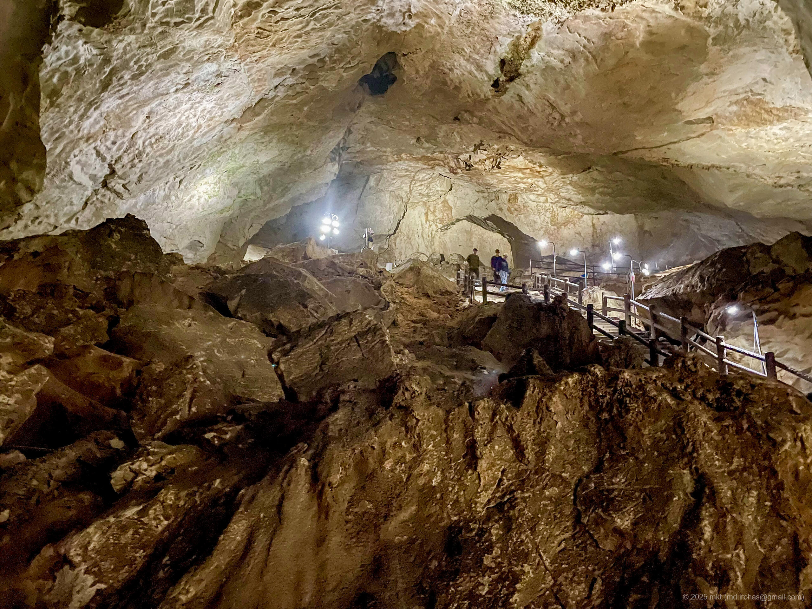
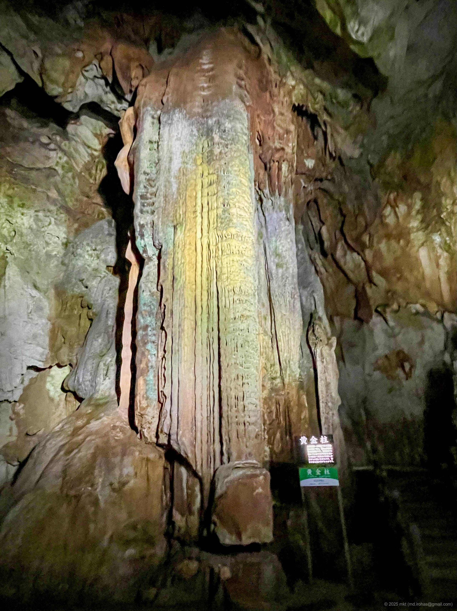
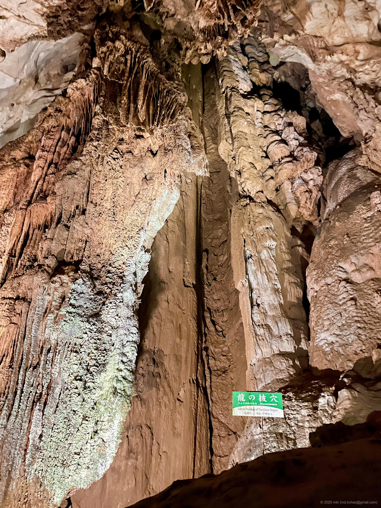


### α6500


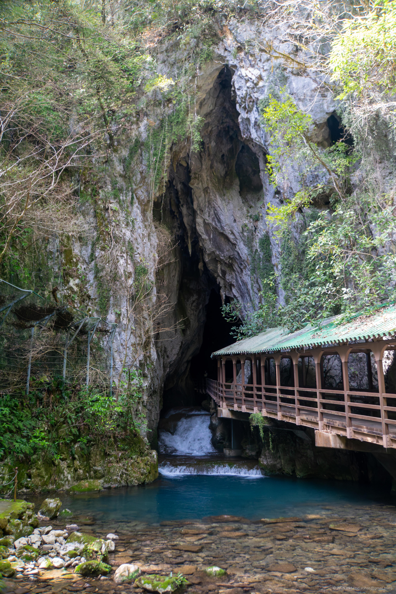
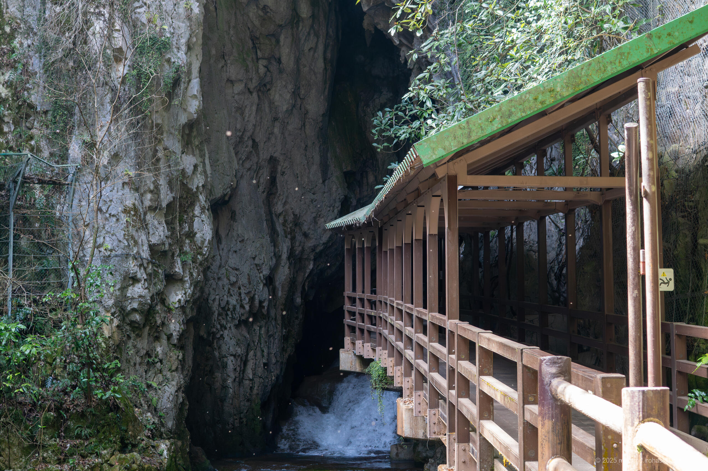
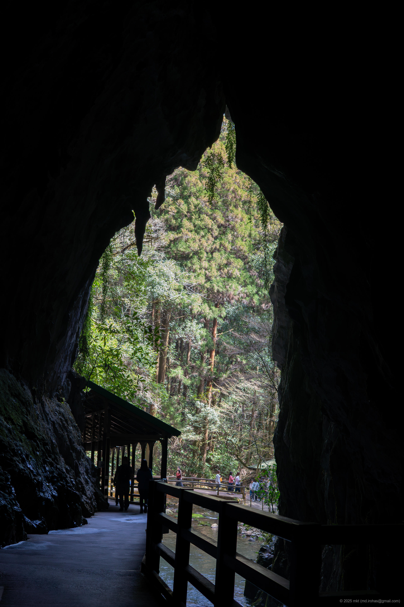

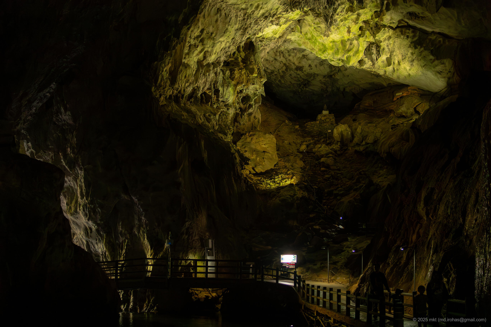
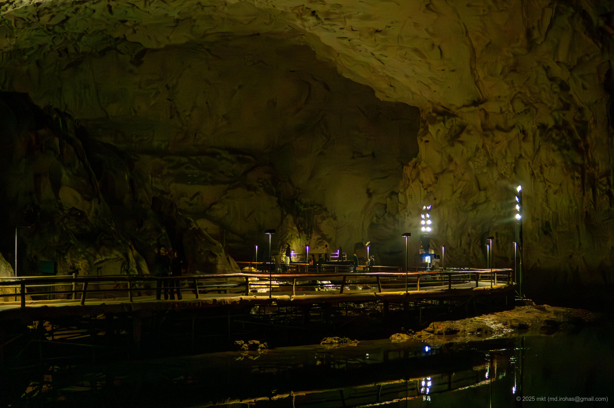
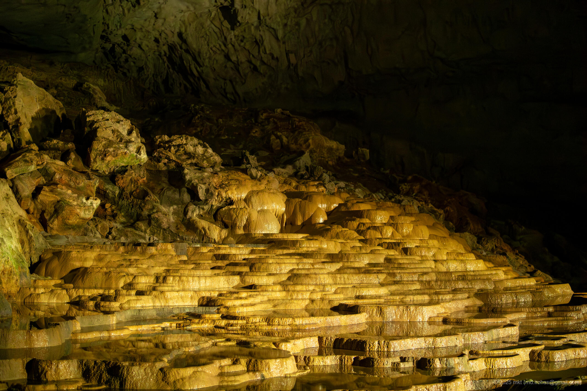
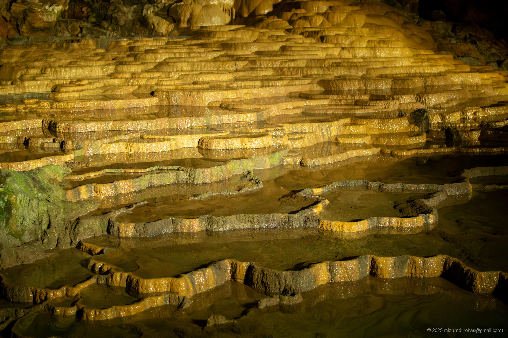
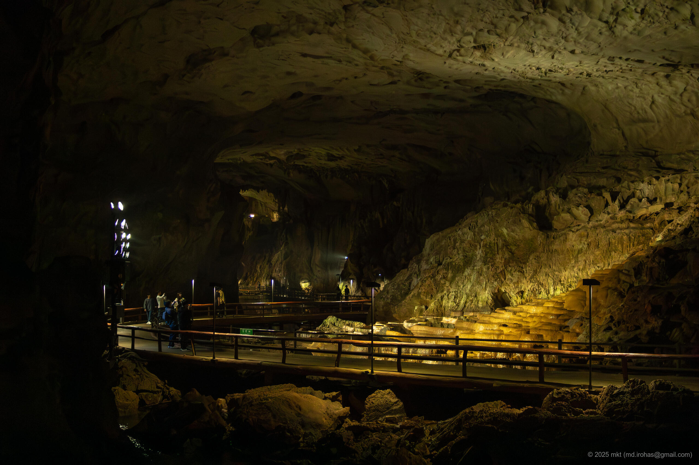
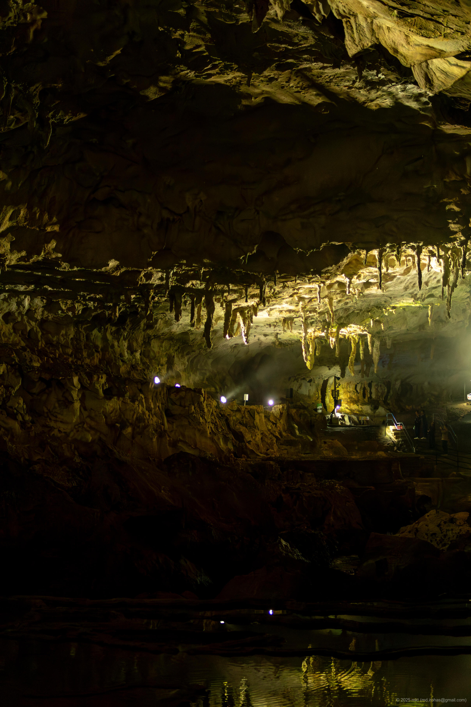
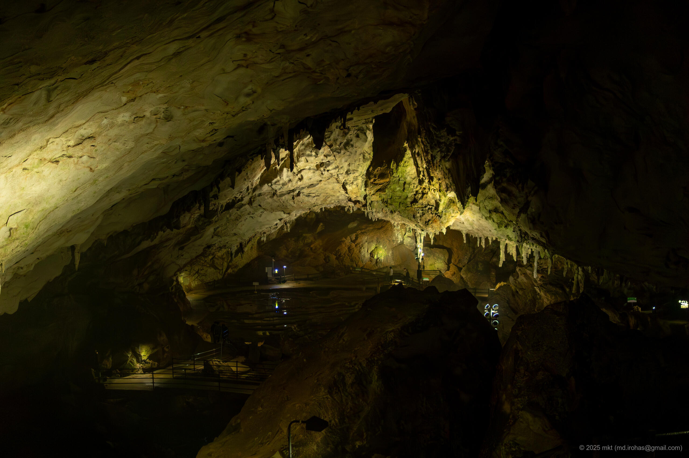
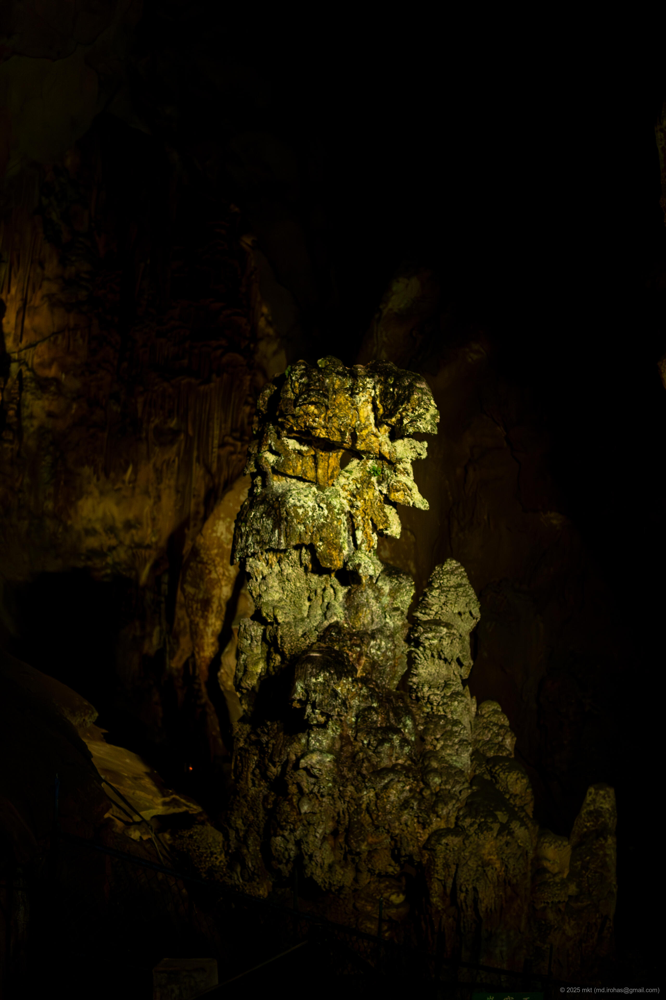
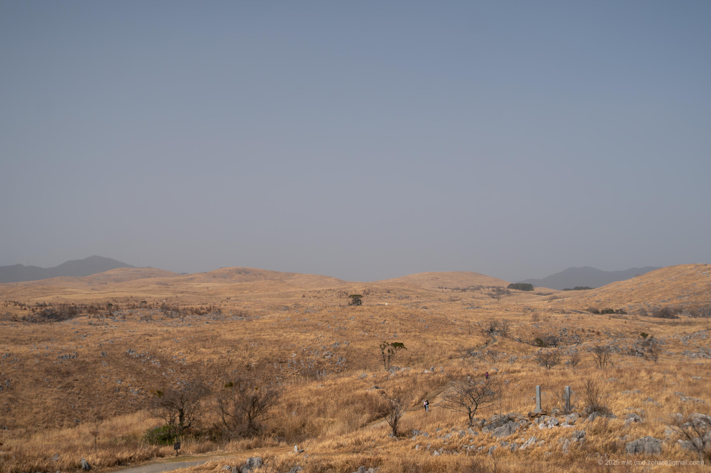




## マップ



## 編集履歴

- 2025/08/28: 初稿作成。

