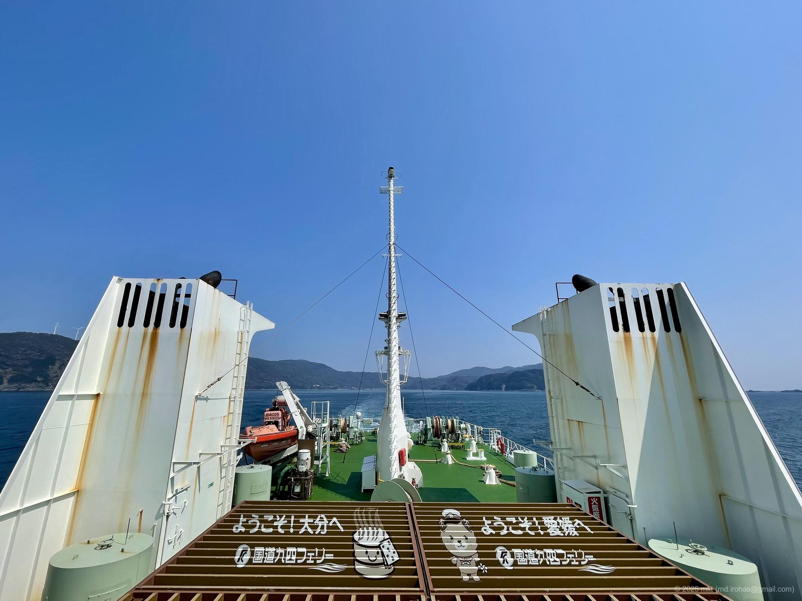

+++
title = '旅の記録: 三重・和歌山・長崎・山口（2025年3月）'
date = '2025-08-29'
categories = ['ブログ（旅の記録）']
tags = ['旅の記録', '三重県', '和歌山県', '長崎県', '山口県']

isCJKLanguage = true
description = '🚙 2025年3月に巡った三重県、和歌山県、長崎県、山口県の旅の記録です。'
summary = '📍 伊勢神宮、伊勢志摩スカイライン、伊勢志摩、熊野那智大社、潮岬、長崎半島、秋芳洞'

draft = false

# Params
+++

## ストーリー

2025年3月、去年に引き続き約2週間の休暇を取り、三重県・和歌山県・長崎県・山口県を車で巡る旅に出ました。



全行程の総移動距離は約3500km。
今年は一部フェリーを使ったり、キャンプ場に宿泊したりと、新しいことを試しつつ、
三重県の伊勢志摩、和歌山県の那智大社・潮岬、長崎県の長崎半島、山口県の秋芳洞等を巡ってきました。

今年も体力的にハードな旅でしたが、
見たことのない多くの景色を眺めることができて、とても満足度の高い旅になりました。

## タイムライン

今回の旅の全日程は11日間、総移動距離は約3500kmでした。

この旅で立ち寄った各スポットとそのタイムラインです。





1日目は、東京の自宅を出発し、最初の目的地である三重県伊勢市へ向かいました。

 



日没前には伊勢市に着いたので、ホテルに荷物を置いて近くの温泉へ行き、のんびりしました。







2日目は伊勢神宮・伊勢志摩を巡りました。

 



伊勢・伊勢志摩エリアは想像以上に広く観光地も多いので、
ゆっくり観光したい方は十分な日数を確保しましょう。





伊勢神宮の外宮と内宮を参拝しました。

<ul>
    <li>伊勢神宮: <a href="https://www.isejingu.or.jp/" target="_blank">https://www.isejingu.or.jp/</a></li>
</ul>

流石の伊勢神宮で、平日にも関わらずとても混雑していました。
どうしても人が写真に入り込んでしまうため、ここで公開できる写真はほとんどありません。



参拝の帰りに赤福本店のぜんざいを食べました。
久しぶりに食べたあんこがとても美味しかったです。

 

赤福餅をお土産にしようかと思ったのですが、
消費期限が短かった（確か翌日まで？）ので断念しました。

<ul>
    <li>伊勢名物 赤福: <a href="https://www.akafuku.co.jp/" target="_blank">https://www.akafuku.co.jp/</a></li>
</ul>



伊勢神宮へは平日の午前の早い時間帯に行ったのですが、内宮の駐車場はほぼ満車でした。
そこで少し遠めの駐車場に停めたのですが、そこも帰りがけには待機列ができていました。
車で参拝される方は要注意です。





伊勢神宮を参拝したあとは、伊勢志摩スカイラインを車で走りました。

 
 

山の稜線を走る開放感、展望台から眺める絶景、荘厳な金剛證寺、とても良かったです。

 
 







伊勢志摩スカイラインのあとは、
パールロードを走って伊勢志摩へ向かいました。

 
 

途中で鳥羽展望台へ立ち寄り、カフェでランチを食べました。
カフェから眺める海もまた絶景でした。

 



食べて少し休んだら、横山展望台へ向かいました。

 
 



 

一通り観光し終わったので、1日目と同じ温泉へ行き、のんびり過ごしました。







3日目は、伊勢市から本州最南端の和歌山県串本町を目指しました。

 



ウミガメ水族館、熊野那智大社、那智の滝に立ち寄り、
本州最南端の潮岬・潮岬灯台を満喫して、3日目に宿泊するキャンプ場へ向かいました。

 
 

和歌山、想像以上に大きかったです...





三重県紀宝町のウミガメ水族館に立ち寄りました。

<ul>
    <li>ウミガメ水族館: <a href="https://umigame.info/" target="_blank">https://umigame.info/</a></li>
</ul>



ウミガメ水族館は道の駅 紀宝町ウミガメ公園に付属する小さな無料の水族館で、
ウミガメの保護やその啓発活動を行っています。



建物の中では、大小様々な数種類のカメが飼育されており、
普段見ることができない多くのカメを間近に見ることができました。









ウミガメ水族館は、X (旧Twitter) 等のSNSでもウミガメを中心にカメの写真や動画を公開していますので、
興味がある方はフォローして癒されましょう 🐢🐢🐢

<ul>
    <li>公式X (旧Twitter): <a href="https://x.com/umigame_kouen" target="_blank">https://x.com/umigame_kouen</a></li>
</ul>





ウミガメ公園をあとはそのまま南へ下り、熊野那智大社と那智の滝を参拝しました。

 
 







熊野那智大社を参拝したあとは、本州最南端の潮岬・潮岬灯台へ向かいました。

 
 







3日目は本州最南端の潮岬の隣に位置する紀伊大島にあるキャンプ場で一泊しました。

 
 







4日目はほぼ移動日で、和歌山の最南端の串本町から四国の西の愛媛県伊予市まで移動しました。

 
 

移動距離は約500km、ノンストップでも7時間の行程です。

 



ほとんどの時間が移動で、観光っぽい休憩は淡路サービスエリアで淡路海峡大橋を眺めたくらいです。



夕方には伊予市についたので、地元のチェーンのラーメン屋さんで晩御飯にしました。







5日目は伊予市から長崎県長崎市を目指しました。

 



伊予市から佐田岬半島をずっと西へ進むと、四国電力の伊方原発がありました。
伊方原発の隣には道の駅と伊方ビジターズハウスがあり、
ビジターズハウスでは、原子力発電に関する展示や説明が無料で公開されていました。



さらに西へ進み、国道九四フェリー三崎営業所からフェリーに乗って大分へ渡りました。
海の旅も悪くないです。



大分で別府温泉に立ち寄り、温泉に入ってのんびりご飯を食べて、長崎へ向かいました。
別府温泉は平日にも関わらずとても混んでいて大変でした...



無事長崎に到着して、5日間の前半戦が終わりました。





実家でのんびりしました。





8日目。長崎市ペンギン水族館へ行き、ペンギンを見ました。

 
 

ペンギン可愛かったです 🐧🐧🐧

 
 







9日目は、長崎半島の樺島灯台と長崎市恐竜博物館を回りました。

 
 







10日目。東京へ戻る後半戦の開始です。

 



復路に立ち寄る観光地は山口県の秋芳洞だけにして、黙々と東京へ向かいました。
途中立ち寄っためかりパーキングエリアは、関門海峡を一望できてとても良かったです。

 
 



 

そのあと、秋芳洞を観光し、その日のうちに岡山県まで移動しました。

 
 







11日目、岡山市から東京まで一日で戻りました。
途中、三重の温泉でのんびりしました。

 



これで、3月の三重・和歌山・長崎・山口の一人旅は無事終了となります。





## ギャラリー

### iPhone 12 mini





## マップ




※ルートは大体の経路です。


## 関連記事











## 編集履歴

- 2025/09/06: 細かな表現を修正。
- 2025/09/03: 初稿作成
