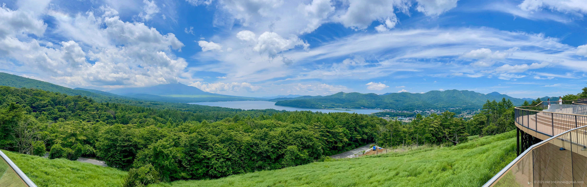

+++
title = 'Trip Photo: Yamanakako (June 2025)'
date = '2025-09-15'
categories = ['Blog (Trip Photo)']
tags = ['Trip', 'Photo', 'Yamanashi', 'Mountain', 'Lake', 'Lookout']

isCJKLanguage = false
description = '🗻 A blog post about my photos I took around Yamanakako in June 2025.'
summary = '📍 Yamanakako, Yamanakako Water Park, Yamanakako Myojinyama Panoramadai, Mt. Fuji'

draft = false

# Params
googlePhotoUrl = 'https://photos.app.goo.gl/8Gh75iRNHZLk8tvq8'
googleDriveUrl = 'https://drive.google.com/drive/folders/1Z2vPXZuKByGcsRzKWlJNE7Zb9kZIEy2a'
+++

## Story

In June 2025, I took a walk around the Lake Yamanakako area.



Yamanakako is the largest of the Fuji Five Lakes, sitting at an elevation of about 980 meters, making it the third highest lake in Japan.
Located northeast of Mt. Fuji, it’s famous for its stunning views of the mountain over the water.

### Yamanakako Water Park

First, I headed to Yamanakako Water Park.



Yamanakako Water Park is located on the north side of Yamanakako.

The park features a long, narrow parking lot along the lake.
Unfortunately, Mt. Fuji was covered with clouds that day,
but I could still enjoy a great view of the mountain over the lake from the parking area.







### Yamanakako Myojinyama Panoramadai

Next, I visited the Yamanakako Myojinyama Panoramadai.



The Yamanakako Myojinyama Panoramadai is an observation point set up along the road from Yamanakako toward Mikuni Pass.

From the panorama deck, you can see both Mt. Fuji and Yamanakako from a high vantage point.
However, be aware that the parking lot is quite small and can get crowded.



The road leading to Mikuni Pass is open and has great views,
and you can also enjoy beautiful scenery of Mt. Fuji and Yamanakako from the roadside.







Unfortunately, Mt. Fuji was covered with clouds here as well,
so I couldn't see the mountain clearly.
Even on sunny days, there aren't many chances to get a perfect view of Mt. Fuji,
so I hope to visit again.

## Gallery





### iPhone 12 mini





### α6500







## Map

### Yamanakako



### Yamanakako Water Park



### Yamanakako Myojinyama Panoramadai



### Sites



## Change History

- 2025/09/17: First version.
