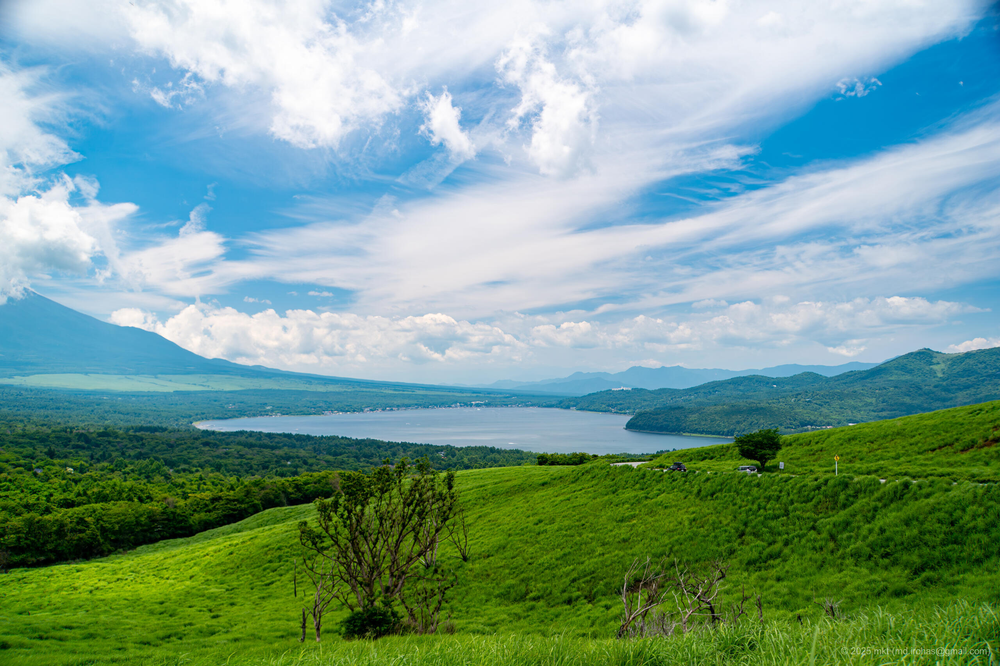

+++
title = '旅の写真: 山中湖（2025年6月）'
date = '2025-09-15'
categories = ['ブログ（旅の写真）']
tags = ['旅行', '写真', '山梨県', '山', '湖', '展望台']

isCJKLanguage = true
description = '🗻 2025年6月に散策した山中湖で撮影した写真です。'
summary = '📍 山中湖、山中湖親水公園、明神山パノラマ台、富士山'

draft = false

# Params
googlePhotoUrl = 'https://photos.app.goo.gl/8Gh75iRNHZLk8tvq8'
googleDriveUrl = 'https://drive.google.com/drive/folders/1Z2vPXZuKByGcsRzKWlJNE7Zb9kZIEy2a'
+++

## ストーリー

2025年6月、山中湖周辺を散策しました。



山中湖は富士五湖の中で最も面積が広い湖で、標高約980メートルに位置し、日本の湖としては3番目に高い位置にあります。
富士山の北東にあり、湖越しに眺める富士山の景観の美しさで有名です。

### 山中湖親水公園

まず、山中湖親水公園へ向かいました。



山中湖親水公園は山中湖の北側にある公園です。

公園には湖に沿って細長い駐車場が整備されていて、
あいにく富士山には雲がかかっていましたが、駐車場付近からは山中湖越しに富士山を一望できました。







### 山中湖明神山パノラマ台

次に、山中湖明神山パノラマ台へ向かいました。



山中湖明神山パノラマ台は、山中湖から三国峠へ向かう途中に整備された展望台です。

パノラマ台からは富士山と山中湖を高台から一望できました。
ただ、駐車場の台数が少なく、混雑するため注意が必要です。



また、三国峠へ続く道は見晴らしの良い開放感あふれる道路で、
その道路の脇からも富士山と山中湖の絶景を眺めることができました。







残念ながら、こちらも富士山には雲がかかっていて、富士山をはっきりと見ることはできませんでした。
晴れの日でも綺麗に富士山を見られる日はあまり多くないため、また訪れたいと思いました。

## ギャラリー





### iPhone 12 mini





### α6500







## マップ

### 山中湖



### 山中湖親水公園



### 山中湖明神山パノラマ台



### 場所一覧



## 編集履歴

- 2025/09/17: 初稿作成。
