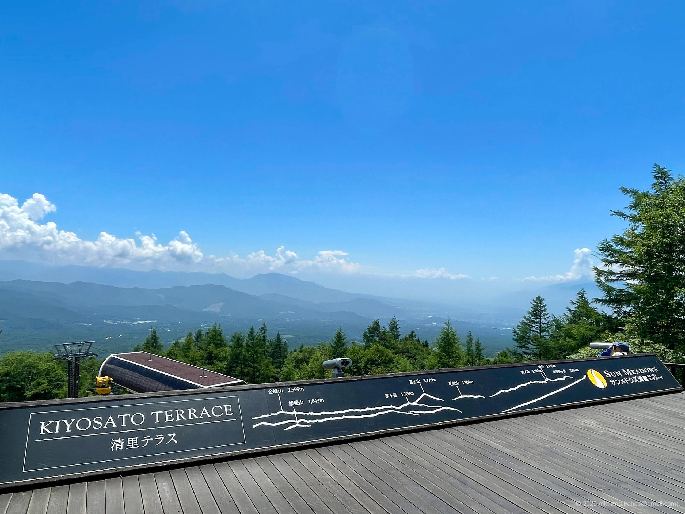
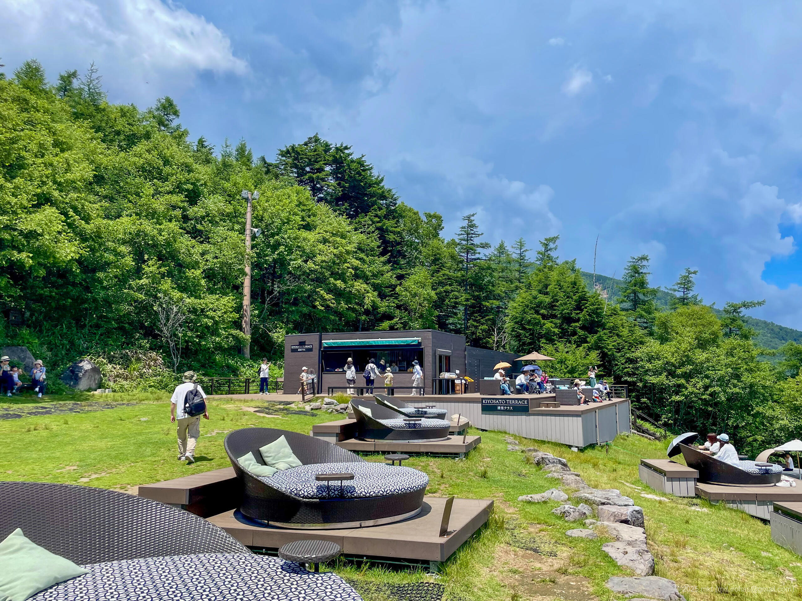
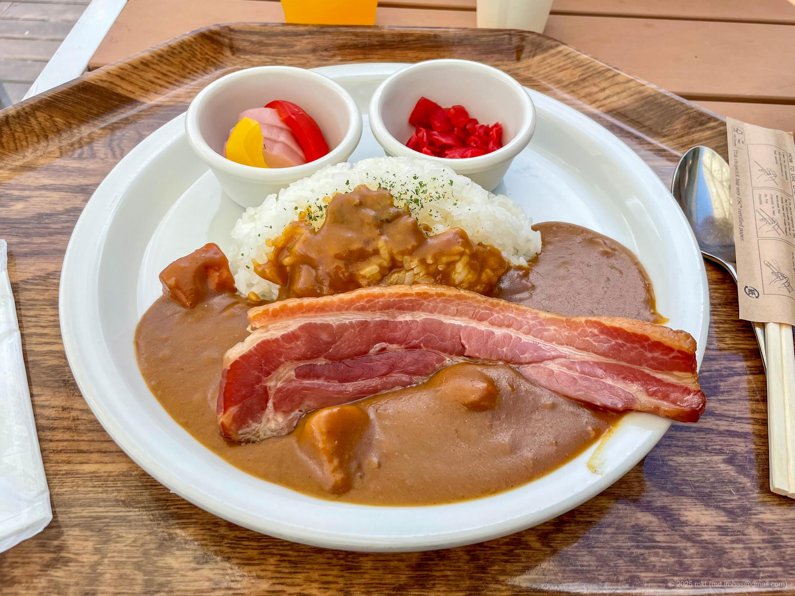
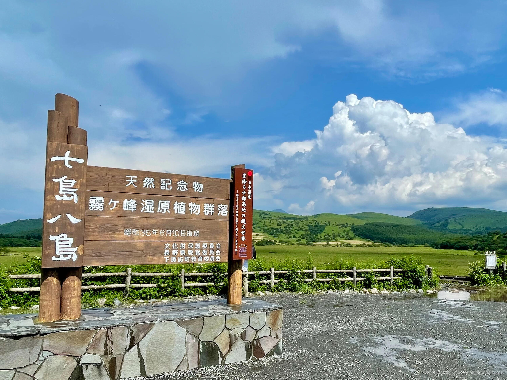
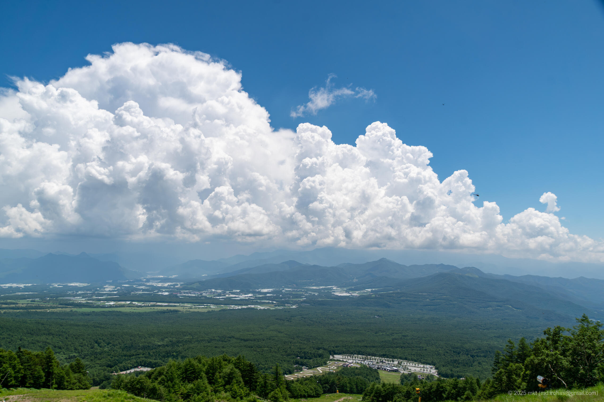
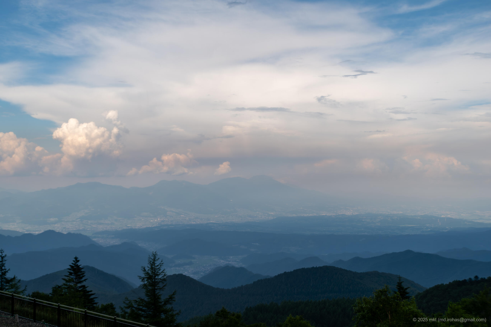

+++
title = '📸 旅の写真: 清里・八島ヶ原・美ヶ原（2025年7月）'
date = '2025-09-17'
categories = ['ブログ（旅の写真）']
tags = ['旅行', '写真', '山梨県', '長野県', '山', '空', '景観道路', '展望台']

isCJKLanguage = true
description = '🏞️ 2025年7月に巡った清里・八島ヶ原・美ヶ原で撮影した写真です。'
summary = '📍 清里テラス、八島ヶ原湿原、ビーナスライン、道の駅 美ヶ原高原'

draft = false

# Params
googlePhotoUrl = 'https://photos.app.goo.gl/NRTFwwRcWF7fyoqcA'
googleDriveUrl = 'https://drive.google.com/drive/folders/1xCj-VJLHkDqnywFv5FL9ua5mN8WjRKLf'
+++

## ストーリー

2025年7月末、避暑地を求めて山梨県の清里テラス、長野県の八島ヶ原湿原、美ヶ原高原を巡りました。



### 清里テラス

まず、山梨県のサンメドウズ清里 清里テラスを訪れました。

- サンメドウズ清里 清里テラス: https://www.sunmeadows.co.jp/green/parkguide/kiyosato_teracce/



サンメドウズ清里は、山梨県と長野県の県境付近にあるアウトドアリゾートです。
冬はスキー場として営業していますが、夏はその一部が避暑地リゾートとして利用されています。
リフトで登った山頂付近のパノラマエリアは標高1900mにあり、夏でも涼しく過ごすことができるそうです。

サンメドウズ清里の駐車場に車を停めてセンターハウスへ向かい、受付でリフト券を購入しました。
往復で大人一人2800円でした。

センターハウスを抜けると、夏の緑の草原に覆われたスキー場がありました。



山頂のパノラマエリアへ向かうため、パノラマリフトに乗りました。



途中でリフトが2回ほど停止しましたが、
車椅子の方やペット同伴のリフトの方が乗り降りする際の一時停止だったようで、
数十秒ほどで再び動き始めました。
10分程度乗っていると、山頂のパノラマエリアに到着しました。

パノラマエリアからの風景は前評判通りの絶景で、雲が自分の目線と同じ高さにある風景を体験できました。





パノラマエリアには自由に寝そべることができるソファが設置されたエリアがあり、
その隣にはカフェがあったのでジェラートを食べました。





カフェのあるエリアから階段でもう一段高い展望デッキへ登ることができました。
空気が澄んでいれば展望デッキから富士山も見えるそうです。
残念ながら私は富士山を見ることはできませんでしたが、
それでもそこからの景色は遥か彼方まで見渡せる絶景でした。







帰りは行きと同じリフトで下りました。



センターハウスへ戻ってきたらちょうどお昼だったので、センターハウスのレストランでカレーライスを食べました。

夏の昼にも関わらず、気温は23度で高原の風が涼しく、
レストランのテラス席で食べたカレーライスはとても美味しく感じました。



私が散策したとき、清里テラスは晴れていましたが、遠くで雷が鳴る音が聞こえました。
山の天気は変わりやすいので、天気の急変には注意した方がいいかもしれません。

### 八島ヶ原湿原

次に、清里から下道で [八島ヶ原湿原（Wikipedia）](https://ja.wikipedia.org/wiki/%E5%85%AB%E5%B3%B6%E3%83%B6%E5%8E%9F%E6%B9%BF%E5%8E%9F) へ向かいました。



八島ヶ原湿原は長野県にある標高約1600mにある湿原で、自然観察やハイキングの名所として知られています。

湿原の隣にある八島ビジターセンターの駐車場に車を停めて湿原へ向かいました。





湿原の周囲は一周90分ほどで散策できるらしいのですが、
天気雨に降られたため、今回は入口で湿原を眺めるだけで引き上げました。





### 道の駅 美ヶ原高原

八島ヶ原湿原をあとにして、ビーナスラインを走って美ヶ原高原へ向かいました。

- 美ヶ原高原: http://www.utsukushigaharakogen.jp/



美ヶ原高原は、長野県松本市・上田市などにまたがる高原地帯で、牧場や遊歩道、美術館、道の駅などを巡ることができます。

本当は遊歩道を散策したかったのですが、あいにくの雨だったため、道の駅 美ヶ原高原へ向かいました。

道の駅 美ヶ原高原で見た、雨と日の光が入り混じる景色には独特の趣がありました。




  




今回巡った場所はいずれも標高1500〜2000mで、夏でも涼しく、避暑地としてとても良い場所でした。
途中からはあいにくの雨で、八島ヶ原湿原の遊歩道、美ヶ原高原の美しの塔や美術館を散策できなかったので、また機会を見つけて巡りたいと思います。

## ギャラリー





### iPhone 12 mini





### α6500







## マップ

### 清里テラス



### 八島ヶ原湿原



### 道の駅 美ヶ原高原



### 場所一覧



## 編集履歴

- 2025/09/19: 初稿作成。
