+++
title = '🏕️ Camping: Tatehara Kogen Camping Ground (October 2025)'
date = '2025-10-23'
categories = ['Blog (Camping)']
tags = ['Camping', 'Photo', 'Nagano', 'Highland Camping', 'Starry Night']

isCJKLanguage = false
description = '🏕️ A blog post about my photos I took at Tatehara Kogen Camping Ground I stayed in October 2025.'
summary = '📍 Shishi-iwa Yatsugatake Observatory, Tatehara Kogen Camping Ground, Yachiho Highland'

draft = false

# Params
googlePhotoUrl = 'https://photos.app.goo.gl/2ts5ZCwGTz7Nazvz8'
googleDriveUrl = 'https://drive.google.com/drive/folders/1z1yVbXp-9dhyo_SCfpt3_JDoyPugc8jc'
+++

## Story

In October 2025, I spent a night camping at Tatehara Kogen Camping Ground in Nagano Prefecture.

- Tatehara Kogen Camping Ground: https://asama-de.com/tatehara/



Tatehara Kogen Camping Ground sits on the Tatehara Highland in Minami-Saku District, Nagano.
I heard they had recently opened a scenic tent site, so I decided to check it out.

### Shishi-iwa Yatsugatake Observatory

On the way to the campground, I stopped by the Shishi-iwa Yatsugatake Observatory.



The observatory is an exposed rocky hill on Hirasawa Pass in Koumi Town, Nagano.
From the rock formation shaped like a lion's profile, you get a sweeping view of the Yatsugatake mountain range.

There is a free parking lot right next to it, so I parked there.
I could enjoy the view of the Yatsugatake from there.







This pass is one of the watersheds that divide rivers flowing to the Pacific Ocean and the Sea of Japan.



I walked up to the observatory.

It's not a built viewing deck;
instead there’s a cluster of rocks called Shishi-iwa.
The rocky area gives you a panoramic view of the Yatsugatake.


Watch your step. Footing around Shishi-iwa is unstable.






It was the season for susuki (Japanese pampas grass),
and the view over the golden fields toward the mountains was beautiful.



On the opposite side of the Yatsugatake sits the National Astronomical Observatory of Japan's Nobeyama Radio Observatory,
and I could see its large parabolic antennas.



### Tatehara Kogen Camping Ground

After enjoying the views of the Yatsugatake,
I bought some groceries at a nearby supermarket and headed to the campground.



Google Maps routed me over the mountains from Kawakami Village via the Kawakami–Saku Line,
but that road was so narrow that cars could barely pass, and the drive was nerve-wracking.

If you're heading to Tatehara Kogen Camping Ground,
I recommend approaching from the Nagano side and driving south instead.
That route has one lane in each direction and is much less stressful.

I checked in at the campground office and moved to the scenic tent site.

It was a weekday, and only a few other groups were there,
so I had plenty of space to spread out on the camp site (I forgot to take photos).



After relaxation at a nearby hot spring, I came back for dinner.
At around 1,400 m elevation and roughly 10°C, things took a while to cook, and like last time the meal was a bit of a struggle.

The sky was perfectly clear that night, and the stars were spectacular.
I couldn't see the Milky Way with the naked eyes, but it showed up clearly in photos.







It stayed calm and comfortable until bedtime,
but around midnight the wind picked up,
and between the gusts and the tent creaking, I didn't sleep well.
Mountain weather changes fast.

The wind was still strong the next morning,
so I skipped breakfast and packed up early (tearing down in the wind was rough).

#### Notes on shooting the night sky

Tatehara Kogen Camping Ground is only about a three-hour drive from Tokyo,
but the stars were incredibly vivid and I could capture the Milky Way
-- no surprise, given the nearby radio observatory.

Here's the gears and tools I used:

- Camera: Sony a6500
- Lens: SIGMA 16mm F1.4 DC DN (APS-C)
- Lens filters:
  - Kenko Starry Night 67mm
  - Kenko MC Pro Softon (A)N 67mm
- Development: Adobe Lightroom







I was thrilled to capture the Milky Way this clearly for the first time,
but I also spotted a few things to improve:

- Light pollution near the horizon is unavoidable.
- Even with a 16 mm (APS-C) wide-angle, the Milky Way filled the frame more than I wanted. I'm tempted to get something even wider.
- Condensation fogged the lens several times, causing missed shots. I should invest in a lens heater.
- My Lightroom edits feel a bit heavy-handed. I want a more natural-looking Milky Way and stars next time.

I'll keep these in mind for future shoots.

### Yachiho Highland

With the morning wind still howling, I packed up early instead of cooking breakfast.

I had planned to stopped by a hot spring on the way back,
but they weren't open that early,
so I stopped at Roadside Station Yachiho Kogen and had chiffon cake and coffee at Yachi Cafe.

After that I drove up the Märchen Road and took a break at Koumi Furusato Cafe.





From there I headed down toward Matsubara Lake and stopped at Yahho-no-Yu Hot Spring.

I could see the Yatsugatake from the open-air bath.
And I had a sauce katsu-don for lunch at the hot spring's cafeteria
and then headed home.



## Gallery





### iPhone 12 mini


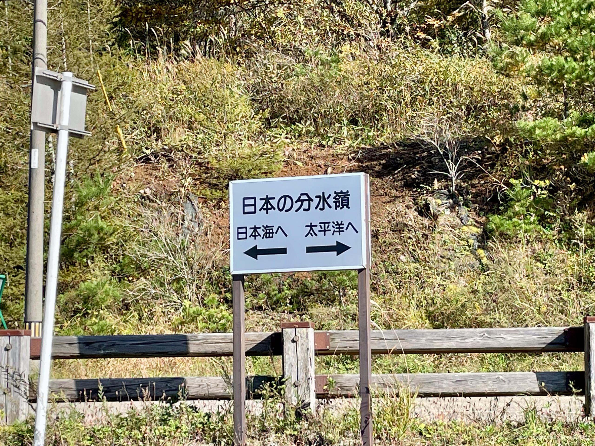
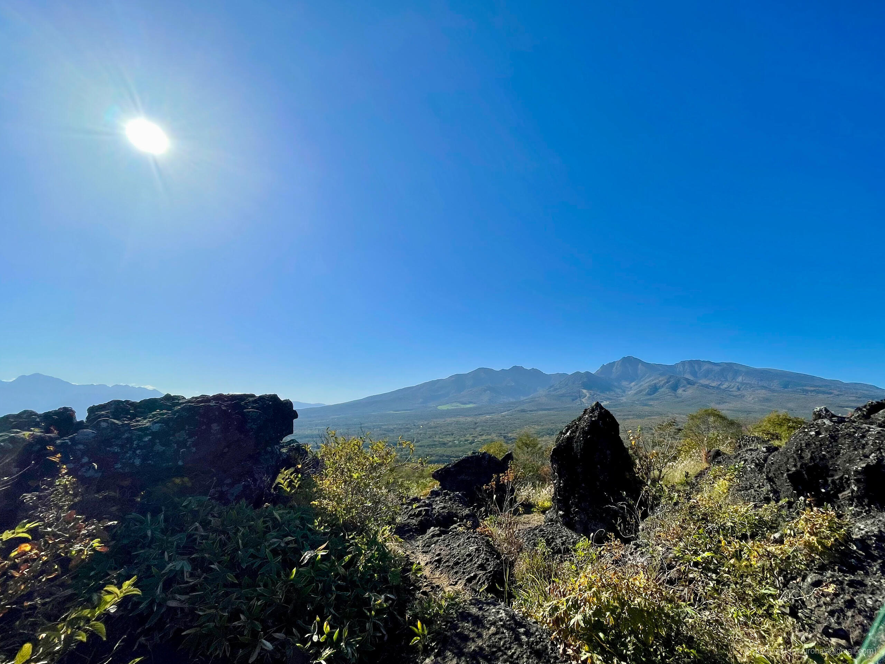
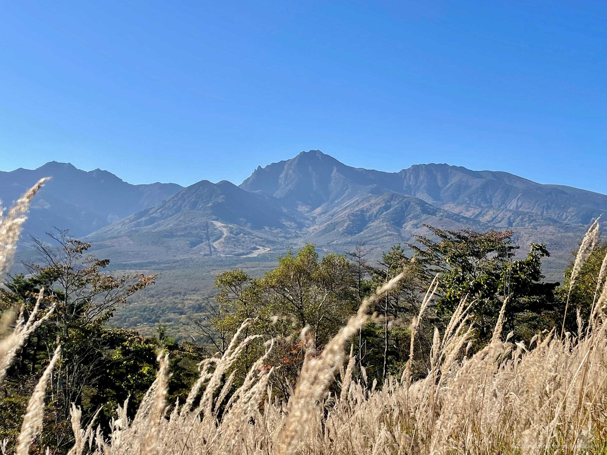
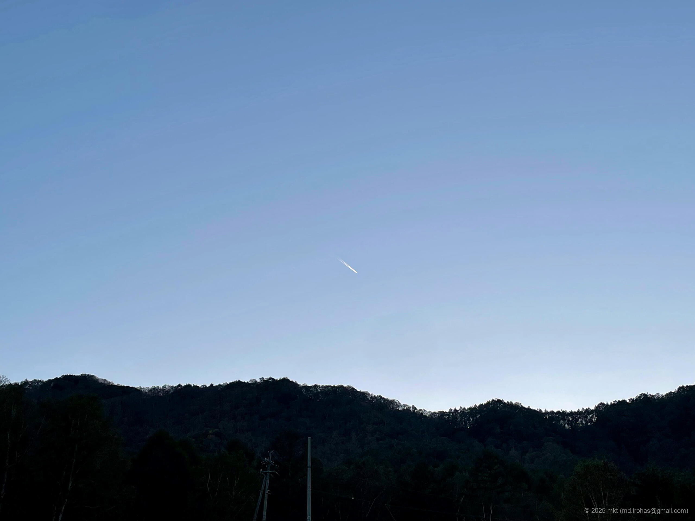
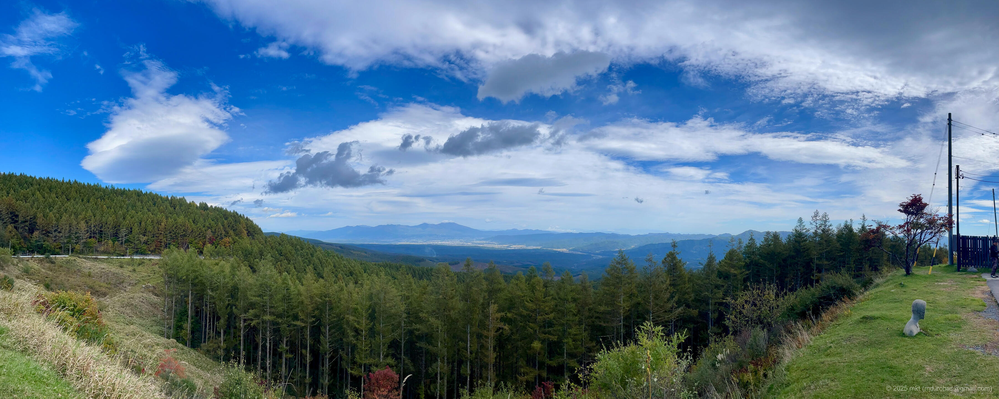
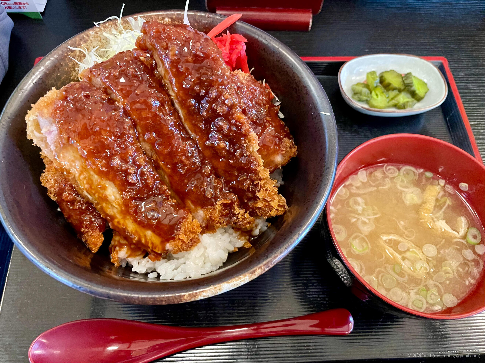


### α6500


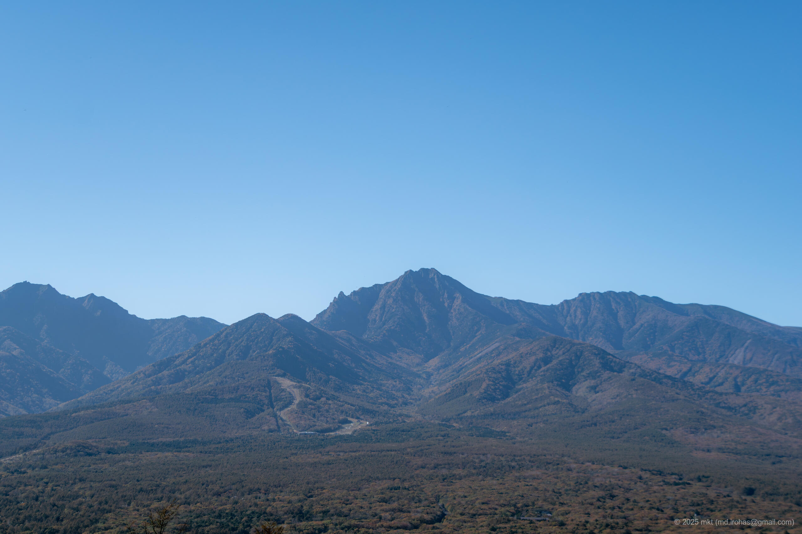
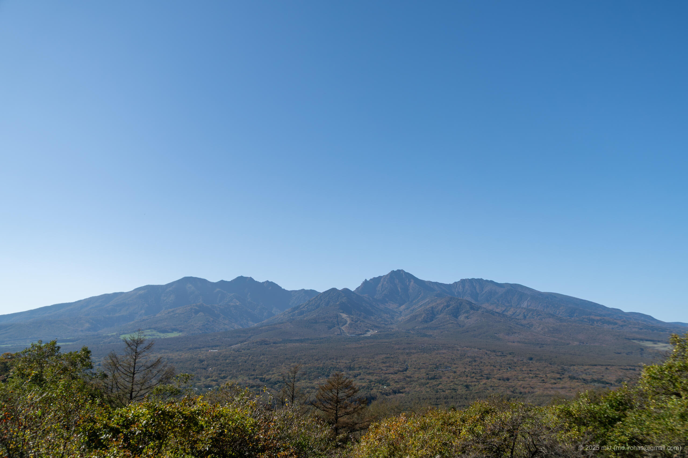
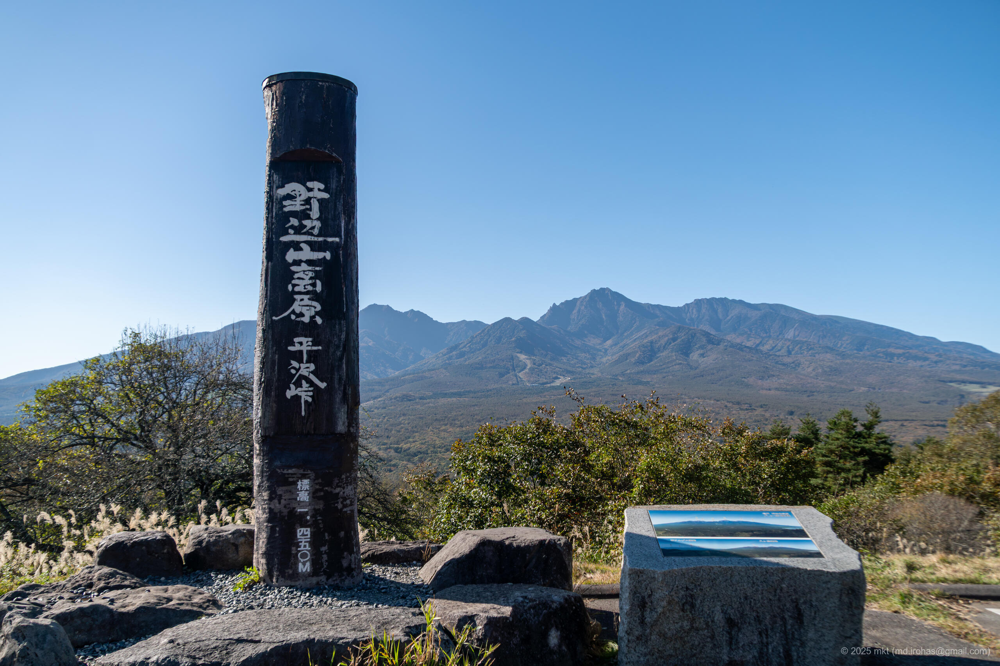
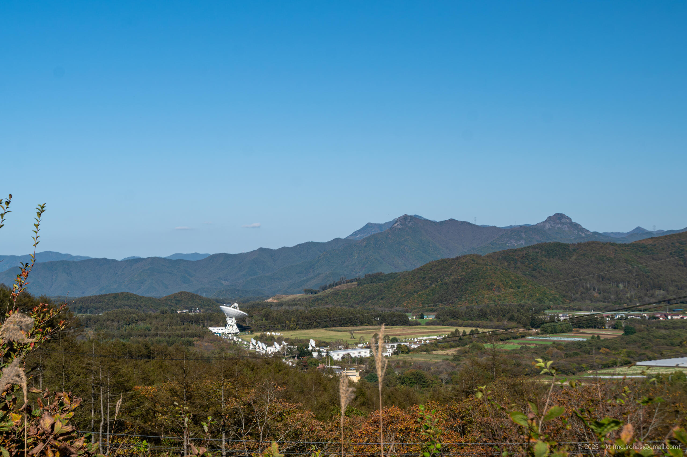
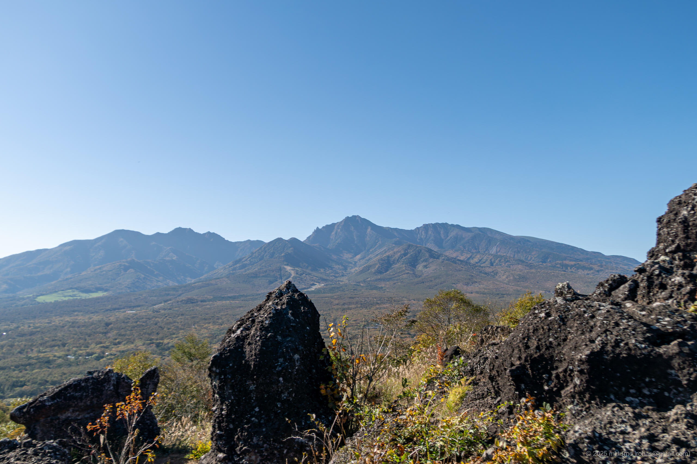
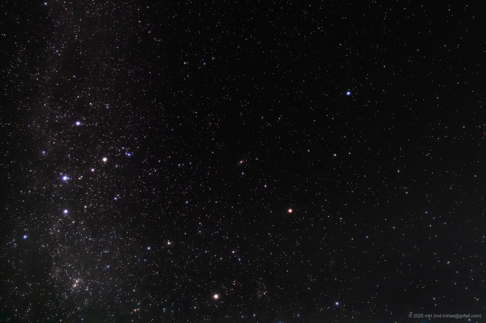
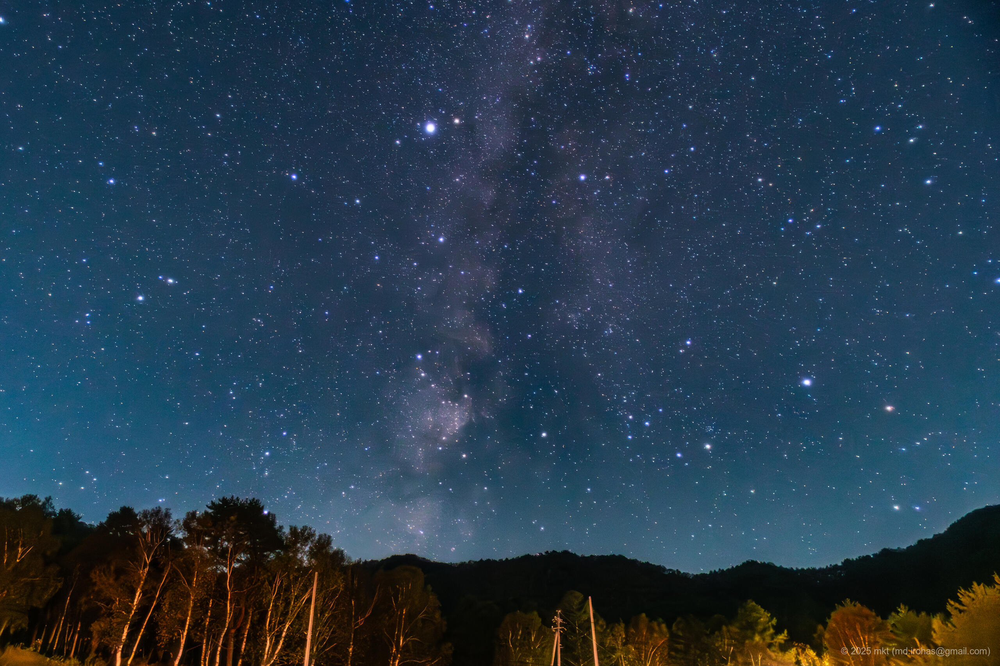
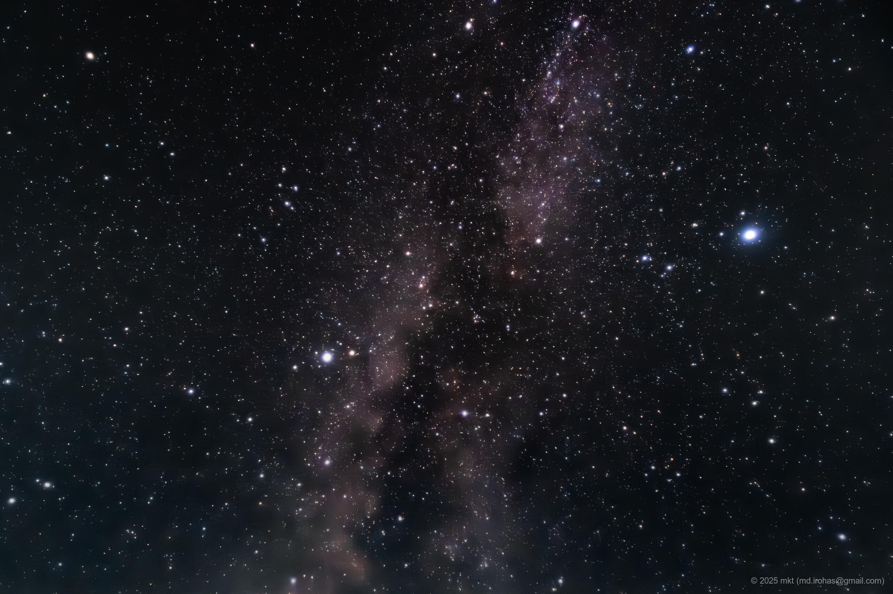
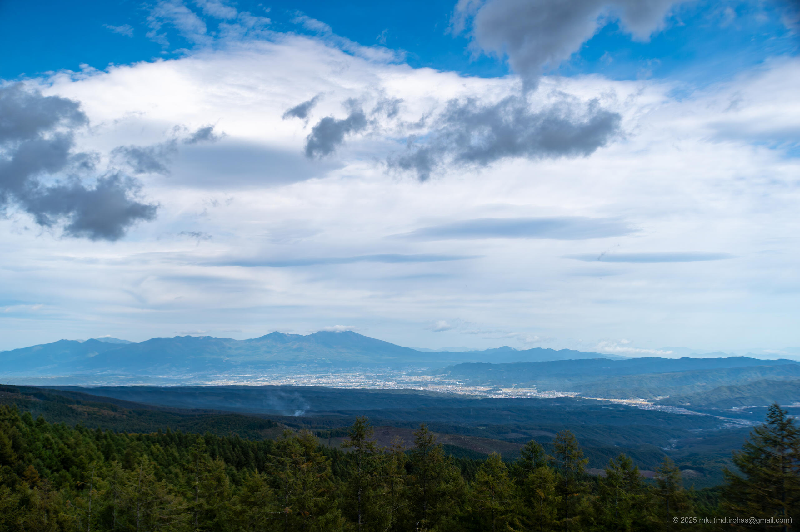




## Map

### Shishi-iwa Yatsugatake Observatory



### Tatehara Kogen Camping Ground



### Sites



## Change History

- 2025/10/24: First version.
