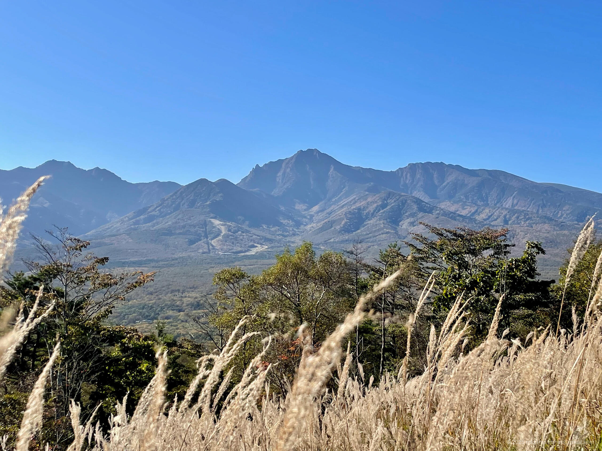
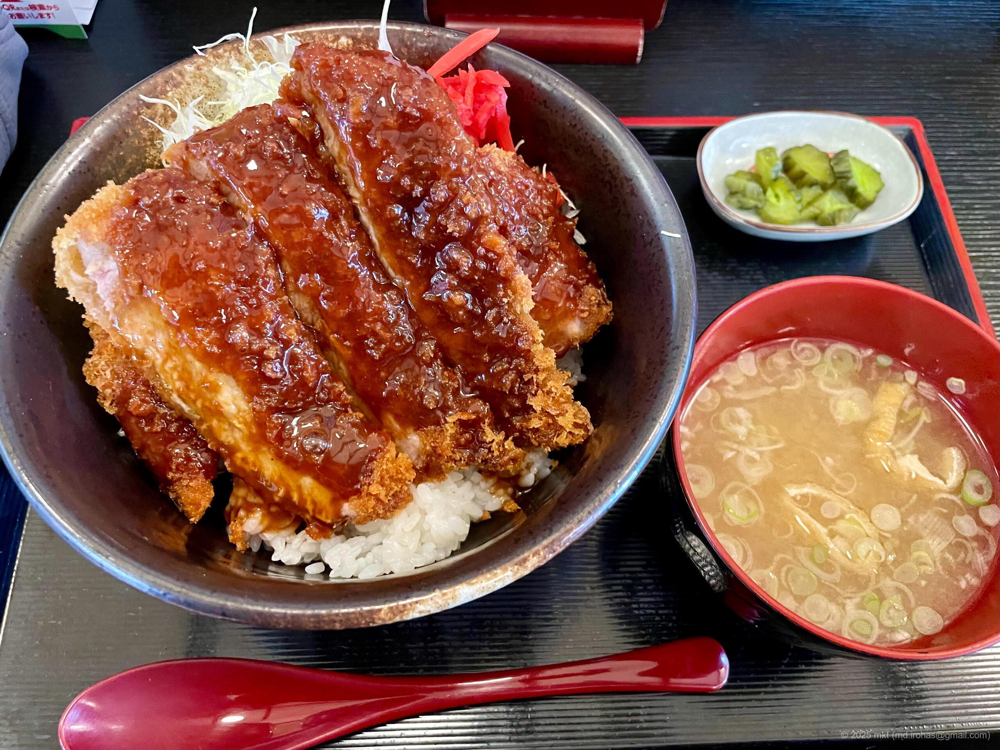
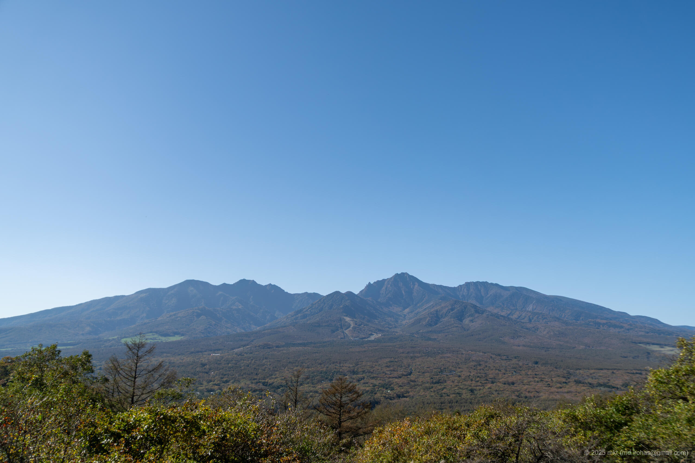
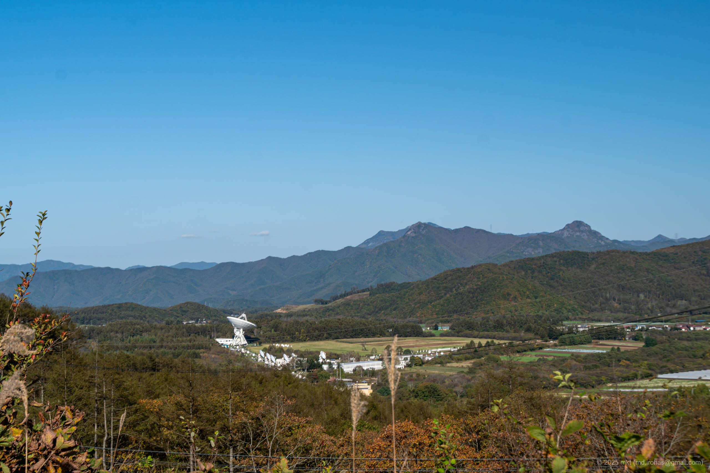
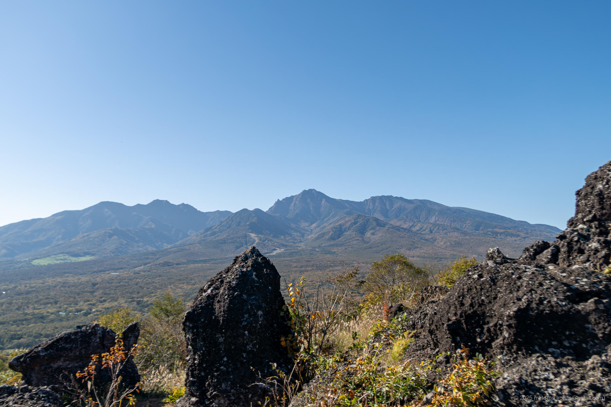
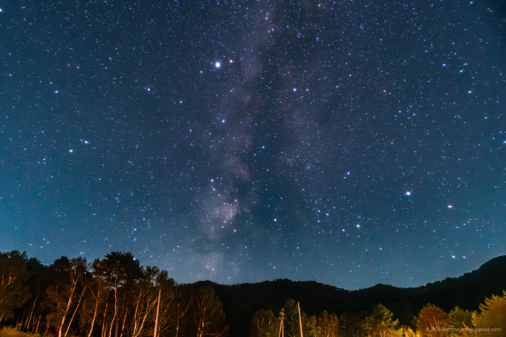
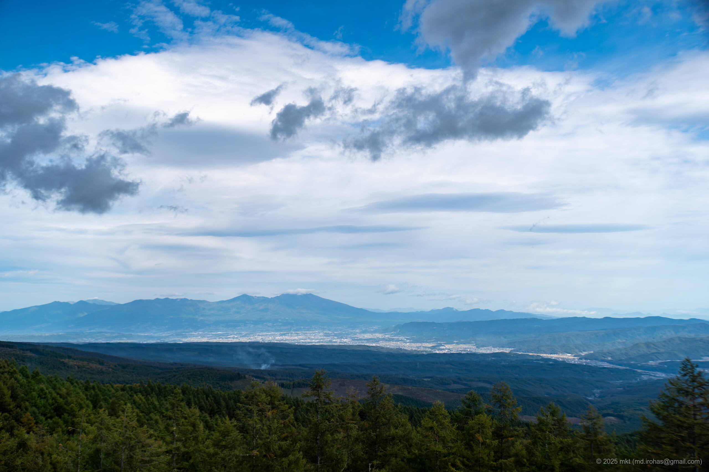

+++
title = 'キャンプ: 立原高原キャンプ場（2025年10月）'
date = '2025-10-23'
categories = ['ブログ（キャンプ）']
tags = ['キャンプ', '写真', '長野県', '高原キャンプ', '星空']

isCJKLanguage = true
description = '🏕️ 2025年10月に立原高原キャンプ場でキャンプしたときの写真です。'
summary = '📍 獅子岩八ヶ岳展望台，立原高原キャンプ場，八千穂高原'

draft = false

# Params
googlePhotoUrl = 'https://photos.app.goo.gl/2ts5ZCwGTz7Nazvz8'
googleDriveUrl = 'https://drive.google.com/drive/folders/1z1yVbXp-9dhyo_SCfpt3_JDoyPugc8jc'
+++

## ストーリー

2025年10月、長野県の立原高原キャンプ場で一泊しました。

- 立原高原キャンプ場: https://asama-de.com/tatehara/



立原高原キャンプ場は、長野県南佐久郡の立原高原にあるキャンプ場です。
最近展望フリーサイトが新設されたと聞いたので行ってみることにしました。

### 獅子岩八ヶ岳展望台

キャンプ場へ向かう途中、獅子岩八ヶ岳展望台へ立ち寄りました。



獅子岩八ヶ岳展望台は、長野県南佐久郡小海町の平沢峠にある岩肌が露出した丘の展望エリアで、
獅子の横顔のような形をした岩の上から八ヶ岳連峰を一望できます。

隣接する無料の駐車場があるのでそこに駐車しました。
そこからも八ヶ岳連峰を一望することができました。







この峠は太平洋と日本海の分水嶺の一つらしいです。



駐車場から展望台まで歩きました。

展望台といってもデッキが整備されているわけではなく、獅子岩と呼ばれる岩石群があるだけです。
その岩のエリアから八ヶ岳連峰を一望することができます。


獅子岩周辺は足場が不安定なので足元に注意。






ちょうどススキの季節で、綺麗なススキ越しにに八ヶ岳連峰を眺めることができました。



また、八ヶ岳連峰の反対側には、国立天文台 野辺山宇宙電波観測所があり、
大きなパラボラアンテナがありました。



### 立原高原キャンプ場

八ヶ岳連峰を満喫したので、近くのスーパーで買い物をしてキャンプ場へ向かいました。



Googleマップには川上村から北上する山越えルート（川上佐久線）を案内されましたが、
そのルートは車がすれ違えないほど狭い山道で、移動していて生きた心地がしませんでした。

立原高原キャンプ場へ行く方は、反対側の長野県側から南下するルートを使いましょう。
こちらは片道1車線で安心です。

キャンプ場の管理棟でチェックインし、展望フリーサイトへ向かいました。

私が泊まった日は平日ということもあり、
私の他には数組しかおらず、フリーサイトを広々と使うことができました（写真は撮り忘れました）。



近くの温泉でのんびりして、キャンプ場に戻ってきて晩御飯。
標高1400m、気温も10度前後だったせいか、火の通りが悪く前回に続いて料理に苦労しました。

また、その日は秋晴れだったこともあり、夜は満天の星空が広がっていました。
肉眼では確認できませんでしたが、天の川もはっきりと撮影することができました。







寝るまでは風はほとんどなく過ごしやすかったのですが、
日付が変わる頃から風が強まり、風とテントが軋む音であまり眠れませんでした。
山の天気は変わりやすいです。

翌朝も風が強かったため、朝食は取らずに早々に撤収しました（撤収作業も風で大変でした）。

#### 星空撮影雑記

今回星空を撮影した立原高原キャンプ場は東京から車で3時間程度の近場ですが、
近くに国立天文台の観測所があることからもわかるように、
星空がとても綺麗で天の川を撮影することができました。

今回撮影に使用した機材、現像方法は以下の通りです。

- カメラ本体: Sony α6500
- カメラレンズ: SIGMA 16mm F1.4 DC DN (APS-C)
- レンズフィルタ: 
  - Kenko スターリーナイト 67mm
  - Kenko MCプロソフトン(A)N 67mm
- 現像: Adobe Lightroom







ここまではっきりした天の川を撮影できたのは初めてだったのでとても嬉しかったのですが、
一方で色々と改善すべき点も見つかりました。

- 地平線周辺はどうしても都市からの光が入ってしまう。
- 使用したレンズは焦点距離16mm（APS-C）の広角レンズだったのですが、それでも天の川が大きく目立ってしまった。より広角なレンズを買いたくなりました。
- 結露でレンズが曇ってしまい、何度も撮影に失敗しました。レンズヒーターの導入を検討したいです。
- 現像はLightroomでゴリ押した感があるので、もっと自然な天の川、星空になるようにしたいです。

次回以降の撮影に活かしたいです。

### 八千穂高原

朝は風が強くキャンプ場で朝食をとることができなかったので、早々に撤収しました。

温泉に入って帰るつもりだったのですが、朝早くまだ温泉も開いていなかったので、
道の駅八千穂高原に立ち寄り、やちカフェでシフォンケーキとコーヒーをいただきました。

そのままメルヘン街道をのぼってレストハウスふるさとで休憩しました。





そこから松原湖の方へ下り、途中の北八ヶ岳松原湖温泉八峰の湯へ立ち寄りました。

露天風呂からは八ヶ岳連峰を眺めることができました
そして、温泉の食堂で昼食にソースカツ丼を食べて帰宅しました。



## ギャラリー





### iPhone 12 mini





### α6500







## マップ

### 獅子岩八ヶ岳展望台



### 立原高原キャンプ場



### 場所一覧



## 編集履歴

- 2025/10/24: 初稿作成。
