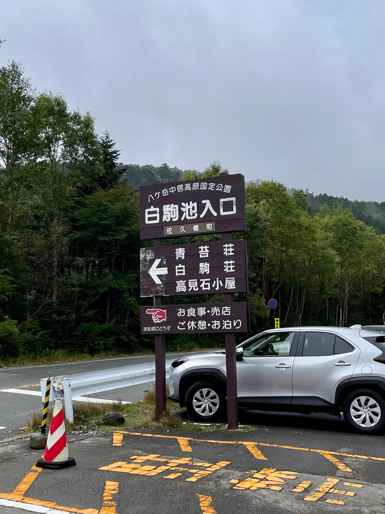
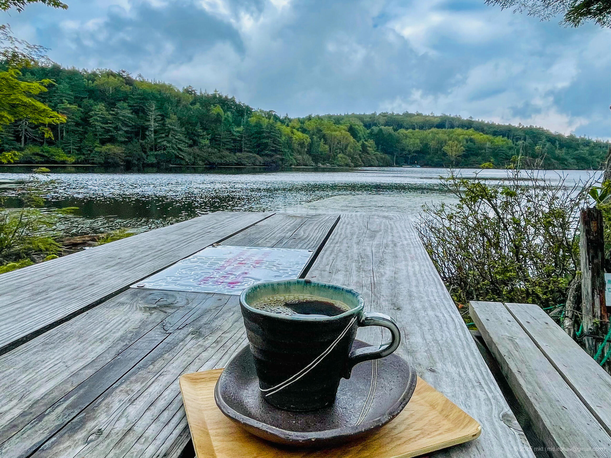
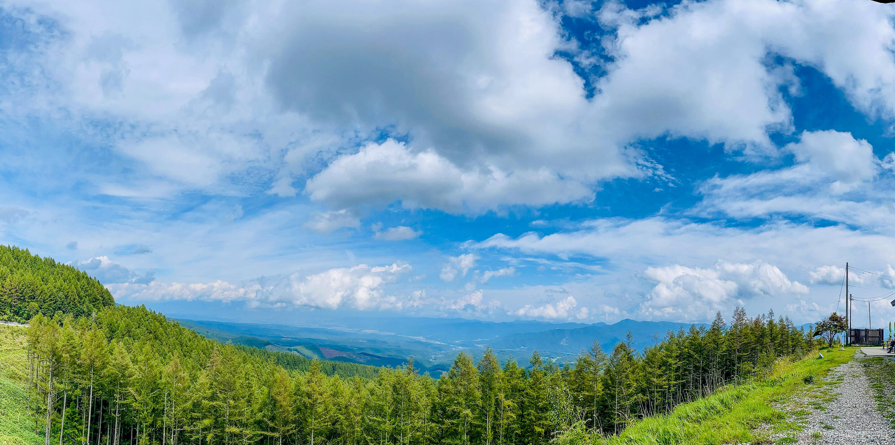
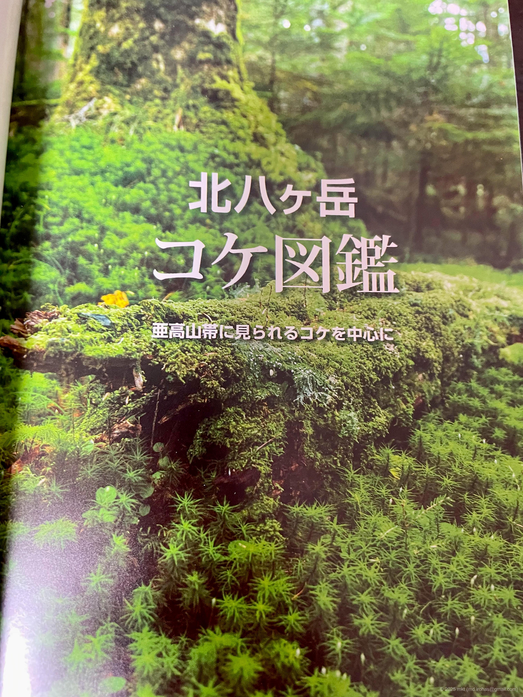
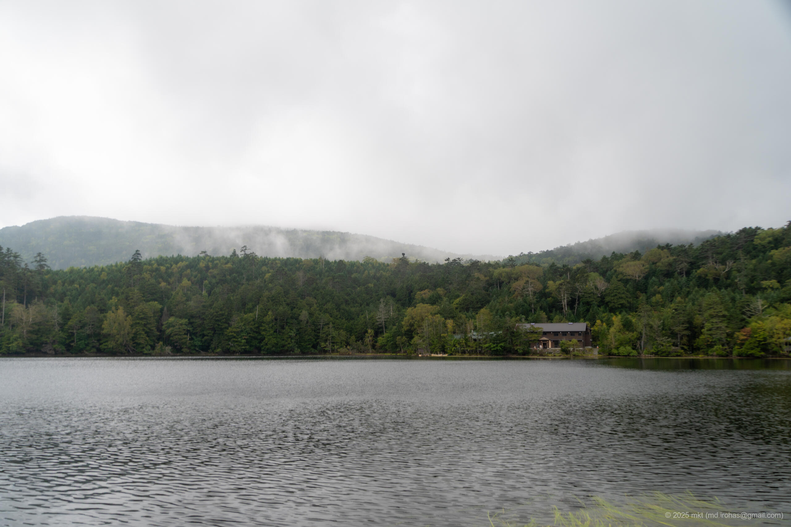
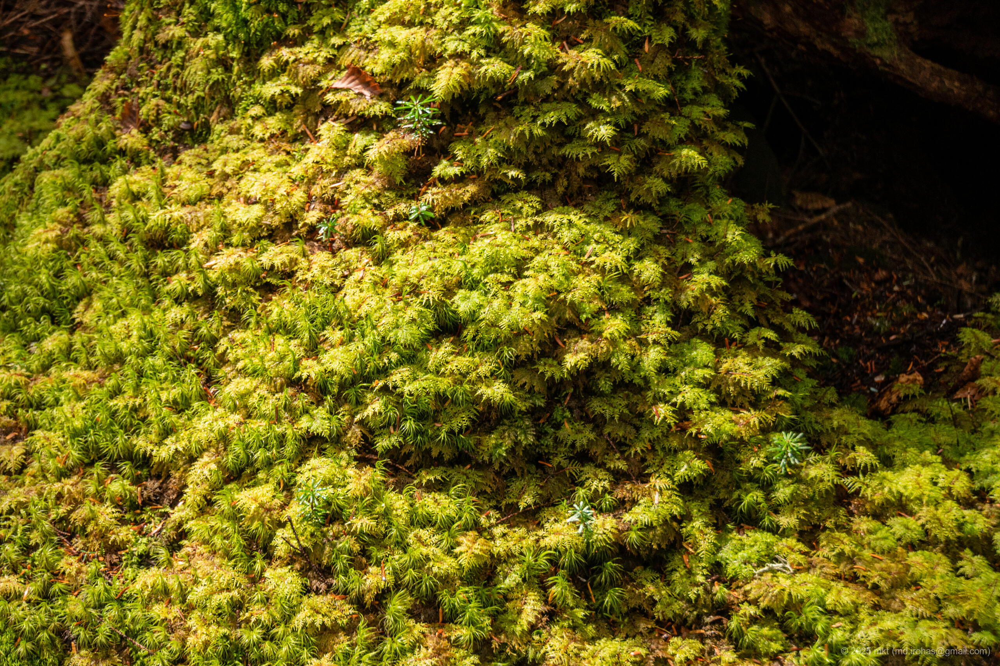
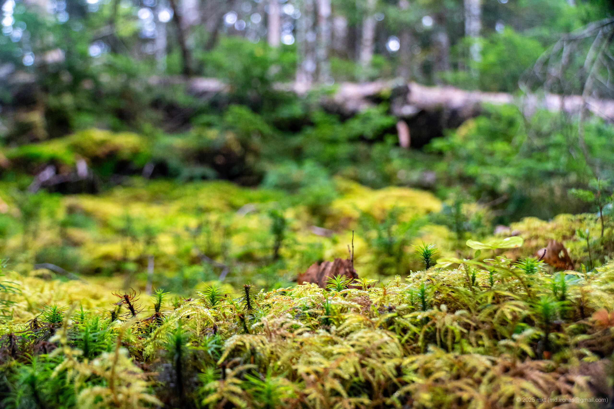
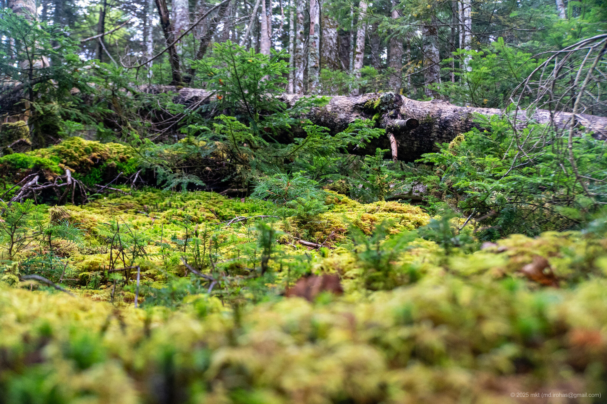

+++
title = '📸 Trip Photo: Shirakoma Forest (September 2023)'
date = '2025-10-25'
categories = ['Blog (Trip Photo)']
tags = ['Trip', 'Photo', 'Nagano', 'Mountains', 'Forest']

isCJKLanguage = false
description = '🌳 A blog post about my photos I took at Shirakoma Forest in September 2023. A moss-covered forest with a surreal atmosphere.'
summary = '📍 Shirakoma Forest, Shirakoma Pond, Koumi Furusato Cafe'

draft = false

# Params
googlePhotoUrl = 'https://photos.app.goo.gl/Ch7iZjU3o29MoufS8'
googleDriveUrl = 'https://drive.google.com/drive/folders/1RFnTFFC3pTiIYoS-BsHxvzjyoDj8FWTT'
+++

 
 


This post is based on photos I took in 2023.


## Story

In September 2023, I stopped by Shirakoma Forest in Nagano on the way back from a camping trip.



Shirakoma Forest is a primeval forest on the slopes of the Yatsugatake Mountains in Nagano, at roughly 2100 meters above sea level.
The landscape is carpeted with moss, and because of that unique look it is sometimes called the "Forest of the Spirits".
The area features Shirakoma Pond and well-maintained walking trails that make for a pleasant stroll.

We parked in a paid lot and walked to Shirakoma Pond.



The interior of the forest felt like another world, entirely covered in moss.

Although I knew moss existed, I was struck by the variety of moss species here and the beauty of their dense growth.





After walking along the trail for a while, I arrived at Shirakoma Pond.



There was a mountain lodge by the pond with a small cafe.
I bought a hot coffee there and sipped it slowly while looking over the pond.





On the way back I took a different route and spent time photographing the moss.









The moss was so impressive that I bought a moss guidebook at a shop.



We then descended toward Saku City and stopped at Koumi Furusato Cafe for a break.





After that I visited nearby Yahho-no-Yu Hot Spring for a soak, had a meal, and then headed home.
The salmon I ate there was called "Shinshu Salmon", locally farmed in Nagano.



## Gallery





### iPhone 12 mini





### α6500







## Map

### Shirakoma Forest



## Change History

- 2025/11/03: First version.
